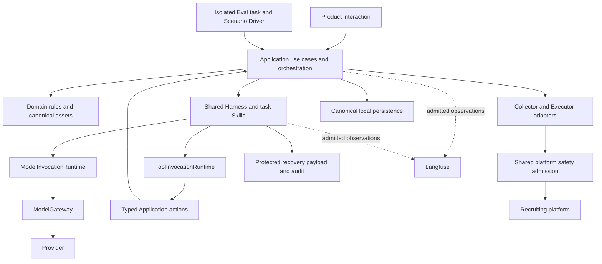

# JobHunter Architecture

> English is the authoritative documentation language. This W2 draft describes the target architecture, not an existing implementation. See [Progress](progress.md) for current joint-review and user-approval state. Contract architectural boundaries remain here; concrete document organization is in Contract Structure. Detailed normative Contracts remain pending the separate Contract Grill.

## 1. Authority, scope, and interpretation

The [Product Specification](spec.md) owns user tasks, entry points, prerequisites, and visible behavior. This document owns the supporting system responsibilities, business authority, dependencies, persistence, concurrency, permissions, recovery, Harness, and Eval boundaries. Repeating a product consequence here explains its mechanism; it does not create a competing definition.

The [English authoring spec](../.scratch/document-authoring-spec.en.md) and [W1 handoff](../.scratch/w1-product-spec-handoff.md) guide document production. The [Decision Register](design/grill-me-design-tree.md), six Harness records, and detailed Eval record provide design provenance. Later corrections control the specific clauses they replace, regardless of an earlier record's ACCEPTED label. The [Contract Design Inventory](design/contract/contract-design-inventory.md) is a non-normative checklist, not a schema or independent source of new requirements.

The [Acceptance](acceptance.md) draft owns required future proof of behavior, and [Development](development.md) owns delivery discipline. [Progress](progress.md) and its supporting [Traceability Matrix](progress/traceability.md) record actual status and evidence. Detailed `docs/contracts/*` remain planned and will own business/data/interface norms. This document does not supply missing fields, types, enums, state-transition tables, API payloads, database schemas, validation errors, or migrations. Existing conceptual names and bounded invariants do not finalize their representation.

The [user-approved process revision](../.scratch/document-authoring-spec.en.md#f-user-approved-delivery-process-revision) adds independent Implementation Plan as the seventh document category. W6 has authored [Implementation Plan](plans/implementation-plan.md); W7 has jointly reviewed the current documents; [Progress](progress.md) records the remaining user-review boundary. The twelve macro Slices contain independently ready milestones. After W7/user review, each milestone completes its required Contract Grill, normative writeback, interface reconciliation and upstream prerequisites before its own development; other milestones in the same Slice and unrelated Contract scope may remain pending. This later instruction changes the older Q22/S38.1 delivery ordering, not the accepted architecture. W1/W2 are document tasks, not implementation Slices. No old code, database, API, test, or completion claim imposes a compatibility obligation. Historical readers for assets produced by the new system remain required; that is distinct from importing the old system.

**Sources:** Q2–Q5, Q11, Q22, Q26, Q32, S24.2, S25.1, S29.2, S37.1, S38.1. The English-language rule and automatic use of stage handoffs are explicit user authoring instructions.

## 2. System responsibilities and dependency direction

### 2.1 Logical boundaries

SL-01.M1's accepted runtime is a loopback local backend with a browser frontend. Workspace owns first-use semantics and delivered navigation; Storage owns the stable startup-selected data directory, one-backend ownership, recognition, transactions and diagnostics. They are infrastructure boundaries, not multiple Workspace identities. The four [M1 Contracts](contracts/index.md#existing-normative-contracts) define their actual fields and protocols. Browser navigation waits for revision-checked resolution and satisfies final opener/referrer safety properties without becoming an Executor action.

JobHunter is one single-user, local-first workspace. The five navigation entries and two Advisor entry modes are owned by Product section 2; navigation organizes tasks without defining Domain ownership. Company aggregation over formal Jobs is a read view, and no unified Candidate Aggregate or tenant hierarchy is introduced. ManualApplicationEntry is a separate mutable record outside the formal Job family; its browser-opening action is ordinary user navigation, not Collector or Executor activity ([CG01-BC1](design/contract/sl-01-m1-grill.md#cg01-bc1)).

| Responsibility | Owns | Must not own |
| --- | --- | --- |
| Product interaction | Navigation, page-local unsaved editing, explicit selection/confirmation, honest display of outcomes | Fact authority inferred from UI state, model prose, or streamed text |
| Business Domain | Identity, immutable facts/assets, compatibility, grounding, approval and application invariants, versioned business policies | Provider transport, graph checkpoints, telemetry success, or third-party payload shapes |
| Application | Use Cases, dependency preparation, exact input freezing, orchestration, authorized commands, transaction boundaries, validated result persistence | Hidden consent, model-defined authority, or a second copy of Domain rules |
| Skills on the shared Harness | Bounded task semantics and protected instructions, declared inputs/outputs, allowed actions, validation and interaction policy | Independent business stores or unrestricted tool/environment access |
| Harness runtimes | Execution ownership, actual model/Tool calls, Context, budget, cancellation, recovery, and audit | Candidate facts, application progress, or permission to bypass Application commands |
| Repositories and adapters | Canonical persistence and validated source/provider/channel integration behind owned boundaries | Promotion of raw external data or exceptions into Domain authority |
| Eval and observability | Isolated experiments, appropriate checks, admitted observations, and evidence | Runtime authorization, business completion, settlement, recovery, or an alternative test-only Agent |

These are responsibility boundaries, not a prescribed package tree, process topology, or service count. Accepted technology commitments include short local SQLite authority transactions, LangGraph execution under Application/Harness ownership, and self-hosted Langfuse for Eval/observability. They do not settle the complete stack, SDK versions, deployment footprint, or storage placement.

The Eval arrow means use of the real entry points in an isolated environment, not access to the live Workspace. LangGraph provides workflow mechanics within the shared execution design; the diagram does not make it a wrapper that owns Harness authority. Provider calls still pass through ModelInvocationRuntime, and recruiting-platform access remains an explicitly authorized Application workflow.

**Sources:** Q1, Q3, Q6, Q27, Q53, Q120, Q126, Q135, Q147, Q160, Q173–Q174, S5.1, S7.1, S17.2–S17.4, S22.1, S35.1.

### 2.2 Canonical data and adapter boundaries

Canonical data stays minimal and consumer-driven. Raw source output is runtime-validated into an adapter representation before it can create a JobHunter asset. External field names, temporary credentials, transport objects, and third-party error shapes are not Domain authority. Source data availability does not grant model visibility.

BossHunter, boss-zhipin-scraper, and resume-optimization projects are research inputs. Before related detailed source/channel Contracts, research must pin studied commits, inspect licenses and maintenance, and map source data through the adapter to justified canonical consumers. Quotas, delays, project layouts, and illustrative implementations in source notes are not accepted defaults or verified current upstream guarantees. W2 records the research obligation; it does not claim to have performed that external verification.

**Sources:** Q3, Q27, Q31, Q49, S7.1.

## 3. Authority, identity, and evolution

### 3.1 Asset ownership

| Concern | Authoritative owner or accepted durable result | Other consumers and limits |
| --- | --- | --- |
| Identity/contact | CandidateProfile and immutable Profile versions | Resume/render consumes exact sources and display choices; contact is model-invisible by default |
| Search intent | One global PreferenceSet and immutable PreferenceSetVersion | Complete explicit configuration; Collection consumes an exact version. Current Preferences do not filter saved Jobs; independent view queries are not writes |
| Career facts | Shared experience-level EvidenceItemVersion, one current saved version per Item | Resumes and admitted Candidate Fit consume facts; import, chat, Memory, and indexes are not alternate fact stores |
| Current career set at a point in time | Immutable EvidenceBaselineSnapshot | Freezes current saved members; neither copied facts nor a completeness assertion |
| Formal resume presentation | Resume root and immutable ResumeVersion | Whole current experiences plus Profile choices/order/presentation; no private alternate career text |
| Support for formal resume claims | Immutable ResumeGroundingSet | Durable derived mapping to actual exact dependencies; not another fact owner |
| Manual application entry | Independent mutable ManualApplicationEntry containing company, role title and user-provided application URL | Separate view and explicit browser opening only; no formal Job/version or analysis/application-history authority |
| Source Job content | Stable Job and immutable complete JobVersion | Requirements bind exact source; observation and current availability remain distinct; ManualApplicationEntry is not a source variant |
| Structured Job requirements | Immutable validated RequirementSet | Derived from exact JD but the sole requirements input for Fits and targeted Advisor |
| Fit findings | Independent CandidateJobFitAnalysis and ResumeJobFitAnalysis | Durable assessments with exact inputs; policy-derived scores and current-result views are not new semantic authorities |
| Proposed formal modification | Target-specific ChangeProposal and its confirmation/result relationship | Exact operation preview, not editable Resume material; Application governs commit |
| Preparation and intended external inputs | Mutable ApplicationPreparation; immutable material assets and ApplicationExecutionSnapshot | Readiness, material confirmation, execution approval, and technical Attempt remain separate |
| Real application history | ApplicationRecord and append-only ApplicationEvents | Technical ExecutionEvents cannot directly set business progress; progress is a policy projection |
| Conversation and collaboration | Durable ChatSession/Turns; independently admitted Long-term Memory | Session statements are not saved facts; Memory only owns limited collaboration semantics |

Durability does not imply factual authority. RequirementSet, Analysis, GroundingSet, and material artifacts can be durable without becoming Candidate facts. Workspace metadata such as default Resume and current baseline does not introduce a Candidate root.

**Sources:** Q7–Q8, Q10, Q15–Q16, Q21, Q25, Q30–Q31, Q37, Q46, Q51, Q53–Q55, Q59, Q63, Q66, Q75, Q108, Q112–Q113, Q127, Q148–Q149, Q157, Q163.

### 3.2 Minimal evolution mechanisms

Choose each mechanism for its actual concern. Stable roots with immutable versions express content history; optimistic revisions prevent lost concurrent writes; append-only events preserve external facts; versioned policies explain derived decisions; projections expose readiness, eligibility, and progress; bounded Run outcomes describe computation. These are not interchangeable and do not justify a universal lifecycle framework.

Historical references bind exact immutable sources. Moving a current pointer never changes an earlier consumer's meaning. Restoring old Evidence text creates a new temporal version; it does not rewind the current version or select a parallel variant. New formal tasks use current eligible inputs, even when old sources remain readable for history.

Evidence grounding identifies an exact Evidence version and a controlled location in its persisted structure. Resolve it using that version's original schema reader; retain historical readers by default, do not rewrite old payloads or redirect old references. A common read projection may follow correct original interpretation. Precise reference syntax, typing, validation findings, and future evolution details await Contracts.

Hashes, provenance, version ancestry, and reference resolution support identity and audit; none alone proves semantic support, current eligibility, or recoverability of content that no longer exists.

**Sources:** Q7, Q18, Q26, Q37, Q42, Q54–Q55, Q59, Q75, Q79, Q86–Q87, Q98, Q108, Q125, Q136.

## 4. Jobs, acquisition, collection, and platform access

### 4.1 Identity and admission

One reliable platform source identity maps to one Job. Semantically changed canonical content produces a new immutable JobVersion; unchanged content updates observation metadata without manufacturing a version. Cross-platform merging and historical physical/logical merge operations are excluded.

BOSS admission atomically persists the formal Job root and first complete JobVersion after validated full detail/JD acquisition. Formal JobVersion retains complete exact canonical JD and immutable content snapshot semantics. No manual root-only admission exception remains.

ManualApplicationEntry has separate identity and mutable company/role/application-URL content, with no JobVersion, source-platform Job identity or downstream Job eligibility. Repeated edits do not create immutable business versions. Its separate view and browser navigation cannot produce Requirements, Fits, Preparation, ExecutionAttempt or ApplicationEvents. The removal request concerns current entry use; detailed retention is not inferred from formal Job history.

The normative definition owner of formal Job identity, content, completeness, versions, lineage and read semantics remains `jobs/jobs-screening.md`. `jobs/collection.md` owns acquisition and adapter workflow under that Contract; SL-08.M2 is the first planned producer and integration milestone, not a semantic owner. `jobs/manual-application-entries.md` is the separate planned entry Contract owner.

**Sources:** Q12–Q13, Q17, Q44, Q48–Q50, S9.1; later [CG01-BC1](design/contract/sl-01-m1-grill.md#cg01-bc1) supersedes the Manual Job branch only and preserves formal canonical Job completeness and immutable history.

### 4.2 Acquisition intent, collection admission and local queries

[CG02-BC1](design/contract/sl-01-m2-grill.md#cg02-bc1) separates three owners: Preferences expresses future acquisition intent; Collection consumes exact immutable PreferenceSetVersion through source planning/admission; Job Pool independently queries already-saved formal Jobs. The six dimensions and explicit-choice gate are defined in Product 4.2. Preferences does not own a source query plan, per-candidate predicate or continuing Job eligibility invariant.

SL-01.M2 supplies complete configuration, immutable versions, read/Save/concurrency and persistence. Under [CG02-S1](design/contract/sl-01-m2-grill.md#cg02-s1), all six dimensions require explicit legal choices before successful Save establishes configured state; no implicit all-empty unrestricted version. Revision admission precedes canonical no-op comparison; real changes create immutable versions. [CG02-Q11–Q15](design/contract/sl-01-m2-grill.md#cg02-q15) adds lazy atomic creation: Workspace bootstrap creates no Preference root; first valid Save creates root, first immutable version and current pointer together, with no residue after failure. Root carries the stable identity/current pointer/revision; versions carry immutable identity and owning-root reference, without is_current. [CG02-Q21–Q25](design/contract/sl-01-m2-grill.md#cg02-q21) defines complete root/version objects, revision-1 first publication, monotonic revision for real changes, successful request receipts and Workspace-lifetime immutable content retention. A replay identifies the original successful result without resetting current authority. Unconfigured reads succeed without creating state. [CG02-Q26–Q30](design/contract/sl-01-m2-grill.md#cg02-q26) fixes versioned Save/current/exact-version HTTP operations, replay-stable success outcomes and lifetime success receipts, including no-ops. Publications share one timestamp, clamped to the previous root.updated_at on clock rollback; no-op/replay refresh nothing. UUIDv4 and created_at provide no strict historical total order; current pointer identifies current, while revision orders root modifications. M2 adds no sequence field. [CG02-Q31–Q35](design/contract/sl-01-m2-grill.md#cg02-q31) fixes strict M2 input admission, bounded raw requests, nested field-error locations and explicit uncertain-Save retry. Common owns shared error representation/vocabulary and the scoped path grammar; Preferences owns triggers and operation mappings. Validated receipt replay precedes ordinary revision admission; errors do not permit hidden command reexecution. The consumed detail now has one normative owner in [Preferences PRF-001–023](contracts/candidate/preferences.md), with shared COM-033–037/WSP-007/STO-014–020 additions. Q38 keeps canonical business equality independent of JSON serialization; Q40 uses INVALID_FORMAT for known mode-incompatible value. [M2 scope review](progress/traceability.md#62-sl-01m2-reviewed-scope-and-interface-evidence) records readiness; implementation remains separate.

SL-08.M2 owns the actual source consumer. `jobs/collection.md` defines exact-version query/admission mapping and source adapter workflow; `jobs/jobs-screening.md` remains the sole definition owner of formal Job admission/content/history and local query semantics. It retains its catalog filename but supplies no M2 QuickScreen component. Search keywords need not appear literally in returned titles. No implicit synonym or model query expansion is introduced in the first release.

Source-expressible constraints may be pushed down; remaining constraints require the defined deterministic admission where metadata supports it. Confirmed list-stage rejection stops detail fetching, and rejected source content is not a durable Job or recoverable audit substitute. Missing/incomparable metadata does not establish conflict or satisfaction. Complete Job/JobVersion admission remains atomic. Collection audit retains usage, aggregate reasons, failures, risk and stop information, not rejected title/company/URL/JD bodies. Acquisition admission does not evaluate CandidateProfile, Evidence, Resume or RequirementSet, and does not parse Requirements.

Each CollectionRun fixes one complete exact PreferenceSetVersion. Later Save affects future Runs only, without changing the running input, initiating collection or automatically restarting it. Explicit stop prevents subsequent access and preserves committed Jobs. Saved Jobs are not re-screened, hidden, marked preference-conflicting, deleted or made ineligible for downstream work merely because current Preferences changed.

JobPoolViewFilter queries existing Jobs independently of acquisition intent. Frontend state and/or backend query parameters may implement it; concrete query/persistence representation remains later Contract work. It does not Save Preferences, create versions, affect future collection, mutate Job authority or produce QuickScreenResult. Genuine Job availability, exact content, material eligibility, runtime admission, safety and consent remain in their existing owners.

**Sources:** Q45/Q49/Q55/Q56/Q110/Q161, S9.1/S17.1, with explicit partial supersession under CG02-BC1/Q6–Q10/S1. The earlier current-Preferences filtering and dispatch QuickScreen gate do not survive; formal Job versioning, fixed collection provenance and exclusion of duplicate screening authority do.

### 4.3 Observation and safety boundaries

Content capture, reliable source observation, and direct availability verification answer different questions. Freshness and availability policies derive views: age can imply staleness, not closure; absence from one search cannot prove closure. Verified closure blocks new automatic application without deleting historical content or applications. Human reporting remains distinguishable from verified source observation. These are formal Job concerns; ManualApplicationEntry has no source observation or availability model. Its explicit browser opening performs no application-controlled extraction, verification or sending.

PlatformAccessSafety is shared persistent admission for platform/account capacity, risk, and action permission. Collector, Browser Executor, and any future implemented Monitor check it before every actual access. Workflow Run/Attempt ownership, budget, recovery, and execution authorization remain independent.

Ordinary page/selector/browser failure may stop its workflow without becoming account risk. Predictable capacity may recover by policy. Strong classified risks require user handling and explicit restoration; no restart, cooldown-only recovery, account/tab switching, or concurrency increase may bypass them. Shared safety admission is never ExecutionApproval. No numeric platform quotas or mandatory Monitor are introduced.

**Sources:** Q36, Q49–Q50, Q160–Q161, Q164.

## 5. Fact maintenance, formal Resumes, and derived work

### 5.1 Preparation before authority

Deterministic document/resume parsing restores source layout, sections, coherent experiences, and existing paragraphs/lists. Optional model enhancement does not own from-scratch ingestion, semantic atomization, merge, or confirmation. Imported Profile/Evidence proposals and My Resumes ResumeDraft remain non-authoritative until review and successful Save. Ambiguous reconciliation blocks formalization rather than overwriting saved facts.

Every formal factual claim needs supported saved authority or user-confirmed creation/correction. Profile facts, career facts, derived summaries, targeting, and presentation have distinct responsibilities; derived wording cannot amplify support. User confirmation can establish personal facts without third-party proof. Omission in another import does not delete saved Evidence.

Save itself confirms entered facts. There is no KnowledgeConfirmation object or Workspace-completeness Gate. Unsaved editor content stays outside task inputs. ResumeDraft belongs only to My Resumes and may be lost on crash; ordinary navigation still offers Save/Discard/Cancel. Advisor and Preparation have no persistent working draft.

**Sources:** Q15, Q63–Q64, Q70–Q75, Q85, Q96, Q98, Q108, Q113, Q146, Q166, S15.1.

### 5.2 One atomic authority change

Application Prepare resolves reconciliation, validates claims and expected revisions, determines direct impact, and plans necessary derived work before commit. One short SQLite transaction commits the changed Profile/Evidence authority, applicable current pointers and baseline, every affected current ResumeVersion and GroundingSet, artifact-currentness information, and required durable derived-work intents together. It never encloses network calls, model calls, or expensive rendering.

Any authority-write failure rolls back the entire formal change. No successfully saved state leaves affected current Resumes awaiting asynchronous synchronization. Propagation reuses the newly saved fact version rather than recursively creating further Evidence versions. Revision checks prevent overwriting concurrent edits; precise command/idempotency and transaction protocols await Contract design.

Career body text edits, including wording changes, version shared Evidence and the career baseline. Pure selection/order/layout changes do not. A Resume selects each chosen experience's complete current body, without per-Resume bullet mappings or alternate facts. Profile changes atomically propagate to referencing current Resumes while preserving field-display choices; contact-only changes do not change the career baseline.

Already-selected Preparation inputs, analyses, prior chat inputs, historical material, and execution snapshots do not follow current pointers. They retain exact history and undergo their own new-use compatibility/adoption rules.

**Sources:** Q73, Q96–Q98, Q108, Q114, Q118–Q119, Q147, Q152, Q163. Q114/Q118 replace manual-refresh interpretations in older reconciliation/grounding records.

### 5.3 Deletion, defaults, and eligibility

Default Resume selection is Workspace configuration. The first Resume becomes default; removing the default chooses another atomically; the last available Resume cannot be removed. Logical Resume removal preserves shared facts and immutable history and requires explicit reselection before continuing a dependent chat.

Removing an experience from one Resume changes only its membership. Global Delete Evidence originates only from Candidate Knowledge management. Compute affected current Resumes by direct Item inclusion, show the impact, and atomically remove current eligibility, update the baseline, and create affected Resume versions/grounding plus necessary derivative intents. No semantic sentence/Claim deletion graph, old-version fallback, or generated replacement is used. Historical assets remain unchanged.

Empty saved content is legal; required-input preflight remains task-specific and occurs before model execution. Detailed prerequisites must not be invented as a universal Profile/contact Gate or experience count.

**Sources:** Q88, Q93, Q100, Q108, Q151, Q153–Q154.

### 5.4 Grounding and demand-driven artifacts

ResumeGroundingSet is immutable and durable, binds exact Resume/Profile/fact dependencies and policy, and has no mutable active-Set pointer. One ResumeVersion can have multiple Sets; EnsureResumeGroundingSet resolves compatible exact inputs without mutating historical assets. Compatibility follows actual used facts, not the whole baseline. Unrelated Evidence changes need not invalidate grounding. Ancestry alone is not proof, and re-grounding an old Resume cannot restore current-use eligibility when its referenced facts are no longer current.

Candidate Fit instead binds the complete saved baseline; career body changes make previous Candidate Fit historical even if an edit appears unrelated. Profile/presentation changes outside its inputs do not. Resume Fit and rendering retain their own exact-input compatibility; old results cannot be relabeled as evaluating new versions.

Rendering, preview, indexing, and caches execute after authority commit. Persist needed intent with Save; later preview/export/Preparation demand also persists intent before execution. Compatible exact-source/configuration work may be reused idempotently. No MQ or all-format eager rendering is required. Before costly dispatch recheck demand/current references and skip obsolete queued work; already-running safe computation may finish but cannot publish stale output as current. Required derivative failure affects readiness, not saved facts. This permission applies only to safe rebuildable work, never model/platform replay.

**Sources:** Q75–Q77, Q87, Q108, Q114, Q118–Q119, Q147, Q150–Q152, Q165; [Recovery](design/harness/recovery.md), section 12; [Storage](design/harness/storage.md), sections 3 and 7.

## 6. Requirements, Fit, and analysis orchestration

### 6.1 Independent dependency preparation

Application owns EnsureRequirementSet. For an exact JobVersion and compatible parser/prompt/schema/validation configuration, reuse a usable immutable Set or create one independent RequirementParse Run. Creation and default activation are separate; a validated Set may activate automatically, while historical consumers retain exact identities. Downstream failure does not delete the successful dependency.

RequirementParse receives complete exact JD for one semantic extraction and at most one deterministic-validation-guided repair. The model interprets meaning; deterministic code checks structure, source support locations, duplicates, emptiness, and verifiable invariants. Structural validation does not prove zero semantic omission. Uncertain necessity/logic is retained, not guessed. A second invalid output fails closed; no usable assessment units means a pre-Fit dependency failure, not a perfect empty-set result or another retry allowance.

Candidate Fit, Resume Fit, and Job-targeted Advisor use the exact RequirementSet as their sole Job-requirements input. They cannot independently reinterpret full JD. General Advisor requires no specific Job/Set, and neither Advisor mode requires a prior Fit.

Shared parse production uses a database-backed atomic claim/unique target/CAS correctness boundary across processes. A process-local mutex is only an optimization. One owner pays actual parse/repair; waiters reuse without duplicate charges. Waiter cancellation affects only waiting. Owner cancellation/failure/unknown outcome yields dependency-unavailable without automatic takeover, transferred budget, or reparse. Explicit Retry first checks for a compatible durable result.

**Sources:** Q10, Q14, Q24, Q58–Q59, Q110–Q111, Q117, Q121, Q142, Q144, Q171.

### 6.2 Independent analysis scopes

| Task | Exact semantic input and scope | Result boundary |
| --- | --- | --- |
| CandidateJobFit | RequirementSet, current saved Evidence baseline, and all task-admitted Candidate facts | Independent CandidateJobFitAnalysis; whole-baseline compatibility |
| ResumeJobFit | RequirementSet, exact eligible saved ResumeVersion, necessary grounding-validation metadata | Independent ResumeJobFitAnalysis; no unexpressed Candidate facts, other Resume content, or Candidate Fit supplementation |

Each uses v1 Full Context, one structured evaluation, and at most one validation-guided repair subject to Run totals. Neither has an autonomous Evidence Tool loop. The tasks have separate Run identity, failure, retry, history, and result selection. Shared Requirements or operation budget does not combine their semantic Runs. Advisor may use compatible results for transient comparisons, without creating CoverageAnalysis, a score gap, or a guaranteed score ordering.

The assessment-producing ContextFrame must prove admitted input inclusion, complete Requirement coverage, valid references, and valid output. FULL_CONTEXT alone does not establish bounded MISSING. Candidate MISSING is absence of support in saved admitted Knowledge; Resume MISSING is absence of expression after complete exact-Resume inspection. Privacy exclusion, incomplete inspection, truncation, or unverifiable judgment remains UNKNOWN. Neither negative proves real-world incapability.

Deterministic versioned ScorePolicy derives display/ranking summaries from each analysis's assessments. Hard gaps cannot be compensated by many minor matches; UNKNOWN is not a fixed low score. Valid analysis may lack a comparable total. Preserve original score or unavailability and original policy, exclude unscored results from ordinary numeric ranking, and never borrow a prior score. Explicit rescoring derives a separate projection under a common policy; missing required dimensions make it unavailable. Numerical weights/thresholds remain pending.

**Sources:** Q19, Q46, Q51, Q72, Q76, Q82–Q83, Q108, Q112–Q115, Q121, Q168, S22.1. Q112/Q115 replace joint Fit, Coverage, and Resume-specific NOT_PRESENT interpretations.

### 6.3 Selection, concurrency, and publication

DeepFitBatch is durable Application orchestration, not a chat Session, Aggregate, or cross-Job transaction. Freeze known user selections first; prepare dependencies; then freeze each complete independent analysis request. Do not invent a placeholder Set or silently replace selected exact inputs. Before dispatch validate source/requirements compatibility, current eligibility, and permissions. Failed final validation after a call preserves usage/audit without publishing invalid analysis.

Distinct targets can run concurrently, but only one effective analysis runs for each target. Backend controls enforce the invariant independently of UI disabling and distinguish actual exact Resume targets. The current view selects the latest successful compatible result; a failed rerun preserves an older compatible success. There is no latest-intent arbitration among overlapping same-target Runs. Recovery releases ended slots and fences obsolete writers without declaring uncertain remote spend free.

An oversized input or failed/cancelled/budget-blocked task does not roll back another successful analysis or dependency and creates no business negative judgment. Revocation affecting protected exact input after freeze terminates that task; no silent scope shrink, revoked-input repair, or valid current-result publication. New scope needs a new task.

**Sources:** Q23, Q35, Q40, Q110, Q112, Q116, Q122–Q124, Q142, Q172, S5.3, S22.1.

## 7. Session, Advisor, Proposal, and confirmed changes

### 7.1 Durable interaction and actual input provenance

Unified ChatSession owns durable conversation and explicit scope/result references. It is not a waiting Agent process or mode-specific targeted Session. Preparation entry creates a new chat with references/intent; business bodies enter through admitted lazy reads. Each user request executes bounded work; later requests reconstruct admitted context rather than revive an old Agent.

Discussion/read selection follows current explicit request, Session adoption, originating Preparation, then Workspace default. A default change does not silently switch ongoing discussion. First lazy resolution pins the actual exact version; later reads of that task object retain it. Querying another Resume does not change the editing target. Unrelated concurrent writes do not upgrade the Run's input.

Suggestions may cite saved Evidence or actual user-stated Session facts. SessionContextRef/UserTurnRef establishes conversational provenance only; validation checks authorized Session membership, real cited text, and scope. Tools do not search the whole chat to infer intent. Unsaved statements may support discussion without compulsory Save prompts, but cannot become formal Fit input, saved Knowledge, or Memory automatically.

At most one foreground Turn is active per Session. New input waits or follows explicit stop. Distinct Sessions and legitimate dependency/auxiliary/background work remain independently admissible.

**Sources:** Q41, Q47, Q52, Q85, Q88–Q89, Q93–Q94, Q128, Q133–Q134, Q138–Q139, Q143, Q155, S17.3.

### 7.2 Exact Proposal and Application-owned confirmation

Formal apply selects the Resume explicitly named in the current instruction, otherwise Workspace default. Discussion priority is not apply authorization. Read the actual target's exact version, validate applicability, and construct its own before/after patch. Do not infer suggestion-source state, transplant another Resume's patch, or copy unrequested experiences.

ChangeProposal is a persisted non-editable operation preview binding actual target, exact changes, shared facts, and affected current Resumes. One explicit confirmation authorizes only that complete operation. Changed target/content or revision conflict requires replacement preview; model-generated parameters or a confirmation flag cannot expand consent.

Generating/displaying the Proposal completes its Turn/Run. Application later validates and executes the exact confirmed command through the formal authority transaction without a model reinterpreting consent. Pending confirmation neither holds a foreground slot nor creates a suspended Run. Later narration is new bounded execution from actual committed results. Q134's general append-only post-write admission does not revive the Proposal-generating Run.

Persisted mutation result is authority for the command outcome and idempotent recovery. Later model/stream failure cannot roll back it or create duplicate versions for the same Proposal. New modification needs new confirmation. Returning the saved Resume to Preparation is a separate explicit narrow revision-checked adoption, preserving Greeting and unrelated edits; it grants no execution authority.

**Sources:** Q91, Q96, Q108, Q113–Q114, Q118–Q119, Q128, Q133–Q134, Q146, Q148–Q149, Q156, Q158.

### 7.3 Two waits and deletion races

Human confirmation follows a completed generating Run. In contrast, waiting for independent RequirementParse keeps the same foreground Turn active while releasing model/Provider invocation capacity. Application delivers dependency completion; there is no model polling, infinite deadline extension, inline parse substitute, or silent producer takeover. Deadline/cancel and owner/waiter rules remain active.

Session deletion atomically arbitrates confirmation eligibility with pending Proposals and cancels active foreground work. Either a legal commit precedes deletion or deletion prevents that pending action; incompatible successful acknowledgements cannot both occur. Old IDs, restored pages, or checkpoints cannot reactivate an invalidated Proposal. Committed facts/results and required history remain. Deleted-source background learning is separately constrained in section 14.

**Sources:** Q52, Q122, Q142, Q144, Q155, Q158–Q159, Q167, Q170.

## 8. Preparation, execution, and application events

ApplicationPreparation is mutable, formal Job/channel-specific, and revision-protected, not immutable history for every edit. Reentry resumes unfinished work without silently replacing exact selections/Greeting. Creation is idempotent against repeated requests; multiple resumable candidates require user choice. Explicit new preparation and reapplication start separate chains.

Preparation displays/selects formally rendered Resumes and cannot edit body text. Greeting is one Preparation-owned editable value with a fixed generic default, no personalization/model call/template library/independent version history. Readiness is a channel-policy projection over eligible saved inputs, validation, rendering, and compatible material confirmation.

MaterialApproval binds actually viewed frozen artifacts, exact sources, and actual Greeting. Required renders precede confirmation. Changed Greeting reconfirms; changed material validates compatibility; equal hashes cannot bypass current eligibility. Rerendering does not replace approved artifacts. A revision/reference/approval/hash check precedes atomic snapshot freeze.

ApplicationExecutionSnapshot is immutable intended input, not execution permission. Separate scope-bound, expiring, single-use ExecutionApproval is consumed by at most one ExecutionAttempt. Partial continuation requires new narrower authorization. Unknown external outcome requires verification, produces no success event, and cannot retry automatically.

Executor's necessary authorized live identity/availability checks do not refresh JobVersion, parse Requirements, replace frozen inputs, or add model Job analysis. Mismatch/closure stops subsequent actions for explicit refresh/repreparation. All access also passes shared PlatformAccessSafety.

ExecutionEvents describe technical actions/observations. Only reliable channel read-back or explicit human report establishes ApplicationEvents. Human reports about formal Jobs do not require automated execution and do not fabricate Snapshot/Approval/Executor history. ManualApplicationEntry is not an ApplicationRecord target; opening its URL creates no Attempt or application fact ([CG01-BC1](design/contract/sl-01-m1-grill.md#cg01-bc1)). ApplicationRecord identifies one real Job/channel/account attempt; reapplication creates another. Events are deduplicated and append-only, retain occurrence/observation distinctions, and use appended corrections/retractions. Versioned ApplicationProgressPolicy derives the read view; it is not independently writable status. Interviews remain ApplicationEvents without a new Aggregate.

Batch application groups membership, scheduling, and progress, while each Job has its own Preparation, Snapshot, Approval, Attempt, and optional real application record. Bulk confirmation does not merge approval scopes or create an atomic business batch. Undispatched members are not failed/applied. Shared risk may stop later dispatch without rewriting completed outcomes.

**Sources:** Q7, Q16–Q17, Q21, Q25, Q30–Q31, Q36–Q37, Q42, Q77, Q91, Q108, Q146, Q150, Q157, Q160, Q162, Q164; Product sections 7–8.

## 9. Shared Harness, Skills, and controlled actions

### 9.1 Task contracts and runtime ownership

Use static code registration of separate RequirementParse, CandidateJobFit, ResumeJobFit, ResumeAdvisor, and MemoryExtraction Skills on one shared Harness. Core Skill semantics/instructions, input requirements, output/validation rules, action/Memory policy, interaction, and execution bounds are protected control. Detailed guidance can be progressively disclosed without becoming a new semantic Tool or Memory authority. No plugin marketplace, workflow editor, or universal career Agent is implied.

One AgentRun serves one bounded semantic task; a Job-specific Run binds one exact Job. Multiple invocations may implement a bounded loop/repair or permitted maintenance for that task, not independent Jobs or both Fits. MemoryExtraction is independent background work; current-Run semantic compaction is auxiliary work in that Run.

| Runtime responsibility | Governing boundary |
| --- | --- |
| AgentRunRuntime | Lifecycle, ownership/generation, foreground/target admission, cancellation, timeout, and startup reconciliation |
| ModelInvocationRuntime | Unique business Provider-call boundary: admission, count/reservation, durable dispatch, complete durable response, settlement, fencing, cancellation/recovery, audit |
| ModelGateway | Provider/model transport adaptation only; no transparent retry, fallback, or separate helper-call authority |
| ToolInvocationRuntime | Per-action argument/object/scope/permission/source validation, invocation/replay and side-effect boundaries, returned-content admission |
| LangGraph workflow integration | Recoverable workflow mechanics, never remote receipts or permission to replay uncheckpointed calls |

Primary, parse, Fit, Advisor, validation repair, semantic compaction, size rescue, and MemoryExtraction Provider requests all use ModelInvocationRuntime. An SDK cannot turn one admitted invocation into hidden additional requests. Independent Eval judges are governed by section 15, not an exception for uncounted business calls.

**Sources:** Q47, Q120–Q122, Q126–Q127, Q132, Q135, Q138–Q140, Q155, Q176, S7.1, S17.4, S22.1.

### 9.2 Tool capability is not permission

Effective action access is the intersection of registration, Skill action allowlist, Context/acquisition restrictions, and current runtime permission. Before execution validate arguments, referenced objects, resource scope, Run authority, and any required approval. Readmit returned content for privacy and task scope before a Frame. Stored data, generated paths/IDs, JD/web content, quoted instructions, Tool output, and checkpoints cannot expand permissions.

Expose typed business read/list/search/write operations through Application boundaries, not arbitrary Shell, SQL, file, HTTP, or model-autonomous browser access. Reads cannot conceal model calls, nested semantic Runs, asset creation, or platform fetches. Necessary invocation audit does not violate read purity.

The specifically accepted action `job.requirements.read` returns an existing compatible Set or missing-dependency information; Application owns EnsureRequirementSet. ResumeAdvisor itself performs optimization; no duplicate `suggest_improvement` Tool is added. Other illustrative names are not a finalized catalog. Tool replay safety depends on the actual action contract, never a convenient name or framework default.

**Sources:** Q120–Q122, Q126, Q128, Q138–Q144; [Tool Actions](design/harness/tool.md), sections 1–7 and 9–10.

## 10. Context Engineering

### 10.1 Allowed sources versus actual model visibility

Context Engineering owns strategy, admission, assembly, compaction, and actual-input records. Its sources are protected control, Session continuity, dynamically admitted collaboration Memory, available typed capabilities, business inputs, and runtime/Tool results. Available source does not mean default prompt payload.

RequirementParse and both Fits use Application-frozen EAGER_EXACT inputs. Advisor primarily uses LAZY_TOOL: initial control, current/recent Session, eligible Recall, and Tool definitions, then admitted exact reads. Preparation entry passes scope references rather than a full business-data dump. Default/preflight Resume requirements do not authorize injecting all Profile/Knowledge/history.

ContextPackage is the immutable initial scope/policy/input/capability manifest. Append actual admitted read/write references as runtime inputs; never rewrite that manifest or earlier outputs. Each ModelInvocation binds an immutable ContextFrame recording what was actually sent, including redaction, selected messages, Tool data, and compaction. Assessment completeness is tested against its producing Frame, not the package's possible scope.

First lazy resolution pins exact versions. A same-task authorized write may add actual committed versions after admission, without guessing IDs, changing independent frozen tasks, or adopting unrelated edits. In the Proposal flow the generating Run has already ended; follow-up narration uses new execution.

**Sources:** Q19, Q72, Q80, Q83, Q94, Q134, Q138–Q139, Q143, Q146, Q158; [Context](design/harness/context.md), sections 1–3.

### 10.2 Protected inputs and ordered reduction

Protect core Skill/control, current user instruction, runtime permissions/approval, and task-required exact EAGER_EXACT inputs. Older dialogue, observable intermediate history, old lazy Tool-result projections, and transient continuity may be compacted. Authority and prompt residency differ: an old Advisor result may be externalized and reread at its exact version, but a protected Fit fact cannot be replaced by a lossy preview.

Apply the accepted order: classify protected/compactable content; externalize large Tool results while retaining their appropriate exact durable source; select a bounded history window; produce deterministic structured/micro projections; only if still insufficient create a bounded semantic ContextCheckpointSummary. Preserve valid Tool-call/result relationships and distinctions between requested/completed, suggested/adopted, observed/authorized. None of the deterministic stages creates career facts or a model call.

Trigger threshold and target watermark are separate to avoid repeated near-limit compaction. Values remain unfrozen. Capacity uses actual serialized input, control/Tool overhead, output reserve, and margin, not remaining money alone. If protected full inputs cannot fit, fail before invocation; do not trim, summarize them, change models automatically, or enable deferred RAG.

**Sources:** Q80, Q121, Q123, Q132, Q139; [Context](design/harness/context.md), sections 4–10 and 16–17.

### 10.3 Checkpoint publication and bounded rescue

Semantic compaction is a same-Run auxiliary invocation sharing ownership, budget, deadline, recovery, and audit. At most one semantic compaction and at most one reactive size-rescue retry are allowed per entire Run; loop progress does not replenish allowances. Both remain subject to total limits. Reactive rescue requires an explicit Provider size rejection, never a guessed explanation for timeout/disconnection/unknown outcome. It cannot grant another semantic checkpoint after that allowance is exhausted.

Retain former recoverable sources while generating and validating a candidate checkpoint. Only valid, durably published, properly fenced checkpoints may enter a later Frame. Failed generation/validation does not publish an untrusted summary or delete Session history. The checkpoint is execution continuity, not fact, approval, or commit evidence. Direct Long-term Memory blocks are excluded; Recall is readmitted per Frame. Indirect influence in actual assistant history is not removed in v1.

Retain exact payload while it is an active recovery dependency; terminal historical references need not pin every source forever. Later permitted exact-source reads are new ToolInvocations, not fabricated old responses. Necessary unavailable sources stop reliable continuation or require user input; no guessed source content, automatic platform revisit, or external replay is allowed.

Mid-run revocation of protected EAGER_EXACT input ends that frozen task and prevents later Frames/repair/Tools from using it or publishing a valid current analysis. A new admitted scope requires a new task; historical frames and truthful prior usage remain. Initial exclusions retain UNKNOWN semantics, and transmitted content cannot be retracted.

**Sources:** Q83, Q122–Q125, Q132, Q135–Q136, Q139–Q140, Q172; [Context](design/harness/context.md), sections 10–18.

## 11. Budgets and resource admission

One shared Budget Runtime serves distinct owners. Application foreground operations own their ExecutionBudget; Runs also have local call/token/step/deadline limits. A DeepFit operation pays its actual parse/Fit/repair work without merging task results. A parse producer's owner pays; reuse does not duplicate cost. Independent background MemoryExtraction uses BackgroundMemoryBudget rather than the last foreground Turn. Current-Run compaction charges that Run.

Before each charged or limited invocation, require valid execution scope and Provider/runtime capacity, then atomically check the owner's remaining envelope, Run totals, and applicable local allowance and reserve before durable dispatch. Conceptually, available budget excludes both settled usage and outstanding reservations. Concurrent calls cannot spend the same balance or allowance. Do not hold a transaction while waiting for a network response.

Actual usage settles the invocation idempotently and releases excess reservation. Record overruns honestly; their handling is a later policy. Dispatched unknown outcomes retain conservative exposure and are not zero cost. Restart and explicit Retry do not create an unused budget or erase old reservations. Safe local reconciliation must not reserve or settle twice. Releasing a concurrency slot does not release uncertain spend.

RequirementParse and Full Context Fits have one primary invocation and at most one validation-guided repair. Semantic compaction and reactive rescue each have their own once-per-Run ceiling. These are ceilings within Run totals, not extra credit. All real calls are counted even when validation fails; deterministic reductions have no model invocation but remain bounded work.

Money/token budget, actual Context capacity, Provider headroom, runtime concurrency, and recruiting-platform safety are distinct resources. Background work yields to foreground headroom even if its monetary budget is sufficient. Insufficient budget prevents new dispatch, preserves independently completed results, and produces no Fit negative. Unknown-usage reconciliation, amounts, allocation, prices, estimation, overrun, and scheduler thresholds remain pending.

**Sources:** Q35, Q110–Q112, Q121–Q124, Q130, Q132, Q135, Q140, Q142, Q144, Q155, Q158–Q160, Q169–Q172, Q176; [Budget](design/harness/budget.md), sections 1–12.

## 12. Durable execution and recovery

### 12.1 Dispatch, response, and canonical publication

Application freezes valid inputs; Runtime admits and reserves; dispatch intent becomes durable before the remote request; complete business response becomes durable before local parsing/validation; current-input, permission, and fencing checks precede canonical Application commit. An in-memory response or partial stream is not durable recovery evidence. A durable malformed response is recoverable input for validation, not accepted business authority.

The following are recovery permissions, not a finalized lifecycle or transition schema:

| Known durable boundary | Permitted interpretation |
| --- | --- |
| Proven undispatched local work | Continue only after current input/permission/budget validation |
| Dispatch intent without complete durable response | Remote work may have happened, including a crash before actual send; end ambiguous execution without silent replay |
| Complete durable response | Resume local parse/validation/publication without another model request |
| Canonical result committed | Reconcile existing identity/result idempotently; no duplicate business asset |
| Former execution authority revoked | Reject its late canonical writes regardless of eventual remote response |

Unknown remote calls require explicit Retry into a new Run with fresh admission and preserved lineage/exposure. Bounded validation repair and explicit size rescue are distinct admitted invocations, not hidden transport retries. LangGraph checkpoint state alone cannot authorize resending a model request or browser effect.

**Sources:** Q40, Q116, Q122, Q124–Q125, Q135, Q140–Q142; [Recovery](design/harness/recovery.md), sections 1–4 and 9.

### 12.2 Ownership, cancellation, and reconciliation

One current execution owner controls a Run. Canonical writes validate current eligibility and execution generation at their write boundary. Cancellation, timeout, revoked ownership, or safe recovery takeover invalidates old writers. A late coroutine cannot publish analysis or checkpoint merely because it received a response. Exact claim/lease/fencing representations and diagnostic handling remain Contract work.

Startup reconciliation inspects unfinished work and durable boundaries, fences former owners, validates frozen inputs/permissions/deadlines/budgets, continues only safe local or undispatched work, ends ambiguous remote work, and releases ended slots. It never silently updates frozen references. Safe continuation cannot cure stale business inputs.

Tool replay is action-specific: eligible local reads may repeat after validation; remote idempotency requires a proven concrete contract; outcome-sensitive calls cannot silently repeat when unknown. No generic idempotency claim reconsumes single-use execution authorization or grants model-controlled browser retry. Recovery promises explicit uncertainty and safe boundaries, not exactly-once remote execution or resumption from every code line.

**Sources:** Q30–Q31, Q40, Q116, Q122, Q124, Q126, Q136, Q142, Q155, Q172; [Recovery](design/harness/recovery.md), sections 5–8 and 13.

### 12.3 Independent committed and presented outcomes

Persisted mutation success survives later narration failure. The same confirmed Proposal resolves to its already committed result without duplicate facts. Stream deltas are disposable presentation, not completed Turns, adoptable Suggestions, extraction sources, or save receipts. Never join fragments from an interrupted attempt to Retry output. Frontend loss does not itself cancel a healthy backend; reconnect may read its complete final result.

Pending Proposals outlive the generating Run but not their current Session eligibility. Unsaved page Drafts have no recovery guarantee. Safe derived-work recovery finds durable intent and respects current demand/reference checks; it does not replay model or recruiting-platform work. These are separate recovery subjects with separate owners.

**Sources:** Q141, Q146–Q149, Q152, Q156, Q158, Q165–Q167; [Recovery](design/harness/recovery.md), sections 9–12.

## 13. Storage, retention, and audit

| Storage responsibility | Content and authority | Retention boundary |
| --- | --- | --- |
| Business Durable Assets | Saved facts, immutable business/derived results, interaction authorization/results, and necessary lineage | Business lifecycle; payload or chat cleanup cannot cascade into formal history |
| Harness Recovery Payload | Exact actual Frame, complete model business response, necessary Tool results and recovery sources | Protected local storage; preserve active dependencies, then independent retention |
| Harness Audit Metadata | Minimal identity/version/hash/lineage, timing, availability, and known/estimated/unknown usage explanation | Durable lightweight evidence; still privacy-controlled and not a hidden full-payload store |
| Operational Logs/Telemetry | Minimal correlation, event, timing, outcome, and sanitized diagnostics | No default full Resume/Evidence/prompt/response or transport-secret dumps; not fallback business persistence |

These are four responsibilities, not four required databases. Immutability prohibits rewriting a Frame, but does not require permanent payload retention. A historical hash/reference does not reconstruct unavailable text. After purge, preserve honest availability and lineage, not a current-data reconstruction mislabeled as the old Frame. Active recovery payload must not be purged merely because its producing invocation completed.

A complete durable response excludes raw Authorization headers, API keys, cookies, login tokens, browser-session secrets, and unrelated transport data. Exception or adapter diagnostics must not leak sensitive payloads into ordinary logs. Persistence never bypasses per-task model admission or current permission.

Business deletion, logical Resume removal, Session deletion, Memory forgetting, recovery-payload purge, and future comprehensive erasure have different effects. Necessary Proposal invalidation/commit evidence can survive deleted chat text without requiring indefinite retention of that text. Historical PDFs and completed applications remain unchanged by current Evidence deletion. Cleanup does not prove remote usage zero or retract already transmitted content.

Physical layouts, encryption/key choices, retention durations, cleanup coordination, full availability vocabulary, and erasure interfaces remain detailed work. Langfuse observations remain derived and independently admitted, as specified in section 15.

**Sources:** Q52, Q75, Q100, Q125, Q131–Q132, Q136, Q139, Q141, Q146–Q152, Q156–Q162, Q165–Q172, Q174; [Storage](design/harness/storage.md), sections 1–12.

## 14. Collaboration Memory

### 14.1 Ownership, admission, and controls

Separate Business Authority, durable Session, admitted Long-term Memory, and derived Memory retrieval. Context Engineering is not a Memory layer. Career facts, identity/contact, search Preferences, Resume selection, and application history keep their business owners. Memory admits collaboration preferences, feedback, working style, and reusable collaboration learning only; no USER_FACT authority is added.

Keep three conflict rules: saved business authority governs facts; Skill/runtime/approval governs permission; current explicit instruction outranks admitted Memory and derived summaries for interaction style. A temporary style override is not a durable preference or approval bypass.

Auto Learning controls automatic pending work/extraction/publication. Recall independently controls entry/summary lookup and every new Frame's Memory injection. Explicit View/Add/Edit/Delete/Clear All uses deterministic validation without extraction and requires neither switch. Recheck learning at dispatch/publication and Recall at each use. Disabling one does not imply the other, delete entries, erase Session history, or retract earlier transmission. Reenablement does not default to historical/disabled-period backfill.

RequirementParse and both Fits admit no Long-term Memory. Advisor admits collaboration preferences, feedback, and working style; reusable-learning storage is not an automatic Advisor grant. A small derived summary and scoped on-demand lookup suffice; no all-chat scan, embedding graph, or complex consolidation is required. New chats do not inherit prior temporary Resume/Job scope.

**Sources:** Q127–Q129, Q131–Q133, Q137, Q139; [Memory](design/harness/memory.md), sections 1–5 and 8–11.

### 14.2 Independent background learning and non-resurrection

Eligible completed durable user-facing Turns create durable pending source work. Coalescing/delay/idle policies schedule independent headless MemoryExtraction; timers are not pending-work authority, a reliable Session-ended event is not required, and every Turn does not automatically invoke a model. Extraction output cannot recursively trigger itself. Sources are minimized to relevant user expression, necessary assistant context, and explicit correction/confirmation evidence.

Extractor proposes; MemoryWriteAdmissionPolicy evaluates collaboration category, scope, durability, existing business owner, supported source, conflict, and sensitivity. Explicit traceable durable user expression/correction may be automatically admitted without a popup for every entry. Repeated behavior, assistant inference, generated summaries, or self-declared candidate type alone are insufficient. Ambiguous candidates remain Session-only or rejected; business routing is not write authorization.

Extraction has independent Run, recovery, and BackgroundMemoryBudget ownership and yields foreground capacity. Failure or shortage cannot roll back a completed Turn or spend its budget retroactively. Failed/unknown ranges remain distinct, do not block new eligible ranges, and do not silently rejoin later automatic batches. Only explicit Retry revisits old failed work; undispatched capacity waiting is still pending.

Forgetting removes future Context eligibility, invalidates derived summaries/indexes, and prevents old sources or late candidates from recreating the entry. Newer corresponding manual management wins over older-source extraction; uncertain recurrence is rejected conservatively. Later genuinely durable user instruction may establish new Memory. Minimal anti-recreation information need not retain deleted content forever; exact markers are deferred.

Deleted source Sessions cannot dispatch new automatic extraction or publish late candidates from pending/in-flight ranges. Recheck sources before dispatch and publication; cancel where possible. Existing accepted Memory retains its own lifecycle. Source deletion/Recall disablement does not prove remote work ceased or cost zero. Direct Memory is excluded from checkpoints; indirect influence already in real dialogue is not removed in v1.

**Sources:** Q127–Q132, Q139, Q141, Q145, Q155–Q156, Q169–Q170; [Memory](design/harness/memory.md), sections 6–7 and 12–17.

## 15. Eval and observability

### 15.1 Platform and authority

Use LangGraph execution with self-hosted Langfuse for generic datasets/versioning, experiments, evaluators, scores/comparison, and dashboards. JobHunter supplies thin real Application/Harness task adapters, domain-aware checks, fixture hydration, and deterministic Scenario driving. Production invariant enforcement stays in Domain/Application/Harness; no second general Eval platform, test-only Agent, generic custom Telemetry Port, or new Domain Eval Aggregate is introduced.

Evaluate outcome, trajectory, Tool behavior, Context, grounding, authorization/safety, reliability, and efficiency separately. Deterministic tests and controlled fault injection primarily prove transactions, permissions, CAS, budget, fencing, and recovery. Model experiments measure semantic/behavioral quality; a judge or fluent final answer cannot prove authorization or actual commit. A model's forbidden request correctly rejected by Runtime differs from actual forbidden execution/exposure.

Independent LLM judges assess existing outputs under separate Eval invocation, budget/cost, model, prompt/rubric, and observability configuration. Their results do not mutate Domain, direct the business decision, or change the original Run outcome. Judge failure/cost remains separate from task failure/cost. Langfuse-managed judges are not assumed to inherit business Runtime atomic reservation, fencing, or recovery guarantees. Semantic support needs appropriate human calibration; resolvable references alone do not prove entailment.

**Sources:** Q117, Q173–Q176, S35.1; [Agent Evaluation](design/eval/agent-evaluation.md), sections 1–7, 16–17, and 26–28.

### 15.2 Isolated exact trials and input separation

Every Trial reconstructs an isolated environment from immutable fixtures and executes the real Application/Domain/Repository/Harness path. Real commits affect a test database, never the live Workspace. Controlled external adapters prevent real recruiting-account access and side effects without bypassing admission. Trials cannot inherit each other's mutations, approvals, or Memory; intended multi-step state remains inside one Scenario.

Freeze Dataset version, reconstructible business fixture, Scenario events/expectations, and exact Skill/Prompt/Context/Model/Evaluator/Rubric/Runner configuration. Stable references and hashes must resolve; missing, mismatched, or unavailable required state is explicitly non-reproducible with no fallback to latest. Fixture storage form is deferred. Exact input/configuration reproducibility does not promise identical remote model output.

Partition task input, evaluation reference, and Scenario control. Agent-under-test receives only reached current/past user inputs and admitted business data; expected answers, future Turns, confirmation scripts, rubrics, and earlier Trial scores cannot reach its Context/Tools. Evaluators receive their own admitted evidence. Trusted judge rubric remains control; task output, Tool text, and embedded instructions remain untrusted evidence.

Evaluator scope follows the judged task. Resume Fit judges cannot supplement from Candidate Knowledge or other Resumes; Candidate judges see its admitted facts, not excluded ones; Advisor evaluation distinguishes user Session assertions from saved Evidence. Deterministic checks may inspect necessary admitted test state separately, without exporting it wholesale to a judge or feeding it back to the Agent.

**Sources:** Q173, Q177, Q184–Q185; [Agent Evaluation](design/eval/agent-evaluation.md), sections 4–5 and 30.

### 15.3 N+1, full Scenarios, and experiment claims

Comparable multi-turn regression uses fixed authored inputs and a thin deterministic Scenario Driver, not a generative User Simulator. For a localized next-turn failure, restore the preceding conversation and necessary exact business/session/runtime/Proposal/source boundary coherently, then execute only N+1. Do not replay historical calls/Tools/mutations to rebuild it, or claim this proves the prior N Turns.

Full Scenarios exercise state creation/progression, Proposal generation, confirmation/refusal, revocation, concurrency, and final persisted effects. At logical checkpoints, the Driver applies authored events through formal Application interfaces rather than wall-clock sleeps. Confirmation requires an actual uniquely matching produced Proposal. Zero/multiple matches or missing preconditions cannot be fixed by arbitrary selection, DB success injection, invented consent, or helping the Agent. The generating Turn has ended under Q158. Assertions use actual structured events, canonical task results, and persisted state rather than trace arrival. NiceEval is inspiration, not a required dependency.

Skill-focused and composed-workflow experiments make different claims. A Fit benchmark with a compatible Set still uses real Ensure reuse but does not measure parsing. Workflow cases include declared dependency preparation and actual executed stages. Attribute failures and cost to those stages; an unexecuted Fit has no measured semantic result, and partial-path cost is not end-to-end cost.

Ordinary comparable Advisor Trials freeze isolated initial Memory, Recall, and permissions and use supported controls to prevent unscripted learning. Memory-specific Scenarios explicitly drive real learning and track separate background evidence/cost. Disabled learning cannot claim Extraction coverage. Neither mode changes production defaults or relaxes guards.

**Sources:** Q158, Q173, Q177–Q178, Q180, Q183, Q186–Q187; [Agent Evaluation](design/eval/agent-evaluation.md), sections 4, 14, 27, and 30.

### 15.4 Judgments, regression retention, and re-evaluation

Keep task outcome separate from every check's conclusion. Correct rejection can satisfy a case. Proven violations, incomplete evidence, evaluator errors, and unassessable samples remain visible; a failed judge does not erase valid deterministic findings. Do not drop inconvenient cases, count missing evidence as pass, or turn Q168's unavailable score into zero.

Expected results constrain required meaning, support, exact identity, and permitted behavior rather than unique wording or Tool order. Multiple semantically valid outcomes can pass, while exact references/authorization remain strict. Required input already supplied through an admitted pinned source does not mandate a redundant read purely to satisfy a metric. Ambiguous expectations require review or an explicit unassessable disposition.

Keep development and holdout datasets separate by Skill, using positive/negative/boundary/regression intent without freezing example names/counts. Disclose holdout contamination if used for tuning. Report deterministic recorded replay separately from live-model behavior. Pass@1 represents the single-attempt experience; repeated Trials measure variability, not best-of-N selection. Trials, in-Run repair, and user Retry are different operations.

Reviewed minimal sanitized/synthetic regression fixtures can outlive original sensitive payload when the failure mechanism and coherent references remain verified. Raw trace promotion is not automatic truth or permission to copy the Workspace. If admissible executable evidence cannot be retained, disclose missing coverage. Retire a regression requirement only when its governing behavior is superseded.

New evaluators may reassess the same retained actual Trial outputs/trajectory/post-state without rerunning Agent, Tools, or mutations. Preserve prior evaluation history and record new evaluator versions; missing evidence yields incomplete/unavailable evaluation, never a silent new run. Rebuilt initial fixtures cannot stand in for actual original post-state. Intentional re-execution is a new Trial with its own inputs and costs.

Hard authority/permission/replay violations cannot be offset by aggregate quality. Report quality, stability, cost, and latency separately, and distinguish absolute target attainment from relative regression. Q175 leaves thresholds, Trial counts, default enablement, release ladders, and repository/CI rollout policy undecided. Q117's formal annotated ParserVersion certification remains deferred, while real-JD tests, manual checks, and traceable quality work remain required.

**Sources:** Q117, Q168, Q173, Q175, Q177–Q182, Q186; [Agent Evaluation](design/eval/agent-evaluation.md), sections 8–21 and 31.

### 15.5 Derived telemetry and platform verification

LangGraph callbacks and explicit Langfuse SDK observations share pre-export masking and canonical Run/Model/Tool correlation. Auxiliary calls and work outside callback-producing graph nodes remain observable without duplicate invocation/cost counts. The integration is infrastructure, not a Domain dependency or a generic telemetry abstraction project.

Local canonical state determines business commit, invocation completion, settlement, and recovery. Failed upload or missing spans cannot roll back success or authorize replay. A missing span alone does not invalidate a check with sufficient local evidence; absence of required evidence does make that check incomplete. Production outcome and evidence availability remain distinct.

Default exports favor admitted minimal references, hashes, versions, usage, source categories, and outcomes. Self-hosting does not authorize full sensitive payload copies, secrets, or a second Knowledge database. Evaluator raw-evidence access is separately admitted. Verify actual selected platform/SDK versions, workers, callback behavior, masking, judge connections, and deployment later; research appendix statements are not claims of deployed capability.

**Sources:** Q125, Q174, Q176, Q178, Q184, S35.1; [Agent Evaluation](design/eval/agent-evaluation.md), sections 22–28 and Appendix A.

## 16. Contract document structure and responsibility plan

[CG02-BC1](design/contract/sl-01-m2-grill.md#cg02-bc1) revises the Preferences/Collection/Job Pool boundary: M2 owns complete versioned acquisition intent; Collection owns its source consumption; jobs-screening retains formal Job/admission/independent-query semantics. No standalone M2 QuickScreen or current-Preference downstream gate remains. Structure maintains the corresponding file and milestone mapping.

### 16.1 Architectural role and authority

Contracts express detailed normative business/data/interface requirements under the responsibilities and invariants in sections 2–15. Architecture owns those architectural boundaries and the high-level families and cross-family single-definition-owner agreements below. It does not maintain the detailed Contract filename catalog, per-file organization or milestone consumption schedule.

[Contract Structure](contracts/structure.md) carries the agreed planned document decomposition, family-to-document mapping, per-file responsibility/exclusions/references, later Grill topics and structural consumer locators. It is a planning document subordinate to the existing formal owners, not a new business or architecture authority or a normative Contract. [Contracts Overview](contracts/README.md) explains the directory; [Contract Index](contracts/index.md) navigates planned/existing documents. Only later reviewed normative Contract bodies define detailed Contract requirements.

The CS1–CS5 structural agreement is preserved in Contract Structure and the [structural handoff](../.scratch/contract-structure-grill-handoff.md). Later user direction retains independent milestone readiness within twelve macro Slices, rather than fifteen replacement Slices or a whole-parent Contract gate. This extraction changes document organization, not business/runtime decisions or review approval.

**Sources:** Q2–Q5, Q11, Q22, Q26, Q32, S24.2, S29.2, S37.1, S38.1; CS1–CS5 and the later user document-organization instruction recorded in [authoring Further Notes F](../.scratch/document-authoring-spec.en.md#f-user-approved-delivery-process-revision).

### 16.2 Candidate families and cross-family references

F01–F11 retain the original ordered responsibility families and source provenance. They are neither filenames nor service/package boundaries. Concrete document decomposition and cross-family document membership are maintained in [Contract Structure](contracts/structure.md#3-family-to-document-mapping).

| Original alias | High-level responsibility family | Architectural boundary |
| --- | --- | --- |
| F01 | Shared identity, version, exact-reference, concurrency and admission conventions | Specific content, eligibility and lifecycle meanings remain with their business owners; no universal base object or whole-system foundation gate. |
| F02 | Workspace, Profile and Preferences | Keep configuration/default selection, identity/contact and search intent distinct. |
| F03 | Evidence, import and baseline | Saved facts own factual authority; import proposes; coordinated Save preserves all affected authority. |
| F04 | Formal Resume, grounding and proposed changes | Expression/support, proposed authorization and committed mutation have separate owners. |
| F05 | Formal Jobs, collection, shared platform safety and separate manual entries | `jobs/jobs-screening.md` owns formal Job semantics; collection produces under them. ManualApplicationEntry has a separate mutable-record Contract outside the Job family, grouped here for document organization only. |
| F06 | Requirements, independent Fits, scoring and orchestration | Dependency production differs from assessment/scoring; Candidate and Resume tasks remain independent. |
| F07 | Materials, Preparation, execution and application history | Rendered output, viewed-content consent, execution authorization and real-event admission are distinct. |
| F08 | Harness, Skills, Invocations and Tools | Controlled execution differs from the action catalog and owned-operation admission; neither acquires Domain authority. |
| F09 | Context, Session and collaboration Memory | Actual model visibility, original interaction sources and long-term collaboration have separate owners. |
| F10 | Budget, recovery, storage and derived work | Resource ledger, invocation recovery, retention and safe local work have separate responsibilities; no duplicate recovery lifecycle owner. |
| F11 | Eval and observability | Evaluation/derived export consume canonical business/runtime evidence; they do not own production outcomes. |

### 16.3 Required boundary reconciliations

Each design fact has one architectural definition owner. A consuming responsibility references that owner; reciprocal interface agreement does not imply a runtime dependency cycle or completion of every referenced document. The following seven agreements preserve sections 3–15. Their concrete planned document mapping and consumer locators belong to [Contract Structure](contracts/structure.md#4-planned-definition-owner-and-reference-map).

| Cross-family agreement | Architectural definition owners | Reference direction and invariant |
| --- | --- | --- |
| Save, propagation and demanded intent | Application owns coordinated prepare/commit and its durable result; Profile/Evidence/Resume own content; derived work owns technical intent/work; materials owns output | Manual/import/Advisor entries consume the same all-affected commit. Authority/currentness and necessary intent commit together; no asynchronous authority repair or rendering inside that transaction |
| Proposal and Session | Advisor change protocol owns exact confirmation eligibility, Proposal/result and confirm-delete arbitration; Session owns source validity/deletion and foreground behavior; Application Save owns committed result | Proposal references valid source and exact Save; deletion coordinates Proposal invalidation and runtime cancellation. The generating Run ends before human confirmation; committed outcomes survive narration failure |
| Requirements, Fit and Harness | Requirements owns usable dependencies and producer/waiter semantics; each Fit owns its task scope, freeze and target/result publication; Context owns input admission/revocation; runtime owns execution/fencing; Budget owns accounting | Pure reads reference existing requirements; Application prepares missing dependencies. Tasks consume exact business inputs and complete applicable runtime/Context/budget safeguards, without joining the independent Fits |
| Materials, preparation, execution and safety | Materials owns rendered output; Preparation owns viewed-content consent, Greeting and intended snapshot; execution owns separate send authorization, Attempt and verification; platform safety owns risk; application history owns real events/progress | Preparation references eligible material; execution consumes intended snapshot and safety admission; verified observations enter business events through their owner. No consent or business success is inferred across boundaries |
| Context, Memory and Storage | Session owns original source validity; Context owns actual visibility/checkpoints; Memory owns entries/Recall/learning/forgetting; Storage owns availability/retention | Context consumes admitted sources/Recall/storage; extraction consumes eligible sources and runtime; publication validates source eligibility. Missing historical payload is not reconstructed as original evidence |
| Budget, Runtime and Recovery | Invocation runtime owns dispatch, durable response, recovery and fencing; Budget owns reservation/settlement/unknown exposure; Storage owns protected payload availability | Runtime reconciles its required accounting/storage interfaces without creating competing lifecycle authorities. Deterministic workflows reuse only applicable invocation primitives; safe local derivative recovery never authorizes remote replay |
| Eval versus canonical authority | Eval owns fixtures, Scenarios, checks, judges and derived export; business/runtime owners retain commit, permission, source scope and settlement | Eval consumes actual norms and admitted local evidence; export is derived. Judge failure or trace outage neither owns task success nor permits replay |

### 16.4 Scope-level development principle

A milestone needs its **actually consumed normative Contract scope**, including complete required shared clauses and both sides of necessary interfaces, before its development. Unrelated sections, files, families or milestones in the same parent may remain pending. File existence does not establish readiness; readiness does not establish implementation or acceptance.

[Implementation Plan](plans/implementation-plan.md) and its [Slice plans](plans/slices/README.md) own milestone decomposition, actual capability/component dependencies and completion. [Development](development.md#51-define-a-bounded-reviewable-capability) requires Contract-ready development; [Progress recording rules](progress/README.md) owns readiness/status/evidence representation, and [Progress](progress.md) owns the actual records. [Contract Structure](contracts/structure.md#6-milestone-consumption-and-progressive-readiness) locates planned scopes without taking over those responsibilities. First-use safeguards and atomic invariants remain indivisible, parent completion still requires all necessary milestones and integrated proof, and shared-scope changes require impact review of affected consumers.

The user has approved the scoped M1 decisions through CG01-Q45, and its actual Common/Workspace/Entry/Storage definitions now exist. Other consumed scopes still require their own detailed Grill/writeback; scoped M1 approval does not imply blanket approval of the historical baseline. See [Progress](progress.md) for review evidence. This section supplies no fields, types, enums, detailed transitions, API payloads, schema, validation errors, migrations or new runtime decisions.

## 17. Deferred detail, exclusions, and handoff boundaries

The [Product Specification](spec.md#12-non-goals-and-pending-detail) defines product exclusions. Architecture additionally excludes a universal lifecycle framework, dynamic Skill/plugin marketplace, arbitrary model execution tools, exactly-once remote guarantees, a generic telemetry abstraction, a second Eval platform/test Agent, and a required distributed queue. Illustration alone does not select code layout, service count, stack version, budget constant, model, or deployment topology.

Candidate Agentic RAG is post-v1. Its retained extension boundary requires derived retrieval units to resolve back to exact canonical Evidence and validate frozen membership, permission, pointer support, and current eligibility. Derived chunks/indexes cannot become durable factual citations or supplement Resume Fit with unexpressed Knowledge. This preserves Q81's boundary without implementing retrieval or an overflow fallback. Q109's Overlay branch remains rejected. Other REJECTED/SUPERSEDED mechanisms are preserved only as exclusion evidence, never simultaneous requirements.

| Pending work | Accepted constraint and next owner |
| --- | --- |
| Business fields and per-function prerequisites | Contract Grill derives exact inputs from real consumers; preserve complete JobVersion, empty saved state, saved authority, and no universal completeness Gate: Q3, Q15, Q44, Q48, Q54, Q154 |
| Reference/type/error/API/schema/evolution details | Contract Grill defines concrete expressions while preserving exact history, original readers, authority, and admission; no old-system migration obligation: Q2–Q5, Q26, Q79, Q86, S24.2, S37.1 |
| Transaction, command/idempotency, target-key, approval and Run protocols | Later Contracts specify representation/concurrency without weakening all-affected Save, exact confirmation, single-use execution, fencing, or Session deletion arbitration: Q30, Q42, Q73, Q91, Q116, Q118–Q119, Q122, Q147–Q149, Q158, Q167 |
| Score and parser validation detail | Preserve valid unscored results, bounded MISSING/UNKNOWN, usable requirements, and bounded repair; weights/thresholds/formulae remain pending: Q46, Q51, Q82, Q111, Q115, Q117, Q168, Q171 |
| Tool catalog, privacy, Context, Memory, budget, retention and rendering policy detail | Later Contracts/policies define interfaces, triggers/values, units/overrun/unknown reconciliation, source ranges, forgetting markers, cleanup, and formats; examples do not freeze defaults: Q19, Q123–Q145, Q150–Q152, Q169–Q172 |
| Upstream/channel/platform feasibility | Research pins source commits/licenses/mappings and actual Langfuse/SDK deployment capabilities before detailed integration claims: Q27, Q31, Q49, S7.1, S35.1 |
| Fixture/evaluator/Scenario interfaces and metric definitions | Eval Contracts and W3 evidence design preserve actual state, data/control separation, multiple valid outcomes, isolation, and explicit incomplete checks: Q173–Q187 |
| Rollout and release | Thresholds, Trial counts, default enablement, release rules, and CI policy remain later rollout work; parser certification remains deferred: Q117, Q175 |

Q18's mechanism review and S7.1's shared Harness boundary, explicitly handed over by W1, are addressed in sections 3.2 and 9. The [Acceptance](acceptance.md) draft maps Product and Architecture behavior to required future scenarios and evidence, distinguishing deterministic invariant proof from semantic Eval. [Development](development.md) defines delivery discipline; [Progress](progress.md) records real state and mappings; W6 has authored the independent [Implementation Plan](plans/implementation-plan.md); the [W7 handoff](../.scratch/w7-joint-review-handoff.md) records joint review, with user baseline approval still required before milestone-scoped Contract cycles within the twelve macro Slices.

The nine design records remain provenance. S25.1/S26.1 describe their module organization; S27.1/S28.1/S29.1/S29.2/S30.1 describe source maintenance history, not new product features or permission to edit the originals during authoring. Stable Q/S identifiers are retained. The [Progress matrix](progress/traceability.md) owns status, and file existence cannot establish implementation or passed acceptance.

**Sources:** Q7, Q18, Q22, Q26–Q27, Q32, Q81, Q109, Q120–Q127, Q175, S7.1, S24.1–S24.2, S25.1, S26.1, S27.1, S28.1, S29.1–S29.2, S30.1, S35.1, S37.1, S38.1.
