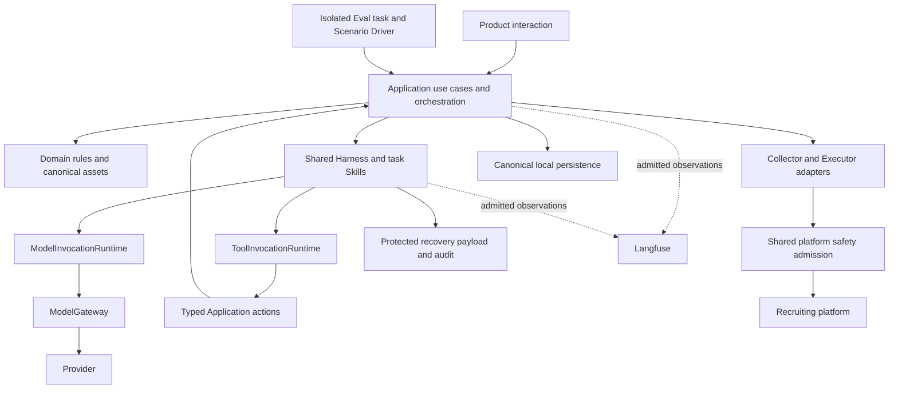

# JobHunter Architecture

> English is the authoritative documentation language. This W2 draft describes the target architecture, not an existing implementation. See [Progress](progress.md) for current joint-review and user-approval state. Contract architectural boundaries remain here; concrete document organization is in Contract Structure. Reviewed consumed Contracts are reached through Contract Index; future scopes retain their separate Contract Grill.

## 1. Authority, scope, and interpretation

The [Product Specification](spec.md) owns user tasks, entry points, prerequisites, and visible behavior. This document owns the supporting system responsibilities, business authority, dependencies, persistence, concurrency, permissions, recovery, Harness, and Eval boundaries. Repeating a product consequence here explains its mechanism; it does not create a competing definition.

The [English authoring spec](../.scratch/document-authoring-spec.en.md) and [W1 handoff](../.scratch/w1-product-spec-handoff.md) guide document production. The [Decision Register](design/grill-me-design-tree.md), six Harness records, and detailed Eval record provide design provenance. Later corrections control the specific clauses they replace, regardless of an earlier record's ACCEPTED label. The [Contract Design Inventory](design/contract/contract-design-inventory.md) is a non-normative checklist, not a schema or independent source of new requirements.

The [Acceptance](acceptance.md) draft owns required future proof of behavior, and [Development](development.md) owns delivery discipline. [Progress](progress.md) and its supporting [Traceability Matrix](progress/traceability.md) record actual status and evidence. Detailed `docs/contracts/*` remain planned and will own business/data/interface norms. This document does not supply missing fields, types, enums, state-transition tables, API payloads, database schemas, validation errors, or migrations. Existing conceptual names and bounded invariants do not finalize their representation.

The [user-approved process revision](../.scratch/document-authoring-spec.en.md#f-user-approved-delivery-process-revision) adds independent Implementation Plan as the seventh document category. W6 has authored [Implementation Plan](plans/implementation-plan.md); W7 has jointly reviewed the current documents; [Progress](progress.md) records the remaining user-review boundary. The twelve macro Slices contain independently ready milestones. After W7/user review, each milestone completes its required Contract Grill, normative writeback, interface reconciliation and upstream prerequisites before its own development; other milestones in the same Slice and unrelated Contract scope may remain pending. This later instruction changes the older Q22/S38.1 delivery ordering, not the accepted architecture. W1/W2 are document tasks, not implementation Slices. No old code, database, API, test, or completion claim imposes a compatibility obligation. Historical readers for assets produced by the new system remain required; that is distinct from importing the old system.

**Sources:** Q2–Q5, Q11, Q22, Q26, Q32, S24.2, S25.1, S29.2, S37.1, S38.1. The English-language rule and automatic use of stage handoffs are explicit user authoring instructions.

## 2. System responsibilities and dependency direction

### 2.1 Logical boundaries

SL-01.M1's accepted runtime is a loopback local backend with a browser frontend. Workspace owns first-use semantics and delivered navigation; Storage owns the stable startup-selected data directory, one-backend ownership, recognition, transactions and diagnostics. They are infrastructure boundaries, not multiple Workspace identities. The four [M1 Contracts](contracts/index.md#existing-normative-contracts) define their actual fields and protocols. Browser navigation waits for revision-checked resolution and satisfies final opener/referrer safety properties without becoming an Executor action.

JobHunter is one single-user, local-first workspace. The five navigation entries and two Advisor entry modes are owned by Product section 2; navigation organizes tasks without defining Domain ownership. Company aggregation over formal Jobs is a read view, and no unified Candidate Aggregate or tenant hierarchy is introduced. ManualApplicationEntry is a separate mutable record outside the formal Job family; its browser-opening action is ordinary user navigation, not Collector or Executor activity ([CG01-BC1](design/contract/sl-01-m1-grill.md#cg01-bc1)).

| Responsibility | Owns | Must not own |
| --- | --- | --- |
| Product interaction | Navigation, page-local unsaved editing, explicit selection/confirmation, honest display of outcomes | Fact authority inferred from UI state, model prose, or streamed text |
| Business Domain | Identity, immutable facts/assets, compatibility, grounding, approval and application invariants, versioned business policies | Provider transport, graph checkpoints, telemetry success, or third-party payload shapes |
| Application | Use Cases, dependency preparation, exact input freezing, orchestration, authorized commands, transaction boundaries, validated result persistence | Hidden consent, model-defined authority, or a second copy of Domain rules |
| Skills on the shared Harness | Bounded task semantics and protected instructions, declared inputs/outputs, allowed actions, validation and interaction policy | Independent business stores or unrestricted tool/environment access |
| Harness runtimes | Execution ownership, actual model/Tool calls, Context, budget, cancellation, recovery, and audit | Candidate facts, application progress, or permission to bypass Application commands |
| Repositories and adapters | Canonical persistence and validated source/provider/channel integration behind owned boundaries | Promotion of raw external data or exceptions into Domain authority |
| Eval and observability | Isolated experiments, appropriate checks, admitted observations, and evidence | Runtime authorization, business completion, settlement, recovery, or an alternative test-only Agent |

These are responsibility boundaries, not a prescribed package tree, process topology, or service count. Accepted technology commitments include short local SQLite authority transactions, LangGraph execution under Application/Harness ownership, and self-hosted Langfuse for Eval/observability. They do not settle the complete stack, SDK versions, deployment footprint, or storage placement.

```mermaid
flowchart TD
    UI["Product interaction"] --> APP["Application use cases and orchestration"]
    APP --> DOMAIN["Domain rules and canonical assets"]
    APP --> HARNESS["Shared Harness and task Skills"]
    HARNESS --> MODEL["ModelInvocationRuntime"]
    MODEL --> GATEWAY["ModelGateway"]
    GATEWAY --> PROVIDER["Provider"]
    HARNESS --> TOOL["ToolInvocationRuntime"]
    TOOL --> PORT["Typed Application actions"]
    PORT --> APP
    APP --> ADAPTER["Collector and Executor adapters"]
    ADAPTER --> SAFETY["Shared platform safety admission"]
    SAFETY --> PLATFORM["Recruiting platform"]
    APP --> STORE["Canonical local persistence"]
    HARNESS --> PAYLOAD["Protected recovery payload and audit"]
    EVAL["Isolated Eval task and Scenario Driver"] --> APP
    APP -. "admitted observations" .-> LF["Langfuse"]
    HARNESS -. "admitted observations" .-> LF
```

The Eval arrow means use of the real entry points in an isolated environment, not access to the live Workspace. LangGraph provides workflow mechanics within the shared execution design; the diagram does not make it a wrapper that owns Harness authority. Provider calls still pass through ModelInvocationRuntime, and recruiting-platform access remains an explicitly authorized Application workflow.

**Sources:** Q1, Q3, Q6, Q27, Q53, Q120, Q126, Q135, Q147, Q160, Q173–Q174, S5.1, S7.1, S17.2–S17.4, S22.1, S35.1.

### 2.2 Canonical data and adapter boundaries

Canonical data stays minimal and consumer-driven. Raw source output is runtime-validated into an adapter representation before it can create a JobHunter asset. External field names, temporary credentials, transport objects, and third-party error shapes are not Domain authority. Source data availability does not grant model visibility.

BossHunter, boss-zhipin-scraper, and resume-optimization projects are research inputs. Before related detailed source/channel Contracts, research must pin studied commits, inspect licenses and maintenance, and map source data through the adapter to justified canonical consumers. Quotas, delays, project layouts, and illustrative implementations in source notes are not accepted defaults or verified current upstream guarantees. W2 records the research obligation; it does not claim to have performed that external verification.

**Sources:** Q3, Q27, Q31, Q49, S7.1.

## 3. Authority, identity, and evolution

### 3.1 Asset ownership

| Concern | Authoritative owner or accepted durable result | Other consumers and limits |
| --- | --- | --- |
| Identity/contact | CandidateProfile and immutable Profile versions | Resume/render consumes exact sources; fixed name/phone/email show when populated under CG03-Q14; contact remains model-invisible by default |
| Search intent | One global PreferenceSet and immutable PreferenceSetVersion | Complete explicit configuration; Collection consumes an exact version. Current Preferences do not filter saved Jobs; independent view queries are not writes |
| Career facts | EvidenceItem owns permanent kind; its immutable EvidenceItemVersions own typed fields and shared semantic content, one current saved version per Item | Item.kind determines the fields schema; API kind is derived, never a second Version authority. Resumes and admitted Candidate Fit consume facts; import/chat/Memory/indexes are not alternate fact stores |
| Current career set at a point in time | Evidence/Baseline domain owns immutable EvidenceBaselineSnapshot and its unique durable current pointer | Exact active-current member refs; initial empty Snapshot under Q55. Physical Workspace/config placement is optional, not fact authority; no copied facts or completeness assertion |
| Formal resume presentation | Resume root and immutable ResumeVersion | Exact Evidence/Profile lineage plus independently versioned Resume-local expression and presentation under BC3; never confirmed Knowledge authority |
| Lineage and AI factual support | Exact source bindings; scoped AI support responsibility | BC3/A2 separates lineage from semantic proof; former universal ResumeGroundingSet/Ensure design is reopened, not a manual Save gate |
| Manual application entry | Independent mutable ManualApplicationEntry containing company, role title and user-provided application URL | Separate view and explicit browser opening only; no formal Job/version or analysis/application-history authority |
| Source Job content | Stable Job and immutable complete JobVersion | Requirements bind exact source; observation and current availability remain distinct; ManualApplicationEntry is not a source variant |
| Structured Job requirements | Immutable validated RequirementSet | Derived from exact JD but the sole requirements input for Fits and targeted Advisor |
| Fit findings | Independent CandidateJobFitAnalysis and ResumeJobFitAnalysis | Durable assessments with exact inputs; policy-derived scores and current-result views are not new semantic authorities |
| Proposed formal modification | Target-specific ChangeProposal and its confirmation/result relationship | Exact operation preview, not editable Resume material; Application governs commit |
| Preparation and intended external inputs | Mutable ApplicationPreparation; immutable material assets and ApplicationExecutionSnapshot | Readiness, material confirmation, execution approval, and technical Attempt remain separate |
| Real application history | ApplicationRecord and append-only ApplicationEvents | Technical ExecutionEvents cannot directly set business progress; progress is a policy projection |
| Conversation and collaboration | Durable ChatSession/Turns; independently admitted Long-term Memory | Session statements are not saved facts; Memory only owns limited collaboration semantics |

Durability does not imply factual authority. RequirementSet, Analysis, GroundingSet, and material artifacts can be durable without becoming Candidate facts. Workspace owns default-Resume configuration. Under CG03-Q55, current-baseline-pointer meaning/publication belongs to Evidence/Baseline domain; optional physical placement in a Workspace/config row does not transfer authority or introduce a Candidate root.

**Sources:** Q7–Q8, Q10, Q15–Q16, Q21, Q25, Q30–Q31, Q37, Q46, Q51, Q53–Q55, Q59, Q63, Q66, Q75, Q108, Q112–Q113, Q127, Q148–Q149, Q157, Q163.

### 3.2 Minimal evolution mechanisms

Choose each mechanism for its actual concern. Stable roots with immutable versions express content history; optimistic revisions prevent lost concurrent writes; append-only events preserve external facts; versioned policies explain derived decisions; projections expose readiness, eligibility, and progress; bounded Run outcomes describe computation. These are not interchangeable and do not justify a universal lifecycle framework.

[CG03-Q56](design/contract/sl-02-m1-grill.md#cg03-q56) explicitly adopts server-generated Common UUIDv4 for SL-02 Profile/Evidence/Baseline/Resume root and immutable-version identities. Clients reference existing IDs, never choose new formal business IDs. Identity carries no content/type/time/order, is not hash-derived and is not reused after retirement/removal. Request idempotency is separate. Historical references bind exact immutable sources. Moving a current pointer never changes an earlier consumer's meaning. For an ACTIVE Item, explicitly replacing current text with different historical text creates a new temporal version without restoring retired availability; it does not rewind the current version or select a parallel variant. Eligibility is task-specific: Candidate uses current admitted Knowledge, while Resume consumers may use its bound historical/retired Evidence and Profile versions under BC3. Ordinary new member selection remains active-current-only; permissions and source availability are separate.

Evidence grounding identifies an exact Evidence version and a controlled location in its persisted structure. Resolve it using that version's original schema reader; retain historical readers by default, do not rewrite old payloads or redirect old references. A common read projection may follow correct original interpretation. Precise reference syntax, typing, validation findings, and future evolution details await Contracts.

Hashes, provenance, version ancestry, and reference resolution support identity and audit; none alone proves semantic support, current eligibility, or recoverability of content that no longer exists.

**Sources:** Q7, Q18, Q26, Q37, Q42, Q54–Q55, Q59, Q75, Q79, Q86–Q87, Q98, Q108, Q125, Q136.

## 4. Jobs, acquisition, collection, and platform access

### 4.1 Identity and admission

One reliable platform source identity maps to one Job. Semantically changed canonical content produces a new immutable JobVersion; unchanged content updates observation metadata without manufacturing a version. Cross-platform merging and historical physical/logical merge operations are excluded.

BOSS admission atomically persists the formal Job root and first complete JobVersion after validated full detail/JD acquisition. Formal JobVersion retains complete exact canonical JD and immutable content snapshot semantics. No manual root-only admission exception remains.

ManualApplicationEntry has separate identity and mutable company/role/application-URL content, with no JobVersion, source-platform Job identity or downstream Job eligibility. Repeated edits do not create immutable business versions. Its separate view and browser navigation cannot produce Requirements, Fits, Preparation, ExecutionAttempt or ApplicationEvents. The removal request concerns current entry use; detailed retention is not inferred from formal Job history.

The normative definition owner of formal Job identity, content, completeness, versions, lineage and read semantics remains `jobs/jobs-screening.md`. `jobs/collection.md` owns acquisition and adapter workflow under that Contract; SL-08.M2 is the first planned producer and integration milestone, not a semantic owner. `jobs/manual-application-entries.md` is the separate planned entry Contract owner.

**Sources:** Q12–Q13, Q17, Q44, Q48–Q50, S9.1; later [CG01-BC1](design/contract/sl-01-m1-grill.md#cg01-bc1) supersedes the Manual Job branch only and preserves formal canonical Job completeness and immutable history.

### 4.2 Acquisition intent, collection admission and local queries

[CG02-BC1](design/contract/sl-01-m2-grill.md#cg02-bc1) separates three owners: Preferences expresses future acquisition intent; Collection consumes exact immutable PreferenceSetVersion through source planning/admission; Job Pool independently queries already-saved formal Jobs. The six dimensions and explicit-choice gate are defined in Product 4.2. Preferences does not own a source query plan, per-candidate predicate or continuing Job eligibility invariant.

SL-01.M2 supplies complete configuration, immutable versions, read/Save/concurrency and persistence. Under [CG02-S1](design/contract/sl-01-m2-grill.md#cg02-s1), all six dimensions require explicit legal choices before successful Save establishes configured state; no implicit all-empty unrestricted version. Revision admission precedes canonical no-op comparison; real changes create immutable versions. [CG02-Q11–Q15](design/contract/sl-01-m2-grill.md#cg02-q15) adds lazy atomic creation: Workspace bootstrap creates no Preference root; first valid Save creates root, first immutable version and current pointer together, with no residue after failure. Root carries the stable identity/current pointer/revision; versions carry immutable identity and owning-root reference, without is_current. [CG02-Q21–Q25](design/contract/sl-01-m2-grill.md#cg02-q21) defines complete root/version objects, revision-1 first publication, monotonic revision for real changes, successful request receipts and Workspace-lifetime immutable content retention. A replay identifies the original successful result without resetting current authority. Unconfigured reads succeed without creating state. [CG02-Q26–Q30](design/contract/sl-01-m2-grill.md#cg02-q26) fixes versioned Save/current/exact-version HTTP operations, replay-stable success outcomes and lifetime success receipts, including no-ops. Publications share one timestamp, clamped to the previous root.updated_at on clock rollback; no-op/replay refresh nothing. UUIDv4 and created_at provide no strict historical total order; current pointer identifies current, while revision orders root modifications. M2 adds no sequence field. [CG02-Q31–Q35](design/contract/sl-01-m2-grill.md#cg02-q31) fixes strict M2 input admission, bounded raw requests, nested field-error locations and explicit uncertain-Save retry. Common owns shared error representation/vocabulary and the scoped path grammar; Preferences owns triggers and operation mappings. Validated receipt replay precedes ordinary revision admission; errors do not permit hidden command reexecution. The consumed detail now has one normative owner in [Preferences PRF-001–023](contracts/candidate/preferences.md), with shared COM-033–037/WSP-007/STO-014–020 additions. Q38 keeps canonical business equality independent of JSON serialization; Q40 uses INVALID_FORMAT for known mode-incompatible value. [M2 scope review](progress/traceability.md#62-sl-01m2-reviewed-scope-and-interface-evidence) records readiness; implementation remains separate.

SL-08.M2 owns the actual source consumer. `jobs/collection.md` defines exact-version query/admission mapping and source adapter workflow; `jobs/jobs-screening.md` remains the sole definition owner of formal Job admission/content/history and local query semantics. It retains its catalog filename but supplies no M2 QuickScreen component. Search keywords need not appear literally in returned titles. No implicit synonym or model query expansion is introduced in the first release.

Source-expressible constraints may be pushed down; remaining constraints require the defined deterministic admission where metadata supports it. Confirmed list-stage rejection stops detail fetching, and rejected source content is not a durable Job or recoverable audit substitute. Missing/incomparable metadata does not establish conflict or satisfaction. Complete Job/JobVersion admission remains atomic. Collection audit retains usage, aggregate reasons, failures, risk and stop information, not rejected title/company/URL/JD bodies. Acquisition admission does not evaluate CandidateProfile, Evidence, Resume or RequirementSet, and does not parse Requirements.

Each CollectionRun fixes one complete exact PreferenceSetVersion. Later Save affects future Runs only, without changing the running input, initiating collection or automatically restarting it. Explicit stop prevents subsequent access and preserves committed Jobs. Saved Jobs are not re-screened, hidden, marked preference-conflicting, deleted or made ineligible for downstream work merely because current Preferences changed.

JobPoolViewFilter queries existing Jobs independently of acquisition intent. Frontend state and/or backend query parameters may implement it; concrete query/persistence representation remains later Contract work. It does not Save Preferences, create versions, affect future collection, mutate Job authority or produce QuickScreenResult. Genuine Job availability, exact content, material eligibility, runtime admission, safety and consent remain in their existing owners.

**Sources:** Q45/Q49/Q55/Q56/Q110/Q161, S9.1/S17.1, with explicit partial supersession under CG02-BC1/Q6–Q10/S1. The earlier current-Preferences filtering and dispatch QuickScreen gate do not survive; formal Job versioning, fixed collection provenance and exclusion of duplicate screening authority do.

### 4.3 Observation and safety boundaries

Content capture, reliable source observation, and direct availability verification answer different questions. Freshness and availability policies derive views: age can imply staleness, not closure; absence from one search cannot prove closure. Verified closure blocks new automatic application without deleting historical content or applications. Human reporting remains distinguishable from verified source observation. These are formal Job concerns; ManualApplicationEntry has no source observation or availability model. Its explicit browser opening performs no application-controlled extraction, verification or sending.

PlatformAccessSafety is shared persistent admission for platform/account capacity, risk, and action permission. Collector, Browser Executor, and any future implemented Monitor check it before every actual access. Workflow Run/Attempt ownership, budget, recovery, and execution authorization remain independent.

Ordinary page/selector/browser failure may stop its workflow without becoming account risk. Predictable capacity may recover by policy. Strong classified risks require user handling and explicit restoration; no restart, cooldown-only recovery, account/tab switching, or concurrency increase may bypass them. Shared safety admission is never ExecutionApproval. No numeric platform quotas or mandatory Monitor are introduced.

**Sources:** Q36, Q49–Q50, Q160–Q161, Q164.

## 5. Fact maintenance, formal Resumes, and derived work

The consumed manual scope is published in [Profile](contracts/candidate/profile.md), [Evidence](contracts/candidate/evidence.md), [Resume](contracts/candidate/resumes-grounding.md) and [Candidate Save](contracts/candidate/candidate-save.md), with [S2 scope review](progress/traceability.md#63-sl-02m1-reviewed-scope-and-interface-evidence). These bodies own detailed fields/IDs; actual M2 rendering and future AI/Import extensions remain separate.

### 5.1 Preparation before authority

[CG03-BC3/A1–A5](design/contract/sl-02-m1-grill.md#cg03-bc3) supersedes current-only Resume sources, shared Resume wording and all-Resume propagation. Candidate Knowledge owns confirmed structured facts and source semantic blocks. ResumeVersion composes exact published EvidenceItemVersions and ProfileVersion with independent local expression and presentation; composition is not inheritance from a Candidate aggregate.

CG03-Q49 initializes a unique Profile root and first immutable all-null contact snapshot when creating SL-02-capable storage, without creating a Resume or claiming identity confirmation. Existing storage uses explicit migration, not normal-startup repair; Preferences' lazy creation is unchanged. Q51 fixes Profile root identity/current pointer/revision/timestamps and immutable version contact fields/metadata; initial root revision and content schema_version are 1. Q55 separately initializes an empty EvidenceBaselineSnapshot and its unique durable Evidence/Baseline-owned current pointer; its physical row placement remains implementation-defined. Atomic initialization/evolution details remain owned by Storage.

CG03-Q52 fixes EvidenceItem root identity/kind/ACTIVE-or-RETIRED status/current pointer/revision/timestamps and immutable Version identity/owner/schema/fields/content/creation time. First publication is atomic with root creation; retirement retains the last current-version pointer for history while removing the Item from current Baselines. CG03-Q48/Q50 gives EvidenceItem sole ownership of immutable kind. Version business content consists of type-specific fields plus common semantic content interpreted through the Item; any API kind projection must derive from that owner. A wrong kind requires explicit new-Item creation/optional retirement, not in-place conversion or lineage migration. Reject cross-kind/unknown fields. Evidence fields/taxonomy and Q32 semantic AST remain: EDUCATION/WORK_EXPERIENCE/PROJECT/SKILL/AWARD/CERTIFICATION with paragraph/list source text, meaningful order and no persistent atomic Assertions. Candidate degree remains separate from Preferences' requirement ceiling. project_url is an Evidence fact; Resume inline hyperlink metadata belongs to presentation and creates no new Evidence dependency. URL value validation is shared, not business ownership.

Under [CG03-Q36](design/contract/sl-02-m1-grill.md#cg03-q36), initial selection copies only the exact source body into independently owned local expression, preserving structure/order with no marks. Structured facts continue to resolve from the bound version; no private factual overrides or ongoing body synchronization arise. Existing source facts are edited in Knowledge. Ordinary Resume member selection captures an active Item's exact current version; existing bindings may remain historical or retired. No arbitrary history picker or implicit latest substitution. New Evidence from the editor must commit through a formal Knowledge form before entering the Resume Draft. Import similarly uses explicit fact confirmation/Knowledge Save before local Resume editing/Save. These two stages are a product choice: a combined technical transaction could preserve authority, but is not the v1 workflow. Committed first-stage facts survive second-stage cancel, close or failure.

Manual Resume Save validates exact reference existence/ownership and document structure, not semantic entailment of user wording. Local wording may omit/reorganize facts or contain unsupported statements without becoming Knowledge. AI/Advisor-generated rewrites retain explicit support constraints and cannot silently write new facts. No universal completeness or KnowledgeConfirmation gate is introduced. Drafts remain page-local with Save/Discard/Cancel and no crash-recovery promise.

### 5.2 One atomic authority change

CG03-Q59 defines the immutable Resume envelope with exact profile_version_id, header_presentation, ordered sections and document_presentation plus identity/schema/creation metadata. Q61 settings are four required values: logical font family (SOURCE_HAN_SANS/HEITI/SONGTI/KAITI), body font_size_pt, full line-box line_spacing_pt and canonical theme_color. RES-012 owns their normative ranges/defaults; Renderer owns actual fonts/fallbacks, not an OS-path-bearing Contract. CG03-Q66 fixes half-point steps for both size/line spacing, JSON numeric value semantics, exact font enums and exact six-digit Hex input canonicalized uppercase without trim; Renderer mapping remains separate. Setting changes advance only this Resume. Header presentation cannot copy Profile contact values; selected Evidence refs do not imply binding the whole Baseline. No root management metadata or compulsory general GroundingSet reference is added.

CG03-Q63 scopes M1 Knowledge commands to one Item per create/update/retire; the new Baseline still captures the complete active-current set. Future atomic multi-item Import needs an explicit batch interface extension rather than pretending separately committed item commands can roll back together. CG03-Q65 uses full replacement of each owner's business content, not generic PATCH: no absent-means-preserve, array merging, client-set publication metadata or implicit rename/lifecycle/default mutation.

[CG03-Q67](design/contract/sl-02-m1-grill.md#cg03-q67) defines nine explicit POST mutation routes with success 200. Path identity is not duplicated in body; existing-root concurrency uses revision, while new Evidence/Resume creation has no fabricated initial revision. Q76/Q84/Q85 subsequently fixes write bodies, default-pointer preconditions and success-result fields; Q86–Q90 subsequently fixes receipt encoding and lifecycle/reference/recovery classes; EVD-013/014, SAV-001–016 and STO-021–028 now define the complete M1 reader/command/storage boundary; MAT-001–003 supplies source/currentness only, with actual rendering in M2.

CG03-Q68 requires a separate client request_id on every M1 user mutation and a success receipt committed atomically with its owned changes, including successful no-op receipts. Matching replay returns the original confirmed result without reexecution or reverting current state; a successful key reused with another operation/target/revision/canonical content conflicts. Replay differs from ordinary new-command revision-before-equality checks. CG03-Q73 scopes a shared Common UUIDv4 request_id namespace to the nine SL-02 commands per Workspace, independent of published Entry/Preferences namespaces. Receipts persist for the Workspace lifetime without TTL or retire/remove cleanup; no Universal Idempotency Framework is implied. Q74 checks parsing, structure/values and canonicalization before receipt lookup; Q98 permits the narrow Evidence Update read of immutable target Item.kind to select the schema, without mutable eligibility admission; matching replay returns the original outcome and mismatching successful keys conflict. Only a receipt miss reaches current revision/lifecycle/freshness admission and atomic execution. Definite uncommitted failures have no success receipt; unknown outcomes keep the same original request/key. Q86/Q87 below fixes logical receipt and fingerprint representation; Q93/Q94 and Q96–Q100 settle storage/admission boundaries for normative consolidation.

CG03-Q69 admits Evidence mutations against the target Item revision without a client expected Baseline or global Knowledge revision. Within the atomic boundary, each publication derives the complete latest ACTIVE/current membership, preserving other committed Item changes. Different-Item writes do not conflict merely because Baseline advanced; same-Item revision conflicts remain. Storage synchronization must prevent lost membership; a client-observed Snapshot cannot replace the latest set.

[CG03-Q75](design/contract/sl-02-m1-grill.md#cg03-q75) defines GET profile, exact EvidenceItem root and exact Resume root readers returning 200 with their named root/current-Version pairs from one consistent snapshot. The pointer and returned Version ID must agree. Retired/removed roots remain readable with last current versions, not editable; nonexistent Evidence/Resume IDs return 404. Resume refs never hydrate through latest-source substitution. CG03-Q78 adds exact ProfileVersion/ResumeVersion reads, EvidenceVersion reads with owner-derived kind, and current/exact Baseline Snapshot reads via the routes recorded in the decision register. Missing requested exact IDs return 404 without current substitution. Current Baseline returns a real Snapshot even when empty; no history-list/sort/picker is introduced.

Atomicity applies to each actual command's owned participants, not every referencing Resume. Prepare validates structure, exact refs, revisions and applicable authorization before a short SQLite transaction; no model/network/render work occurs inside it.

- Knowledge Save publishes changed Evidence versions/current pointers, the exact current baseline, the Evidence/Baseline-owned current-baseline pointer and the command receipt together. Material intent is not pre-delivered by M1 under Q95; actual later consumer requirements extend the owning transaction. Retirement removes the Item from the new baseline and preserves referenced history. Neither operation updates Resumes or their material currentness.
- Profile Save publishes the changed Profile version/current pointer and its required metadata atomically; it does not update Resume snapshots or career baseline.
- Resume Save publishes its local expression/presentation and exact source bindings as a new ResumeVersion, advances that Resume's current pointer, coordinates applicable default configuration, lineage and its command receipt. Q95 retains exact-source/currentness boundaries in M1 and adds actual demanded material intent with its M2 consumer, atomically when required. It does not mutate Knowledge, Profile or other Resumes.

CG03-Q37 requires newly added membership to reference an active Item's current version at commit, rejecting the complete command on intervening update/retirement. Validate this within the authority transaction so preparation cannot race a later source write. Already-published membership may retain its unchanged exact historical binding. CG03-Q45 applies the same active/current-at-commit check when explicitly replacing an existing Evidence binding. Reject an intervening update/retirement without silently upgrading or reverting; an explicit cancellation of adoption may retain the old published binding. Exact command/base preconditions are defined by SAV-001/003/004 and RES-011.

CG03-Q60 applies current-at-commit admission to first or explicitly switched Profile references only. An unchanged reference from the preceding saved ResumeVersion retains historical validity. Reject raced first/switch publication without latest substitution and preserve Draft; explicit cancellation may keep the old reference.

CG03-Q57 requires root revision admission before canonical equality for ordinary new commands; all new roots start at revision 1. A valid no-op publishes no version/revision/Baseline. Real content changes publish a fresh Version and increment the owning root once; rename/first retire/remove increments the root with only its owned lifecycle effects, not an artificial content version. A→B→A does not reactivate old IDs. At Common revision maximum, real mutation fails while a valid no-op can succeed. Q64 now fixes repeated target-state retire/remove at matching revision as a no-op; stale revisions still conflict. Same-request replay remains a separate command protocol.

CG03-Q58 assigns one publication_time to each real commit: max(now, old updated_at of roots actually modified, previous current Baseline.created_at only if that commit advances Baseline). Profile-only/Resume-only changes do not consult Baseline time. New roots use it for both times, modified roots for updated_at and new immutable Versions/Snapshots for created_at; old root created_at stays fixed. Reads/no-op/replay refresh no business times. Reuse Common UTC milliseconds; no global clock/sequence or strict total history order from timestamps/UUIDs.

A failed command leaves none of its owned changes committed; independent earlier commands remain committed. Revisions, idempotency and truthful uncertain-outcome recovery remain required. Explicit source/contact adoption is a Resume mutation; no automatic fuzzy matching, text relocation or presentation migration accompanies Knowledge publication. CG03-Q38 separates explicit source adoption from local-body reset: adoption retains local expression/marks/links and changes source-provided structured facts; the UI asks whether to replace expression from the adopted source, and only explicit choice authorizes replacement. Retention makes no semantic-support claim. Explicit adoption/reset is expressed through the complete Resume document Save in SAV-001, subject to RES-010/011.

CG03-Q53 keeps Resume name/availability/current pointer/revision and root timestamps outside immutable document content; root creation includes its first Version. Q54 sections own grouping/order with members containing exact Item+Version refs and local content, without independent section/member IDs or position fields. Validate Version ownership and section-kind agreement against the Item; grouping does not own fact kind.

Header retains fixed full_name/phone_number/email from the bound ProfileVersion: no hide controls/private override, populated display, null omitted. Optional Header is local presentation. Resume-local block organization, BOLD/ITALIC/UNDERLINE/LINK, section/member order and document-wide typography are independently versioned. No Evidence marks overlay or format-only EvidenceVersion exists. Draft-only empty sections are omitted by the client; the server rejects empty formal sections. Empty formal section collection is legal. Under CG03-Q39/Q40, a member may have empty content without fallback; nonempty content rejects empty blocks/lists/items. Resume paragraphs use ordered runs, list blocks use ordered items of runs, and runs carry text plus BOLD/ITALIC/UNDERLINE/LINK marks (at most one LINK). No block/item/run IDs or list marks. CG03-Q41 orders unique marks and merges adjacent equal canonical marks within a paragraph/item; duplicate marks are invalid. Q42/Q43 separates trimmed Evidence source strings from preserved local run text: reject controls/line separators, empty runs and empty paragraphs/items; a local run consisting only of permitted Common fixed-set whitespace has no marks under Q46; retain those exact characters. Q47 validates every raw run before canonical merging so invalid marked whitespace/empty text/duplicate marks cannot be repaired by concatenation. Q44 fixes per-body structural/text/canonical-run limits; Q62 additionally fixes whole-document member/local-text capacities; Q80 now fixes raw-node/depth/transport budgets below. Evidence keeps its distinct plain semantic AST. These rules do not add an AI or rendering step to Save.

CG03-Q79 explicitly adopts a strict S2 JSON boundary: UTF-8 application/json with compatible charset=utf-8, absent/identity Content-Encoding, no malformed JSON/duplicate keys/non-object request roots/unknown fields/coercion, and owner-specific missing/null semantics. Defined GET operations admit no query/body; POST admits no extra query. Reuse Common error object shapes and sanitized output; Q83 explicitly adopts the small nested Common path grammar for S2, with pre-canonicalization submitted-array indices, known-parent UNKNOWN_FIELD without key echo, expected missing-field paths and common-parent cross-field errors; error ordering is not protocol. M1 path behavior remains unchanged. Remaining status mappings require S2 definitions.

CG03-Q80 caps POST bodies at 8,388,608 bytes for Resume Create/document Save, 1,048,576 for Evidence Create/Update and 65,536 for the other five commands. Limit raw JSON values to 100,000 nodes (each object/array/scalar including root, excluding keys) and object/array nesting to 32 containers including root. Count bytes while reading, enforce depth while parsing and all raw budgets before canonicalization; merging/deduplication/truncation cannot repair excess. These are cumulative admission bounds alongside business capacities. Byte excess is 413 REQUEST_TOO_LARGE; Q82 maps node/depth excess to 422 VALIDATION_ERROR with STRUCTURE_TOO_COMPLEX at $, without promising continued traversal. Byte excess has an empty field_errors array. Common owns representation; S2 owns trigger thresholds, with no changes to existing consumers.

CG03-Q84 fixes the seven remaining command bodies alongside Q76's remove/default inputs, without a generic payload wrapper or client publication metadata. CG03-Q85 freezes successful results with request_id, outcome (CREATED/UPDATED/RETIRED/REMOVED/UNCHANGED) and operation-specific fields in the decision register. Receipt persistence must reconstruct command-time mutable root/selection values and exact immutable versions rather than querying today's root to fabricate an old result. These snapshots are result history, not a second authority. Evidence no-op captures the then-current Baseline ID without advancing it; replay preserves that ID after later Baselines. Resume Create/default results likewise preserve their original selection revision/ID after subsequent switches. Rename replay preserves original name/revision. Returned Versions do not imply a new publication; replay uses original outcome, never REPLAYED or latest-state mutation. CG03-Q86 fixes CandidateCommandReceipt fields request_id/command_type/request_fingerprint/schema_version/outcome/result_snapshot. The typed result snapshot preserves complete mutable roots/selection plus exact immutable Version/Baseline IDs, with root-pointer/Version agreement; no duplicate immutable bodies/raw request, receipt revision/lifecycle or second authority. Nine operation enum values and per-operation snapshot fields are in the decision register.

CG03-Q87 hashes fixed UTF-8 prefix JobHunter:SL02:Command:1 followed by one LF, then exactly the typed encoding of [command_type, target_id, canonical input excluding request_id]. The outer encoding starts a3:. Include caller revisions/replacement/content and canonical path ID (null for no path ID), excluding generated post-commit values. The codec distinguishes null, booleans b0/b1, UTF-8 byte-length strings, canonical decimal numbers, ordered arrays and Unicode-code-point-sorted object keys; lengths/counts are unpadded ASCII decimal. Negative zero canonicalizes to zero; non-finite inputs are rejected. Complete normative byte grammar is owned by SAV-010, traced to CG03-Q87; codec type support never weakens command field admission. Existing SL-01 encodings remain unchanged.

CG03-Q98 supersedes Q88 payload-union inference. Evidence Update admits its common envelope, then reads the path target EvidenceItem's permanent immutable kind, validates fields/shared content under that authoritative schema and canonicalizes before receipt lookup. This is a schema-discriminator read, not revision/lifecycle/freshness admission: even a RETIRED retained Item can supply kind for replay. Missing WORK_EXPERIENCE company_name is REQUIRED at fields.company_name. No Update kind field is added; Create retains its declared kind. At this early kind lookup, a missing target returns 404 NOT_FOUND before fingerprint/receipt processing, even when request_id was already used for a different target; REQUEST_CONFLICT does not take precedence. This is the narrow Q98 exception to general receipt ordering. Successful Update targets are retained; actually detected corrupted stored references remain Q100 integrity failures. Only a receipt miss reaches mutable-state admission. Q89 classifies missing path/GET targets as 404 NOT_FOUND; inactive write/default/replacement targets as 409 INVALID_STATE; noncurrent/inactive newly adopted Resume sources as 409 SOURCE_CONFLICT; final-Resume removal as 409 LAST_RESUME_REQUIRED; supplied missing/wrong-owner references or Resume section/Item-kind disagreement as 422 VALIDATION_ERROR with INVALID_REFERENCE at their path. Q98 replaces the former Update alternate-schema mismatch trigger with field validation against the authoritative kind. Retained historical bindings and lifecycle no-ops retain their exceptions; existing conflict/capacity/exhaustion codes remain distinct. Missing persisted lineage is not thereby ordinary bad input.

CG03-Q90 distinguishes confirmed success/definite rejection or established non-commit from unknown write results. 503 STORAGE_UNAVAILABLE requires established non-commit; 503 OUTCOME_UNKNOWN, timeout/connection loss or another 5xx without non-commit proof require verification with the same original request/key. Clients do not infer success from present-state similarity, change the pending intent or repeat creation under a fresh key. Latest-state read failure cannot undo confirmed success. Uncertainty belongs to command recovery, not business state.

CG03-Q91 adds the ACTIVE Evidence list: complete roots plus explicit current_evidence_item_version_id equal to each root pointer and the corresponding fields, from one snapshot. No duplicate kind/status/revision projection or full body; order by creation time/canonical ID ascending. Q92 atomically caps ACTIVE EvidenceItems at 1,000 with CAPACITY_EXCEEDED for new excess creates; retired history remains outside the count and replay allocates no slot.

CG03-Q96 retains configured loopback Host/Origin admission (403 ACCESS_DENIED), without fixing development defaults as S2 constants. Malformed/unsupported encoding, media/Content-Encoding or malformed/duplicate-key JSON is 400 BAD_REQUEST; parseable invalid root/types/fields/values and prohibited query/GET body is 422 VALIDATION_ERROR. Byte excess remains 413 REQUEST_TOO_LARGE; node/depth excess remains 422 with STRUCTURE_TOO_COMPLEX at $. Preserve required processing phases, without an exhaustive priority order among simultaneously invalid inputs.

CG03-Q97 assigns stable shared FieldError vocabulary/representation exclusively to Common, with field/operation triggers owned by consuming Contracts. S2 maps missing/type/unknown/blank/text-length/prohibited-character conditions to REQUIRED/INVALID_TYPE/UNKNOWN_FIELD/BLANK_VALUE/TOO_LONG/INVALID_CHARACTERS; invalid enum/month/contact/URL/color formats and invalid combinations to INVALID_FORMAT; numeric range/half-point-grid/collection bounds to OUT_OF_RANGE. Invalid intervals/line-spacing combinations/duplicate sections, members or marks locate their common parent/collection. Missing/type errors are not format errors; return at least one accurate field error without ordering/exhaustiveness guarantees. Q82 complexity and Q89 reference classes remain effective as scoped by Q98.

CG03-Q99 requires concurrent same-key/same-fingerprint commands to converge on one successful mutation and its original committed result. Different fingerprints cannot both succeed under that key; the loser observes REQUEST_CONFLICT once a receipt exists. Handle database uniqueness races safely and classify committed receipt state, not as invented revision conflict. Bounded safe transaction-completion recovery never secretly reexecutes business commands; established non-commit and uncertain commit retain their distinct storage outcomes. Rejection of a retry does not prove a prior uncertain attempt uncommitted or justify new-key creation.

CG03-Q100 treats missing/wrong-owner persisted root/Resume/Baseline/receipt references as integrity faults: affected reads return 500 INTERNAL_ERROR without partial results, omitted members, current substitution or fabricated empty authority. Receipt reconstruction failure cannot rerun the command. Stop affected writes with safe rollback; ambiguous commit remains OUTCOME_UNKNOWN. Internal diagnostics do not expose raw content/database details. Ordinary absent requested IDs remain 404. Startup rejects detected missing mandatory initial records/incomplete storage without repair; exhaustive historical-body scans are not required.

### 5.3 Deletion, defaults, and eligibility

First/default/last-Resume and explicit chat reselection rules survive. CG03-Q70 makes frontend choose the next ACTIVE Resume in canonical list order, or previous if no next exists, and show that exact replacement in the confirmation dialog. Remove carries the confirmed replacement_resume_id; backend atomically removes the default and changes the pointer, rejecting changed-default/inactive-replacement/other precondition races without automatic fallback. Last-ACTIVE removal is forbidden; non-default removal leaves the default unchanged. Q71 orders ACTIVE Resume roots by created_at ascending then canonical resume_id string ascending, without assigning chronology to UUIDs or reordering on rename/Save/default change. Dialog-opening list state supplies the confirmed replacement; a later insertion alone does not invalidate it or trigger recomputation. Q72 defines DefaultResumeSelection as small Workspace state (default_resume_id, revision), initially null/1, without a heavyweight aggregate or generic configuration framework. Real pointer changes, including first creation, increment once; matching-revision same-target is no-op and stale revision conflicts even after A→B→A. Ordinary Resume changes do not advance it; no selection history is introduced. CG03-Q76 gives set-default request_id/revision/default_resume_id and remove request_id/target revision/default_resume_selection.revision/required nullable replacement_resume_id. After pure admission and receipt miss, target revision precedes already-REMOVED no-op; only an ACTIVE target proceeds to selection revision and default/non-default semantics. Thus even non-default active removal checks the selection token, but a matching removed-root no-op ignores current default/replacement state. Active default removal requires a different ACTIVE replacement, non-default removal requires null; replacement rename/document changes need no replacement revision. Required revision overflow rejects the entire command; valid no-op remains possible. Q77 GET /api/v1/resumes returns full ACTIVE roots in Q71 order and default_resume_selection from one snapshot, no document bodies/pagination/filter/sort controls. Initial result is [] plus null/1; Q81 caps ACTIVE Resume roots at 100, atomically enforced on new creation with 409 CAPACITY_EXCEEDED; removed roots/history/receipts are retained outside this count, existing mutations remain possible and successful replay allocates no new slot. Q84 supplies no caller default token for Create: the first successful ACTIVE creation sets default null→new root and selection 1→2, while another concurrently prepared creation can commit preserving that default. Observing null earlier is not a conflict; capacity/source/other admission still applies. Default selection changes no ResumeVersion/source binding. Logical Resume removal preserves Knowledge and immutable history. Removing a member only changes the selected Resume.

Knowledge retirement changes current membership/baseline, never referencing Resumes. Usage counts are information, not authorization or a requirement for cascading edits. Retain exact published Evidence/Profile versions required by Resume/Analysis lineage. Existing bindings remain valid even after newer publication/retirement; new ordinary selection excludes retired Items. Retirement is distinct from privacy revocation, payload unavailability or comprehensive erasure, whose real consumer admission rules still apply.

CG03-Q55 snapshots reference every ACTIVE Item's current version exactly once, canonically ordered by Item ID without temporal/presentation meaning. Retiring the last active Item publishes a new empty Snapshot while retaining the unique non-null domain current pointer; a read, Profile edit or Resume edit cannot advance it.

CG03-Q64 lifecycle is one-way in v1: retired Evidence rejects update, removed Resume rejects content/rename, and neither accepts implicit restoration through Save. Historical root/version reads remain supported under actual access/availability rules. A future restore requires explicit new Contract scope; recreating current availability uses a new identity.

No automatic update, alternate current-fact substitution, generated replacement or source erasure is permitted. Empty Knowledge/Resume content remains legal with task-specific prerequisites.

### 5.4 Grounding and demand-driven artifacts

BC3/A2 separates resolvable exact lineage from semantic factual support. Manual Save cannot claim fact-verified Resume content merely because its sources resolve. The old universal ResumeGroundingSet/EnsureResumeGroundingSet semantic/current-fact gate is superseded; whether to retain a narrower support object, its name and representation remain detailed Contract decisions. AI/Advisor rewrites still need explicit support; exact history/readers and permission checks survive independently.

Candidate Fit compatibility follows its exact current admitted baseline. Resume Fit follows the specified document and cannot inspect Knowledge to fill unexpressed facts. Knowledge/Profile updates alone do not invalidate unchanged Resume documents, their analyses by source freshness alone, rendered artifacts or demanded work. Actual permissions, source availability, target Requirements and task policies remain independent compatibility concerns.

CG03-Q95 supersedes M1-first intent delivery: M1 owns saved authority, exact retained sources/currentness, local Draft preview and Save-not-output-ready semantics. Actual demand/configuration/durable intent and artifact execution are delivered together in M2. M2 extends candidate-save/Storage atomically whenever an existing real material demand requires it; no lossy post-commit notification or speculative M1 queue substitutes for that extension. Persist required derivative intent with the actual owning Save or later demand. Render after commit from exact Resume/configuration inputs; local A4 Draft preview is non-authoritative and separate. Reuse compatible outputs/work; skip truly superseded demand and fence stale publication. A source current-pointer change alone is not superseded Resume demand. Rendering failure does not roll back saved facts/documents; safe local recovery never authorizes replay of model/platform effects.

**Sources:** CG03-BC3/A1–A5/Q31–Q35 explicitly supersedes affected original Q63/Q75–Q77/Q87/Q96–Q98/Q108/Q114/Q118–Q119/Q151/Q153/Q163 and earlier CG03 clauses. Default/last, privacy, exact history, per-command atomicity and Q147/Q150/Q152/Q165 demand discipline survive.

CG04 closes M2 as explicit exact-version demand. Materials owns immutable configuration, derived Manifest provenance, Artifact identity/bytes and output conformance; Derived Work owns independent Intent, shared exact-target Work, claim identity and terminal outcomes. Application admission commits receipt + Intent + verified Artifact binding, existing Work association, or new Work and association atomically. Original receipt replay is an acceptance snapshot independent of current readiness. Candidate Save creates no speculative intent or moving target in this scope; its conditional future atomic participant rule remains unchanged.

An internal source projection supplies complete exact Resume/Profile plus ordered Evidence identity/kind/structured fields. It validates actual consumed inputs without requiring unused Evidence expression payloads and does not weaken existing full Candidate GET/Save. Historical exact lineage is not a second authority in Manifest. New demand admission differs from previously accepted execution; ordinary source currentness/removal cannot revoke that accepted exact demand.

The Coordinator validates attempt-scoped candidate output and durably prepares its immutable bytes before atomically publishing Artifact/Manifest, Work success and all pending Intent results. Renderer code cannot publish business state. RUNNING writes require current attempt fencing; a known unavailable configuration may atomically fail QUEUED Work without claiming, conditional on observed count/state. Recovery preserves captured limits, reconciles unknown commits first and never confuses logical timeout with physical renderer exit. Pure reads do not generate, recover or repair. Concrete rules are in [Derived Work](contracts/foundation/derived-work.md) and [Storage](contracts/foundation/storage.md#sto-029); no distributed lease/queue or unconditional process kill is required.

## 6. Requirements, Fit, and analysis orchestration

### 6.1 Independent dependency preparation

Application owns EnsureRequirementSet. For an exact JobVersion and compatible parser/prompt/schema/validation configuration, reuse a usable immutable Set or create one independent RequirementParse Run. Creation and default activation are separate; a validated Set may activate automatically, while historical consumers retain exact identities. Downstream failure does not delete the successful dependency.

RequirementParse receives complete exact JD for one semantic extraction and at most one deterministic-validation-guided repair. The model interprets meaning; deterministic code checks structure, source support locations, duplicates, emptiness, and verifiable invariants. Structural validation does not prove zero semantic omission. Uncertain necessity/logic is retained, not guessed. A second invalid output fails closed; no usable assessment units means a pre-Fit dependency failure, not a perfect empty-set result or another retry allowance.

Candidate Fit, Resume Fit, and Job-targeted Advisor use the exact RequirementSet as their sole Job-requirements input. They cannot independently reinterpret full JD. General Advisor requires no specific Job/Set, and neither Advisor mode requires a prior Fit.

Shared parse production uses a database-backed atomic claim/unique target/CAS correctness boundary across processes. A process-local mutex is only an optimization. One owner pays actual parse/repair; waiters reuse without duplicate charges. Waiter cancellation affects only waiting. Owner cancellation/failure/unknown outcome yields dependency-unavailable without automatic takeover, transferred budget, or reparse. Explicit Retry first checks for a compatible durable result.

**Sources:** Q10, Q14, Q24, Q58–Q59, Q110–Q111, Q117, Q121, Q142, Q144, Q171.

### 6.2 Independent analysis scopes

| Task | Exact semantic input and scope | Result boundary |
| --- | --- | --- |
| CandidateJobFit | RequirementSet, current saved Evidence baseline, and all task-admitted Candidate facts | Independent CandidateJobFitAnalysis; whole-baseline compatibility |
| ResumeJobFit | RequirementSet, exact eligible saved ResumeVersion, necessary exact-lineage metadata, without a manual factual-entailment gate | Independent ResumeJobFitAnalysis; no unexpressed Candidate facts, other Resume content, or Candidate Fit supplementation |

BC3 keeps all Resume-local expression, including Optional Header, out of Candidate Knowledge authority and Candidate Fit inputs. Resume Fit assesses what its admitted exact document expresses, not whether current Knowledge verifies it. The exact permitted projection/privacy rules remain Contract work; lack of Knowledge support alone is not a manual Resume eligibility rejection. Opposite Candidate/Resume outcomes are valid in either direction.

Each uses v1 Full Context, one structured evaluation, and at most one validation-guided repair subject to Run totals. Neither has an autonomous Evidence Tool loop. The tasks have separate Run identity, failure, retry, history, and result selection. Shared Requirements or operation budget does not combine their semantic Runs. Advisor may use compatible results for transient comparisons, without creating CoverageAnalysis, a score gap, or a guaranteed score ordering.

The assessment-producing ContextFrame must prove admitted input inclusion, complete Requirement coverage, valid references, and valid output. FULL_CONTEXT alone does not establish bounded MISSING. Candidate MISSING is absence of support in saved admitted Knowledge; Resume MISSING is absence of expression after complete exact-Resume inspection. Privacy exclusion, incomplete inspection, truncation, or unverifiable judgment remains UNKNOWN. Neither negative proves real-world incapability.

Deterministic versioned ScorePolicy derives display/ranking summaries from each analysis's assessments. Hard gaps cannot be compensated by many minor matches; UNKNOWN is not a fixed low score. Valid analysis may lack a comparable total. Preserve original score or unavailability and original policy, exclude unscored results from ordinary numeric ranking, and never borrow a prior score. Explicit rescoring derives a separate projection under a common policy; missing required dimensions make it unavailable. Numerical weights/thresholds remain pending.

**Sources:** Q19, Q46, Q51, Q72, Q76, Q82–Q83, Q108, Q112–Q115, Q121, Q168, S22.1. Q112/Q115 replace joint Fit, Coverage, and Resume-specific NOT_PRESENT interpretations.

### 6.3 Selection, concurrency, and publication

DeepFit(Job, Resume) is the unified product workflow; DeepFitBatch is durable Application orchestration, not a third Analysis, chat Session, Aggregate, or cross-Job transaction. One invocation pair shares the same exact RequirementSet and independently frozen baseline/Resume. Per-Requirement UI shows both assessments and their own source versions; no merged fact pool, Coverage or required score ordering. Failed/unavailable sides retain independent status and can be retried inside DeepFit. Internal Candidate/Resume capabilities remain separately executable; the product entry requires a Resume. Freeze known user selections first; prepare dependencies; then freeze each complete independent analysis request. Do not invent a placeholder Set or silently replace selected exact inputs. Before dispatch validate source/requirements compatibility, task-specific eligibility and permissions; a newer/retired Evidence binding alone does not reject an existing Resume. Failed final validation after a call preserves usage/audit without publishing invalid analysis.

Distinct targets can run concurrently, but only one effective analysis runs for each target. Backend controls enforce the invariant independently of UI disabling and distinguish actual exact Resume targets. The current view selects the latest successful compatible result; a failed rerun preserves an older compatible success. There is no latest-intent arbitration among overlapping same-target Runs. Recovery releases ended slots and fences obsolete writers without declaring uncertain remote spend free.

An oversized input or failed/cancelled/budget-blocked task does not roll back another successful analysis or dependency and creates no business negative judgment. Revocation affecting protected exact input after freeze terminates that task; no silent scope shrink, revoked-input repair, or valid current-result publication. New scope needs a new task.

**Sources:** Q23, Q35, Q40, Q110, Q112, Q116, Q122–Q124, Q142, Q172, S5.3, S22.1.

## 7. Session, Advisor, Proposal, and confirmed changes

### 7.1 Durable interaction and actual input provenance

Unified ChatSession owns durable conversation and explicit scope/result references. It is not a waiting Agent process or mode-specific targeted Session. Preparation entry creates a new chat with references/intent; business bodies enter through admitted lazy reads. Each user request executes bounded work; later requests reconstruct admitted context rather than revive an old Agent.

Discussion/read selection follows current explicit request, Session adoption, originating Preparation, then Workspace default. A default change does not silently switch ongoing discussion. First lazy resolution pins the actual exact version; later reads of that task object retain it. Querying another Resume does not change the editing target. Unrelated concurrent writes do not upgrade the Run's input.

Suggestions may cite saved Evidence or actual user-stated Session facts. SessionContextRef/UserTurnRef establishes conversational provenance only; validation checks authorized Session membership, real cited text, and scope. Tools do not search the whole chat to infer intent. Unsaved statements may support discussion without compulsory Save prompts, but cannot become formal Fit input, saved Knowledge, or Memory automatically.

At most one foreground Turn is active per Session. New input waits or follows explicit stop. Distinct Sessions and legitimate dependency/auxiliary/background work remain independently admissible.

**Sources:** Q41, Q47, Q52, Q85, Q88–Q89, Q93–Q94, Q128, Q133–Q134, Q138–Q139, Q143, Q155, S17.3.

### 7.2 Exact Proposal and Application-owned confirmation

Formal apply selects the Resume explicitly named in the current instruction, otherwise Workspace default. Discussion priority is not apply authorization. Read the actual target's exact version, validate applicability, and construct its own before/after patch. Do not infer suggestion-source state, transplant another Resume's patch, or copy unrequested experiences.

ChangeProposal is a persisted non-editable operation preview binding the actual target Resume, exact local changes, admitted support and revisions. BC3/A2 permits no automatic Knowledge write or other-Resume mutation; new/corrected facts require a separate explicit Knowledge flow. One explicit confirmation authorizes only that complete operation. Changed target/content or revision conflict requires replacement preview; model-generated parameters or a confirmation flag cannot expand consent.

Generating/displaying the Proposal completes its Turn/Run. Application later validates and executes the exact confirmed command through the formal authority transaction without a model reinterpreting consent. Pending confirmation neither holds a foreground slot nor creates a suspended Run. Later narration is new bounded execution from actual committed results. Q134's general append-only post-write admission does not revive the Proposal-generating Run.

Persisted mutation result is authority for the command outcome and idempotent recovery. Later model/stream failure cannot roll back it or create duplicate versions for the same Proposal. New modification needs new confirmation. Returning the saved Resume to Preparation is a separate explicit narrow revision-checked adoption, preserving Greeting and unrelated edits; it grants no execution authority.

**Sources:** Q91, Q96, Q108, Q113–Q114, Q118–Q119, Q128, Q133–Q134, Q146, Q148–Q149, Q156, Q158.

### 7.3 Two waits and deletion races

Human confirmation follows a completed generating Run. In contrast, waiting for independent RequirementParse keeps the same foreground Turn active while releasing model/Provider invocation capacity. Application delivers dependency completion; there is no model polling, infinite deadline extension, inline parse substitute, or silent producer takeover. Deadline/cancel and owner/waiter rules remain active.

Session deletion atomically arbitrates confirmation eligibility with pending Proposals and cancels active foreground work. Either a legal commit precedes deletion or deletion prevents that pending action; incompatible successful acknowledgements cannot both occur. Old IDs, restored pages, or checkpoints cannot reactivate an invalidated Proposal. Committed facts/results and required history remain. Deleted-source background learning is separately constrained in section 14.

**Sources:** Q52, Q122, Q142, Q144, Q155, Q158–Q159, Q167, Q170.

## 8. Preparation, execution, and application events

ApplicationPreparation is mutable, formal Job/channel-specific, and revision-protected, not immutable history for every edit. Reentry resumes unfinished work without silently replacing exact selections/Greeting. Creation is idempotent against repeated requests; multiple resumable candidates require user choice. Explicit new preparation and reapplication start separate chains.

Preparation displays/selects formally rendered Resumes and cannot edit body text. Greeting is one Preparation-owned editable value with a fixed generic default, no personalization/model call/template library/independent version history. Readiness is a channel-policy projection over eligible saved inputs, validation, rendering, and compatible material confirmation.

MaterialApproval binds actually viewed frozen artifacts, exact sources, and actual Greeting. Required renders precede confirmation. Changed Greeting reconfirms; changed material validates compatibility; equal hashes cannot bypass current eligibility. Rerendering does not replace approved artifacts. A revision/reference/approval/hash check precedes atomic snapshot freeze.

ApplicationExecutionSnapshot is immutable intended input, not execution permission. Separate scope-bound, expiring, single-use ExecutionApproval is consumed by at most one ExecutionAttempt. Partial continuation requires new narrower authorization. Unknown external outcome requires verification, produces no success event, and cannot retry automatically.

Executor's necessary authorized live identity/availability checks do not refresh JobVersion, parse Requirements, replace frozen inputs, or add model Job analysis. Mismatch/closure stops subsequent actions for explicit refresh/repreparation. All access also passes shared PlatformAccessSafety.

ExecutionEvents describe technical actions/observations. Only reliable channel read-back or explicit human report establishes ApplicationEvents. Human reports about formal Jobs do not require automated execution and do not fabricate Snapshot/Approval/Executor history. ManualApplicationEntry is not an ApplicationRecord target; opening its URL creates no Attempt or application fact ([CG01-BC1](design/contract/sl-01-m1-grill.md#cg01-bc1)). ApplicationRecord identifies one real Job/channel/account attempt; reapplication creates another. Events are deduplicated and append-only, retain occurrence/observation distinctions, and use appended corrections/retractions. Versioned ApplicationProgressPolicy derives the read view; it is not independently writable status. Interviews remain ApplicationEvents without a new Aggregate.

Batch application groups membership, scheduling, and progress, while each Job has its own Preparation, Snapshot, Approval, Attempt, and optional real application record. Bulk confirmation does not merge approval scopes or create an atomic business batch. Undispatched members are not failed/applied. Shared risk may stop later dispatch without rewriting completed outcomes.

**Sources:** Q7, Q16–Q17, Q21, Q25, Q30–Q31, Q36–Q37, Q42, Q77, Q91, Q108, Q146, Q150, Q157, Q160, Q162, Q164; Product sections 7–8.

## 9. Shared Harness, Skills, and controlled actions

### 9.1 Task contracts and runtime ownership

Use static code registration of separate RequirementParse, CandidateJobFit, ResumeJobFit, ResumeAdvisor, and MemoryExtraction Skills on one shared Harness. Core Skill semantics/instructions, input requirements, output/validation rules, action/Memory policy, interaction, and execution bounds are protected control. Detailed guidance can be progressively disclosed without becoming a new semantic Tool or Memory authority. No plugin marketplace, workflow editor, or universal career Agent is implied.

One AgentRun serves one bounded semantic task; a Job-specific Run binds one exact Job. Multiple invocations may implement a bounded loop/repair or permitted maintenance for that task, not independent Jobs or both Fits. MemoryExtraction is independent background work; current-Run semantic compaction is auxiliary work in that Run.

| Runtime responsibility | Governing boundary |
| --- | --- |
| AgentRunRuntime | Lifecycle, ownership/generation, foreground/target admission, cancellation, timeout, and startup reconciliation |
| ModelInvocationRuntime | Unique business Provider-call boundary: admission, count/reservation, durable dispatch, complete durable response, settlement, fencing, cancellation/recovery, audit |
| ModelGateway | Provider/model transport adaptation only; no transparent retry, fallback, or separate helper-call authority |
| ToolInvocationRuntime | Per-action argument/object/scope/permission/source validation, invocation/replay and side-effect boundaries, returned-content admission |
| LangGraph workflow integration | Recoverable workflow mechanics, never remote receipts or permission to replay uncheckpointed calls |

Primary, parse, Fit, Advisor, validation repair, semantic compaction, size rescue, and MemoryExtraction Provider requests all use ModelInvocationRuntime. An SDK cannot turn one admitted invocation into hidden additional requests. Independent Eval judges are governed by section 15, not an exception for uncounted business calls.

**Sources:** Q47, Q120–Q122, Q126–Q127, Q132, Q135, Q138–Q140, Q155, Q176, S7.1, S17.4, S22.1.

### 9.2 Tool capability is not permission

Effective action access is the intersection of registration, Skill action allowlist, Context/acquisition restrictions, and current runtime permission. Before execution validate arguments, referenced objects, resource scope, Run authority, and any required approval. Readmit returned content for privacy and task scope before a Frame. Stored data, generated paths/IDs, JD/web content, quoted instructions, Tool output, and checkpoints cannot expand permissions.

Expose typed business read/list/search/write operations through Application boundaries, not arbitrary Shell, SQL, file, HTTP, or model-autonomous browser access. Reads cannot conceal model calls, nested semantic Runs, asset creation, or platform fetches. Necessary invocation audit does not violate read purity.

The specifically accepted action `job.requirements.read` returns an existing compatible Set or missing-dependency information; Application owns EnsureRequirementSet. ResumeAdvisor itself performs optimization; no duplicate `suggest_improvement` Tool is added. Other illustrative names are not a finalized catalog. Tool replay safety depends on the actual action contract, never a convenient name or framework default.

**Sources:** Q120–Q122, Q126, Q128, Q138–Q144; [Tool Actions](design/harness/tool.md), sections 1–7 and 9–10.

## 10. Context Engineering

### 10.1 Allowed sources versus actual model visibility

Context Engineering owns strategy, admission, assembly, compaction, and actual-input records. Its sources are protected control, Session continuity, dynamically admitted collaboration Memory, available typed capabilities, business inputs, and runtime/Tool results. Available source does not mean default prompt payload.

RequirementParse and both Fits use Application-frozen EAGER_EXACT inputs. Advisor primarily uses LAZY_TOOL: initial control, current/recent Session, eligible Recall, and Tool definitions, then admitted exact reads. Preparation entry passes scope references rather than a full business-data dump. Default/preflight Resume requirements do not authorize injecting all Profile/Knowledge/history.

ContextPackage is the immutable initial scope/policy/input/capability manifest. Append actual admitted read/write references as runtime inputs; never rewrite that manifest or earlier outputs. Each ModelInvocation binds an immutable ContextFrame recording what was actually sent, including redaction, selected messages, Tool data, and compaction. Assessment completeness is tested against its producing Frame, not the package's possible scope.

First lazy resolution pins exact versions. A same-task authorized write may add actual committed versions after admission, without guessing IDs, changing independent frozen tasks, or adopting unrelated edits. In the Proposal flow the generating Run has already ended; follow-up narration uses new execution.

**Sources:** Q19, Q72, Q80, Q83, Q94, Q134, Q138–Q139, Q143, Q146, Q158; [Context](design/harness/context.md), sections 1–3.

### 10.2 Protected inputs and ordered reduction

Protect core Skill/control, current user instruction, runtime permissions/approval, and task-required exact EAGER_EXACT inputs. Older dialogue, observable intermediate history, old lazy Tool-result projections, and transient continuity may be compacted. Authority and prompt residency differ: an old Advisor result may be externalized and reread at its exact version, but a protected Fit fact cannot be replaced by a lossy preview.

Apply the accepted order: classify protected/compactable content; externalize large Tool results while retaining their appropriate exact durable source; select a bounded history window; produce deterministic structured/micro projections; only if still insufficient create a bounded semantic ContextCheckpointSummary. Preserve valid Tool-call/result relationships and distinctions between requested/completed, suggested/adopted, observed/authorized. None of the deterministic stages creates career facts or a model call.

Trigger threshold and target watermark are separate to avoid repeated near-limit compaction. Values remain unfrozen. Capacity uses actual serialized input, control/Tool overhead, output reserve, and margin, not remaining money alone. If protected full inputs cannot fit, fail before invocation; do not trim, summarize them, change models automatically, or enable deferred RAG.

**Sources:** Q80, Q121, Q123, Q132, Q139; [Context](design/harness/context.md), sections 4–10 and 16–17.

### 10.3 Checkpoint publication and bounded rescue

Semantic compaction is a same-Run auxiliary invocation sharing ownership, budget, deadline, recovery, and audit. At most one semantic compaction and at most one reactive size-rescue retry are allowed per entire Run; loop progress does not replenish allowances. Both remain subject to total limits. Reactive rescue requires an explicit Provider size rejection, never a guessed explanation for timeout/disconnection/unknown outcome. It cannot grant another semantic checkpoint after that allowance is exhausted.

Retain former recoverable sources while generating and validating a candidate checkpoint. Only valid, durably published, properly fenced checkpoints may enter a later Frame. Failed generation/validation does not publish an untrusted summary or delete Session history. The checkpoint is execution continuity, not fact, approval, or commit evidence. Direct Long-term Memory blocks are excluded; Recall is readmitted per Frame. Indirect influence in actual assistant history is not removed in v1.

Retain exact payload while it is an active recovery dependency; terminal historical references need not pin every source forever. Later permitted exact-source reads are new ToolInvocations, not fabricated old responses. Necessary unavailable sources stop reliable continuation or require user input; no guessed source content, automatic platform revisit, or external replay is allowed.

Mid-run revocation of protected EAGER_EXACT input ends that frozen task and prevents later Frames/repair/Tools from using it or publishing a valid current analysis. A new admitted scope requires a new task; historical frames and truthful prior usage remain. Initial exclusions retain UNKNOWN semantics, and transmitted content cannot be retracted.

**Sources:** Q83, Q122–Q125, Q132, Q135–Q136, Q139–Q140, Q172; [Context](design/harness/context.md), sections 10–18.

## 11. Budgets and resource admission

One shared Budget Runtime serves distinct owners. Application foreground operations own their ExecutionBudget; Runs also have local call/token/step/deadline limits. A DeepFit operation pays its actual parse/Fit/repair work without merging task results. A parse producer's owner pays; reuse does not duplicate cost. Independent background MemoryExtraction uses BackgroundMemoryBudget rather than the last foreground Turn. Current-Run compaction charges that Run.

Before each charged or limited invocation, require valid execution scope and Provider/runtime capacity, then atomically check the owner's remaining envelope, Run totals, and applicable local allowance and reserve before durable dispatch. Conceptually, available budget excludes both settled usage and outstanding reservations. Concurrent calls cannot spend the same balance or allowance. Do not hold a transaction while waiting for a network response.

Actual usage settles the invocation idempotently and releases excess reservation. Record overruns honestly; their handling is a later policy. Dispatched unknown outcomes retain conservative exposure and are not zero cost. Restart and explicit Retry do not create an unused budget or erase old reservations. Safe local reconciliation must not reserve or settle twice. Releasing a concurrency slot does not release uncertain spend.

RequirementParse and Full Context Fits have one primary invocation and at most one validation-guided repair. Semantic compaction and reactive rescue each have their own once-per-Run ceiling. These are ceilings within Run totals, not extra credit. All real calls are counted even when validation fails; deterministic reductions have no model invocation but remain bounded work.

Money/token budget, actual Context capacity, Provider headroom, runtime concurrency, and recruiting-platform safety are distinct resources. Background work yields to foreground headroom even if its monetary budget is sufficient. Insufficient budget prevents new dispatch, preserves independently completed results, and produces no Fit negative. Unknown-usage reconciliation, amounts, allocation, prices, estimation, overrun, and scheduler thresholds remain pending.

**Sources:** Q35, Q110–Q112, Q121–Q124, Q130, Q132, Q135, Q140, Q142, Q144, Q155, Q158–Q160, Q169–Q172, Q176; [Budget](design/harness/budget.md), sections 1–12.

## 12. Durable execution and recovery

### 12.1 Dispatch, response, and canonical publication

Application freezes valid inputs; Runtime admits and reserves; dispatch intent becomes durable before the remote request; complete business response becomes durable before local parsing/validation; current-input, permission, and fencing checks precede canonical Application commit. An in-memory response or partial stream is not durable recovery evidence. A durable malformed response is recoverable input for validation, not accepted business authority.

The following are recovery permissions. The bounded M1 representations and atomic predicates are now defined in [Execution Runtime](contracts/agent/execution-runtime.md); they are not a universal consumer business lifecycle:

| Known durable boundary | Permitted interpretation |
| --- | --- |
| Proven undispatched local work | Continue only after current input/permission/budget validation |
| Dispatch intent without complete durable response | Remote work may have happened, including a crash before actual send; end ambiguous execution without silent replay |
| Complete durable response | Resume local parse/validation/publication without another model request |
| Canonical result committed | Reconcile existing identity/result idempotently; no duplicate business asset |
| Former execution authority revoked | Reject its late canonical writes regardless of eventual remote response |

Unknown remote calls require explicit Run-level Retry into a new Run with fresh admission and preserved lineage/exposure. M1 does not deliver that Retry command or its lineage fields; Invocation-level repair remains separately consumer-defined. Bounded validation repair and explicit size rescue are distinct admitted invocations, not hidden transport retries. LangGraph checkpoint state alone cannot authorize resending a model request or browser effect.

An original live dispatch winner may continue after an uncertain intent acknowledgement only after confirming its own committed intent, proving adapter entry has not begun and retaining valid qualification/admission. A restarted or replacement path cannot reuse that intent as sending authorization. Existing immutable response confirmation is read-only and remains available after ending, revocation or expiry; this never grants first-publication authority. First publication must still match the original dispatch generation and current valid owner.

Consumer-established deadlines do not universally start at Run creation. Expiry prohibits new remote effects and late first response publication. A response legitimately durable before expiry can support explicitly admitted, finitely bounded local recovery under fresh authority without extending the deadline or reopening an ended Run. Canonical business writes retain their own current eligibility checks. Consumer whole-Run completion may be reconciled without unneeded raw-response access, but ending still requires lawful recovery qualification or atomic ownerless coordination. A single committed result is not automatically proof that the whole Run completed.

Scoped source: [CG05 closure](design/contract/sl-03-m1-grill.md#cg05-pub), especially Q28/Q58/Q71/Q83/Q89/Q126/Q127.

**Sources:** Q40, Q116, Q122, Q124–Q125, Q135, Q140–Q142; [Recovery](design/harness/recovery.md), sections 1–4 and 9.

### 12.2 Ownership, cancellation, and reconciliation

One current execution owner controls a Run. Canonical writes validate current eligibility and execution generation at their write boundary. Cancellation, timeout, revoked ownership, or safe recovery takeover invalidates old writers. A late coroutine cannot publish analysis or checkpoint merely because it received a response. The [M1 Runtime scope](contracts/agent/execution-runtime.md#exr-005) uses the physical Workspace owner, a fresh runtime instance and generations advanced only when execution is granted/regranted. Revocation clears qualification without incrementing generation; no distributed lease is introduced. Broader consumer interfaces remain separate Contract work.

Startup reconciliation inspects unfinished work and durable boundaries, fences former owners, validates frozen inputs/permissions/deadlines/budgets, continues only safe local or undispatched work, ends ambiguous remote work, and releases ended slots. It never silently updates frozen references. Safe continuation cannot cure stale business inputs.

Tool replay is action-specific: eligible local reads may repeat after validation; remote idempotency requires a proven concrete contract; outcome-sensitive calls cannot silently repeat when unknown. No generic idempotency claim reconsumes single-use execution authorization or grants model-controlled browser retry. Recovery promises explicit uncertainty and safe boundaries, not exactly-once remote execution or resumption from every code line.

M1's controlled exact-version pure local-read proof may recover the original unfinished ToolInvocation with unchanged exact inputs and fresh qualification under its explicit action agreement. This is distinct from a new Context acquisition. It performs no hidden Ensure, remote parsing or business write. A Run ending fences all sibling Invocations without inventing remote completion or discarding independent committed facts. Missing historical consumer/read-format capabilities isolate and lawfully converge affected OPEN Runs; they do not require unrelated application startup failure.

**Sources:** Q30–Q31, Q40, Q116, Q122, Q124, Q126, Q136, Q142, Q155, Q172; [Recovery](design/harness/recovery.md), sections 5–8 and 13.

### 12.3 Independent committed and presented outcomes

Persisted mutation success survives later narration failure. The same confirmed Proposal resolves to its already committed result without duplicate facts. Stream deltas are disposable presentation, not completed Turns, adoptable Suggestions, extraction sources, or save receipts. Never join fragments from an interrupted attempt to Retry output. Frontend loss does not itself cancel a healthy backend; reconnect may read its complete final result.

Pending Proposals outlive the generating Run but not their current Session eligibility. Unsaved page Drafts have no recovery guarantee. Safe derived-work recovery finds durable intent and respects current demand/reference checks; it does not replay model or recruiting-platform work. These are separate recovery subjects with separate owners.

**Sources:** Q141, Q146–Q149, Q152, Q156, Q158, Q165–Q167; [Recovery](design/harness/recovery.md), sections 9–12.

## 13. Storage, retention, and audit

SL-03.M1 adds [atomic SQLite invocation persistence](contracts/foundation/storage.md#sto-040): intent/descriptor/generation and complete response bytes/integrity/phase each publish at their owned transaction boundary. The versioned response format determines exact UTF-8 bytes; physical TEXT/BLOB storage must preserve them. Response metadata derives its format from Invocation. OPEN-Run recovery dependencies remain protected even after their producer completed; M1 also retains terminal payloads because it delivers no purge/disposition operation or Pin subsystem. Broader retention/cleanup below remains future scope. The implementation adds a forward migration from the actual head, preserving previous consumers and creating no fictitious historical Runs. Materials' file protocol and Candidate receipts remain unchanged.

CG03-Q93 established the schema-3 delivery boundary (current runtime evidence is maintained in Progress): add a migration to the retained schema-1/2 chain, preserve application/database identity and all Entry/Preferences data/receipts, and use explicit offline upgrade under the physical-directory lock. Schema/initial data/migration metadata commit atomically. Seed real empty Profile/version, empty domain-owned Baseline pointer and null/revision-1 default selection, without Resume or Preference creation. Normal startup neither upgrades nor repairs missing required records.

CG03-Q94 separates relational identity/lifecycle/concurrency/lineage/exact refs from JSON type-specific content/presentation trees. Root/version metadata and constrained references cannot exist solely inside JSON; actual DB constraints enforce required existence/same-owner integrity. Internal membership rows/order columns introduce no business IDs. JSON representation is not authority/equality; Application canonicalization remains the sole semantic comparison. Ordinary retire/remove never cascades away retained history. Physical SQL is implementation detail within these invariants.

CG03-Q99/Q100 adds the storage obligations detailed in §5.2: safe committed-receipt arbitration for competing requests, truthful commit uncertainty, and failure on broken stored lineage without partial reconstruction or hidden command reexecution. Startup rejects detected mandatory-record incompleteness without requiring exhaustive historical-content scans.

| Storage responsibility | Content and authority | Retention boundary |
| --- | --- | --- |
| Business Durable Assets | Saved facts, immutable business/derived results, interaction authorization/results, and necessary lineage | Business lifecycle; payload or chat cleanup cannot cascade into formal history |
| Harness Recovery Payload | Exact actual Frame, complete model business response, necessary Tool results and recovery sources | Protected local storage; preserve active dependencies, then independent retention |
| Harness Audit Metadata | Minimal identity/version/hash/lineage, timing, availability, and known/estimated/unknown usage explanation | Durable lightweight evidence; still privacy-controlled and not a hidden full-payload store |
| Operational Logs/Telemetry | Minimal correlation, event, timing, outcome, and sanitized diagnostics | No default full Resume/Evidence/prompt/response or transport-secret dumps; not fallback business persistence |

These are four responsibilities, not four required databases. Immutability prohibits rewriting a Frame, but does not require permanent payload retention. A historical hash/reference does not reconstruct unavailable text. After purge, preserve honest availability and lineage, not a current-data reconstruction mislabeled as the old Frame. Active recovery payload must not be purged merely because its producing invocation completed.

A complete durable response excludes raw Authorization headers, API keys, cookies, login tokens, browser-session secrets, and unrelated transport data. Exception or adapter diagnostics must not leak sensitive payloads into ordinary logs. Persistence never bypasses per-task model admission or current permission.

Business deletion, logical Resume removal, Session deletion, Memory forgetting, recovery-payload purge, and future comprehensive erasure have different effects. Necessary Proposal invalidation/commit evidence can survive deleted chat text without requiring indefinite retention of that text. Current and historical bound Resumes, their PDFs and completed applications remain unchanged by ordinary Evidence retirement or Profile publication. Retain immutable versions required for existing Resume/Analysis lineage; newer current pointers are not grounds for their cleanup. Cleanup does not prove remote usage zero or retract already transmitted content.

Physical layouts, encryption/key choices, retention durations, cleanup coordination, full availability vocabulary, and erasure interfaces remain detailed work. Langfuse observations remain derived and independently admitted, as specified in section 15.

**Sources:** Q52, Q75, Q100, Q125, Q131–Q132, Q136, Q139, Q141, Q146–Q152, Q156–Q162, Q165–Q172, Q174; [Storage](design/harness/storage.md), sections 1–12.

CG04's M2 extension adds forward migration from the implementation-time head, preserving existing authority and receipt histories without backfilling material demand. A concrete next schema number belongs to implementation evidence, not Materials semantics. Immutable configuration registration is separate from schema migration and current executability: missing rendering dependencies can yield false capability while the application remains usable; conflicting/corrupt historically referenced records cannot be repaired from a catalog. Persisted technical state and managed regular-file payloads obey [STO-029–039](contracts/foundation/storage.md#sto-029), including non-overwriting durable publication, verified content snapshots, retained published history and cleanup only after reference/commit/writer uncertainty is resolved.

## 14. Collaboration Memory

### 14.1 Ownership, admission, and controls

Separate Business Authority, durable Session, admitted Long-term Memory, and derived Memory retrieval. Context Engineering is not a Memory layer. Career facts, identity/contact, search Preferences, Resume selection, and application history keep their business owners. Memory admits collaboration preferences, feedback, working style, and reusable collaboration learning only; no USER_FACT authority is added.

Keep three conflict rules: saved business authority governs facts; Skill/runtime/approval governs permission; current explicit instruction outranks admitted Memory and derived summaries for interaction style. A temporary style override is not a durable preference or approval bypass.

Auto Learning controls automatic pending work/extraction/publication. Recall independently controls entry/summary lookup and every new Frame's Memory injection. Explicit View/Add/Edit/Delete/Clear All uses deterministic validation without extraction and requires neither switch. Recheck learning at dispatch/publication and Recall at each use. Disabling one does not imply the other, delete entries, erase Session history, or retract earlier transmission. Reenablement does not default to historical/disabled-period backfill.

RequirementParse and both Fits admit no Long-term Memory. Advisor admits collaboration preferences, feedback, and working style; reusable-learning storage is not an automatic Advisor grant. A small derived summary and scoped on-demand lookup suffice; no all-chat scan, embedding graph, or complex consolidation is required. New chats do not inherit prior temporary Resume/Job scope.

**Sources:** Q127–Q129, Q131–Q133, Q137, Q139; [Memory](design/harness/memory.md), sections 1–5 and 8–11.

### 14.2 Independent background learning and non-resurrection

Eligible completed durable user-facing Turns create durable pending source work. Coalescing/delay/idle policies schedule independent headless MemoryExtraction; timers are not pending-work authority, a reliable Session-ended event is not required, and every Turn does not automatically invoke a model. Extraction output cannot recursively trigger itself. Sources are minimized to relevant user expression, necessary assistant context, and explicit correction/confirmation evidence.

Extractor proposes; MemoryWriteAdmissionPolicy evaluates collaboration category, scope, durability, existing business owner, supported source, conflict, and sensitivity. Explicit traceable durable user expression/correction may be automatically admitted without a popup for every entry. Repeated behavior, assistant inference, generated summaries, or self-declared candidate type alone are insufficient. Ambiguous candidates remain Session-only or rejected; business routing is not write authorization.

Extraction has independent Run, recovery, and BackgroundMemoryBudget ownership and yields foreground capacity. Failure or shortage cannot roll back a completed Turn or spend its budget retroactively. Failed/unknown ranges remain distinct, do not block new eligible ranges, and do not silently rejoin later automatic batches. Only explicit Retry revisits old failed work; undispatched capacity waiting is still pending.

Forgetting removes future Context eligibility, invalidates derived summaries/indexes, and prevents old sources or late candidates from recreating the entry. Newer corresponding manual management wins over older-source extraction; uncertain recurrence is rejected conservatively. Later genuinely durable user instruction may establish new Memory. Minimal anti-recreation information need not retain deleted content forever; exact markers are deferred.

Deleted source Sessions cannot dispatch new automatic extraction or publish late candidates from pending/in-flight ranges. Recheck sources before dispatch and publication; cancel where possible. Existing accepted Memory retains its own lifecycle. Source deletion/Recall disablement does not prove remote work ceased or cost zero. Direct Memory is excluded from checkpoints; indirect influence already in real dialogue is not removed in v1.

**Sources:** Q127–Q132, Q139, Q141, Q145, Q155–Q156, Q169–Q170; [Memory](design/harness/memory.md), sections 6–7 and 12–17.

## 15. Eval and observability

### 15.1 Platform and authority

Use LangGraph execution with self-hosted Langfuse for generic datasets/versioning, experiments, evaluators, scores/comparison, and dashboards. JobHunter supplies thin real Application/Harness task adapters, domain-aware checks, fixture hydration, and deterministic Scenario driving. Production invariant enforcement stays in Domain/Application/Harness; no second general Eval platform, test-only Agent, generic custom Telemetry Port, or new Domain Eval Aggregate is introduced.

Evaluate outcome, trajectory, Tool behavior, Context, grounding, authorization/safety, reliability, and efficiency separately. Deterministic tests and controlled fault injection primarily prove transactions, permissions, CAS, budget, fencing, and recovery. Model experiments measure semantic/behavioral quality; a judge or fluent final answer cannot prove authorization or actual commit. A model's forbidden request correctly rejected by Runtime differs from actual forbidden execution/exposure.

Independent LLM judges assess existing outputs under separate Eval invocation, budget/cost, model, prompt/rubric, and observability configuration. Their results do not mutate Domain, direct the business decision, or change the original Run outcome. Judge failure/cost remains separate from task failure/cost. Langfuse-managed judges are not assumed to inherit business Runtime atomic reservation, fencing, or recovery guarantees. Semantic support needs appropriate human calibration; resolvable references alone do not prove entailment.

**Sources:** Q117, Q173–Q176, S35.1; [Agent Evaluation](design/eval/agent-evaluation.md), sections 1–7, 16–17, and 26–28.

### 15.2 Isolated exact trials and input separation

Every Trial reconstructs an isolated environment from immutable fixtures and executes the real Application/Domain/Repository/Harness path. Real commits affect a test database, never the live Workspace. Controlled external adapters prevent real recruiting-account access and side effects without bypassing admission. Trials cannot inherit each other's mutations, approvals, or Memory; intended multi-step state remains inside one Scenario.

Freeze Dataset version, reconstructible business fixture, Scenario events/expectations, and exact Skill/Prompt/Context/Model/Evaluator/Rubric/Runner configuration. Stable references and hashes must resolve; missing, mismatched, or unavailable required state is explicitly non-reproducible with no fallback to latest. Fixture storage form is deferred. Exact input/configuration reproducibility does not promise identical remote model output.

Partition task input, evaluation reference, and Scenario control. Agent-under-test receives only reached current/past user inputs and admitted business data; expected answers, future Turns, confirmation scripts, rubrics, and earlier Trial scores cannot reach its Context/Tools. Evaluators receive their own admitted evidence. Trusted judge rubric remains control; task output, Tool text, and embedded instructions remain untrusted evidence.

Evaluator scope follows the judged task. Resume Fit judges cannot supplement from Candidate Knowledge or other Resumes; Candidate judges see its admitted facts, not excluded ones; Advisor evaluation distinguishes user Session assertions from saved Evidence. Deterministic checks may inspect necessary admitted test state separately, without exporting it wholesale to a judge or feeding it back to the Agent.

**Sources:** Q173, Q177, Q184–Q185; [Agent Evaluation](design/eval/agent-evaluation.md), sections 4–5 and 30.

### 15.3 N+1, full Scenarios, and experiment claims

Comparable multi-turn regression uses fixed authored inputs and a thin deterministic Scenario Driver, not a generative User Simulator. For a localized next-turn failure, restore the preceding conversation and necessary exact business/session/runtime/Proposal/source boundary coherently, then execute only N+1. Do not replay historical calls/Tools/mutations to rebuild it, or claim this proves the prior N Turns.

Full Scenarios exercise state creation/progression, Proposal generation, confirmation/refusal, revocation, concurrency, and final persisted effects. At logical checkpoints, the Driver applies authored events through formal Application interfaces rather than wall-clock sleeps. Confirmation requires an actual uniquely matching produced Proposal. Zero/multiple matches or missing preconditions cannot be fixed by arbitrary selection, DB success injection, invented consent, or helping the Agent. The generating Turn has ended under Q158. Assertions use actual structured events, canonical task results, and persisted state rather than trace arrival. NiceEval is inspiration, not a required dependency.

Skill-focused and composed-workflow experiments make different claims. A Fit benchmark with a compatible Set still uses real Ensure reuse but does not measure parsing. Workflow cases include declared dependency preparation and actual executed stages. Attribute failures and cost to those stages; an unexecuted Fit has no measured semantic result, and partial-path cost is not end-to-end cost.

Ordinary comparable Advisor Trials freeze isolated initial Memory, Recall, and permissions and use supported controls to prevent unscripted learning. Memory-specific Scenarios explicitly drive real learning and track separate background evidence/cost. Disabled learning cannot claim Extraction coverage. Neither mode changes production defaults or relaxes guards.

**Sources:** Q158, Q173, Q177–Q178, Q180, Q183, Q186–Q187; [Agent Evaluation](design/eval/agent-evaluation.md), sections 4, 14, 27, and 30.

### 15.4 Judgments, regression retention, and re-evaluation

Keep task outcome separate from every check's conclusion. Correct rejection can satisfy a case. Proven violations, incomplete evidence, evaluator errors, and unassessable samples remain visible; a failed judge does not erase valid deterministic findings. Do not drop inconvenient cases, count missing evidence as pass, or turn Q168's unavailable score into zero.

Expected results constrain required meaning, support, exact identity, and permitted behavior rather than unique wording or Tool order. Multiple semantically valid outcomes can pass, while exact references/authorization remain strict. Required input already supplied through an admitted pinned source does not mandate a redundant read purely to satisfy a metric. Ambiguous expectations require review or an explicit unassessable disposition.

Keep development and holdout datasets separate by Skill, using positive/negative/boundary/regression intent without freezing example names/counts. Disclose holdout contamination if used for tuning. Report deterministic recorded replay separately from live-model behavior. Pass@1 represents the single-attempt experience; repeated Trials measure variability, not best-of-N selection. Trials, in-Run repair, and user Retry are different operations.

Reviewed minimal sanitized/synthetic regression fixtures can outlive original sensitive payload when the failure mechanism and coherent references remain verified. Raw trace promotion is not automatic truth or permission to copy the Workspace. If admissible executable evidence cannot be retained, disclose missing coverage. Retire a regression requirement only when its governing behavior is superseded.

New evaluators may reassess the same retained actual Trial outputs/trajectory/post-state without rerunning Agent, Tools, or mutations. Preserve prior evaluation history and record new evaluator versions; missing evidence yields incomplete/unavailable evaluation, never a silent new run. Rebuilt initial fixtures cannot stand in for actual original post-state. Intentional re-execution is a new Trial with its own inputs and costs.

Hard authority/permission/replay violations cannot be offset by aggregate quality. Report quality, stability, cost, and latency separately, and distinguish absolute target attainment from relative regression. Q175 leaves thresholds, Trial counts, default enablement, release ladders, and repository/CI rollout policy undecided. Q117's formal annotated ParserVersion certification remains deferred, while real-JD tests, manual checks, and traceable quality work remain required.

**Sources:** Q117, Q168, Q173, Q175, Q177–Q182, Q186; [Agent Evaluation](design/eval/agent-evaluation.md), sections 8–21 and 31.

### 15.5 Derived telemetry and platform verification

LangGraph callbacks and explicit Langfuse SDK observations share pre-export masking and canonical Run/Model/Tool correlation. Auxiliary calls and work outside callback-producing graph nodes remain observable without duplicate invocation/cost counts. The integration is infrastructure, not a Domain dependency or a generic telemetry abstraction project.

Local canonical state determines business commit, invocation completion, settlement, and recovery. Failed upload or missing spans cannot roll back success or authorize replay. A missing span alone does not invalidate a check with sufficient local evidence; absence of required evidence does make that check incomplete. Production outcome and evidence availability remain distinct.

Default exports favor admitted minimal references, hashes, versions, usage, source categories, and outcomes. Self-hosting does not authorize full sensitive payload copies, secrets, or a second Knowledge database. Evaluator raw-evidence access is separately admitted. Verify actual selected platform/SDK versions, workers, callback behavior, masking, judge connections, and deployment later; research appendix statements are not claims of deployed capability.

**Sources:** Q125, Q174, Q176, Q178, Q184, S35.1; [Agent Evaluation](design/eval/agent-evaluation.md), sections 22–28 and Appendix A.

## 16. Contract document structure and responsibility plan

[CG02-BC1](design/contract/sl-01-m2-grill.md#cg02-bc1) revises the Preferences/Collection/Job Pool boundary: M2 owns complete versioned acquisition intent; Collection owns its source consumption; jobs-screening retains formal Job/admission/independent-query semantics. No standalone M2 QuickScreen or current-Preference downstream gate remains. Structure maintains the corresponding file and milestone mapping.

### 16.1 Architectural role and authority

Contracts express detailed normative business/data/interface requirements under the responsibilities and invariants in sections 2–15. Architecture owns those architectural boundaries and the high-level families and cross-family single-definition-owner agreements below. It does not maintain the detailed Contract filename catalog, per-file organization or milestone consumption schedule.

[Contract Structure](contracts/structure.md) carries the agreed planned document decomposition, family-to-document mapping, per-file responsibility/exclusions/references, later Grill topics and structural consumer locators. It is a planning document subordinate to the existing formal owners, not a new business or architecture authority or a normative Contract. [Contracts Overview](contracts/README.md) explains the directory; [Contract Index](contracts/index.md) navigates planned/existing documents. Only later reviewed normative Contract bodies define detailed Contract requirements.

The CS1–CS5 structural agreement is preserved in Contract Structure and the [structural handoff](../.scratch/contract-structure-grill-handoff.md). Later user direction retains independent milestone readiness within twelve macro Slices, rather than fifteen replacement Slices or a whole-parent Contract gate. This extraction changes document organization, not business/runtime decisions or review approval.

**Sources:** Q2–Q5, Q11, Q22, Q26, Q32, S24.2, S29.2, S37.1, S38.1; CS1–CS5 and the later user document-organization instruction recorded in [authoring Further Notes F](../.scratch/document-authoring-spec.en.md#f-user-approved-delivery-process-revision).

CG03-Q97 establishes the long-term error ownership rule: common.md alone defines stable FieldError.code vocabulary and shared error representation; Evidence, Profile, Resume and other consuming Contracts define field/operation-specific triggers by reference. Do not duplicate code definitions or give the same shared code conflicting meanings in separate domains. New shared additions carry explicit consumer applicability so established protocols are preserved. Contract Structure only maps these owners; it does not become the vocabulary definition.

### 16.2 Candidate families and cross-family references

F01–F11 retain the original ordered responsibility families and source provenance. They are neither filenames nor service/package boundaries. Concrete document decomposition and cross-family document membership are maintained in [Contract Structure](contracts/structure.md#3-family-to-document-mapping).

| Original alias | High-level responsibility family | Architectural boundary |
| --- | --- | --- |
| F01 | Shared identity, version, exact-reference, concurrency and admission conventions | Specific content, eligibility and lifecycle meanings remain with their business owners; no universal base object or whole-system foundation gate. |
| F02 | Workspace, Profile and Preferences | Keep configuration/default selection, identity/contact and search intent distinct. |
| F03 | Evidence, import and baseline | Saved facts own factual authority; import proposes; BC3 separates confirmed Knowledge Save from Resume Save with independent committed outcomes. |
| F04 | Formal Resume, grounding and proposed changes | Expression/support, proposed authorization and committed mutation have separate owners. |
| F05 | Formal Jobs, collection, shared platform safety and separate manual entries | `jobs/jobs-screening.md` owns formal Job semantics; collection produces under them. ManualApplicationEntry has a separate mutable-record Contract outside the Job family, grouped here for document organization only. |
| F06 | Requirements, independent Fits, scoring and orchestration | Dependency production differs from assessment/scoring; Candidate and Resume tasks remain independent. |
| F07 | Materials, Preparation, execution and application history | Rendered output, viewed-content consent, execution authorization and real-event admission are distinct. |
| F08 | Harness, Skills, Invocations and Tools | Controlled execution differs from the action catalog and owned-operation admission; neither acquires Domain authority. |
| F09 | Context, Session and collaboration Memory | Actual model visibility, original interaction sources and long-term collaboration have separate owners. |
| F10 | Budget, recovery, storage and derived work | Resource ledger, invocation recovery, retention and safe local work have separate responsibilities; no duplicate recovery lifecycle owner. |
| F11 | Eval and observability | Evaluation/derived export consume canonical business/runtime evidence; they do not own production outcomes. |

### 16.3 Required boundary reconciliations

Each design fact has one architectural definition owner. A consuming responsibility references that owner; reciprocal interface agreement does not imply a runtime dependency cycle or completion of every referenced document. The following seven agreements preserve sections 3–15. Their concrete planned document mapping and consumer locators belong to [Contract Structure](contracts/structure.md#4-planned-definition-owner-and-reference-map).

| Cross-family agreement | Architectural definition owners | Reference direction and invariant |
| --- | --- | --- |
| Separate authority Save and demanded intent | Application owns coordinated prepare/commit and its durable result; Profile/Evidence/Resume own content; derived work owns technical intent/work; materials owns output | Knowledge/Profile/Resume commands have separate owned commits; Import/editor creation uses two explicit stages. CG03-Q95 keeps M1 authority/exact-source/currentness separate from actual M2 material demand/intent. CG04 scopes current M2 to explicit exact-version demand with no Save-triggered intent or target advancement. When a future real demand requires an authority/currentness change plus intent, they commit together; no lossy post-commit notification, automatic cross-Resume propagation, asynchronous repair or rendering inside a transaction |
| Proposal and Session | Advisor change protocol owns exact confirmation eligibility, Proposal/result and confirm-delete arbitration; Session owns source validity/deletion and foreground behavior; Application Save owns committed result | Proposal references valid source and exact Save; deletion coordinates Proposal invalidation and runtime cancellation. The generating Run ends before human confirmation; committed outcomes survive narration failure |
| Requirements, Fit and Harness | Requirements owns usable dependencies and producer/waiter semantics; each Fit owns its task scope, freeze and target/result publication; Context owns input admission/revocation; runtime owns execution/fencing; Budget owns accounting | Pure reads reference existing requirements; Application prepares missing dependencies. Tasks consume exact business inputs and complete applicable runtime/Context/budget safeguards, through unified DeepFit orchestration without merging independent semantic analyses |
| Materials, preparation, execution and safety | Materials owns rendered output; Preparation owns viewed-content consent, Greeting and intended snapshot; execution owns separate send authorization, Attempt and verification; platform safety owns risk; application history owns real events/progress | Preparation references eligible material; execution consumes intended snapshot and safety admission; verified observations enter business events through their owner. No consent or business success is inferred across boundaries |
| Context, Memory and Storage | Session owns original source validity; Context owns actual visibility/checkpoints; Memory owns entries/Recall/learning/forgetting; Storage owns availability/retention | Context consumes admitted sources/Recall/storage; extraction consumes eligible sources and runtime; publication validates source eligibility. Missing historical payload is not reconstructed as original evidence |
| Budget, Runtime and Recovery | Invocation runtime owns dispatch, durable response, recovery and fencing; Budget owns reservation/settlement/unknown exposure; Storage owns protected payload availability | Runtime reconciles its required accounting/storage interfaces without creating competing lifecycle authorities. Deterministic workflows reuse only applicable invocation primitives; safe local derivative recovery never authorizes remote replay |
| Eval versus canonical authority | Eval owns fixtures, Scenarios, checks, judges and derived export; business/runtime owners retain commit, permission, source scope and settlement | Eval consumes actual norms and admitted local evidence; export is derived. Judge failure or trace outage neither owns task success nor permits replay |

### 16.4 Scope-level development principle

A milestone needs its **actually consumed normative Contract scope**, including complete required shared clauses and both sides of necessary interfaces, before its development. Unrelated sections, files, families or milestones in the same parent may remain pending. File existence does not establish readiness; readiness does not establish implementation or acceptance.

[Implementation Plan](plans/implementation-plan.md) and its [Slice plans](plans/slices/README.md) own milestone decomposition, actual capability/component dependencies and completion. [Development](development.md#51-define-a-bounded-reviewable-capability) requires Contract-ready development; [Progress recording rules](progress/README.md) owns readiness/status/evidence representation, and [Progress](progress.md) owns the actual records. [Contract Structure](contracts/structure.md#6-milestone-consumption-and-progressive-readiness) locates planned scopes without taking over those responsibilities. First-use safeguards and atomic invariants remain indivisible, parent completion still requires all necessary milestones and integrated proof, and shared-scope changes require impact review of affected consumers.

The user has approved the scoped M1 decisions through CG01-Q45, and its actual Common/Workspace/Entry/Storage definitions now exist. Other consumed scopes still require their own detailed Grill/writeback; scoped M1 approval does not imply blanket approval of the historical baseline. See [Progress](progress.md) for review evidence. This section supplies no fields, types, enums, detailed transitions, API payloads, schema, validation errors, migrations or new runtime decisions.

## 17. Deferred detail, exclusions, and handoff boundaries

The [Product Specification](spec.md#12-non-goals-and-pending-detail) defines product exclusions. Architecture additionally excludes a universal lifecycle framework, dynamic Skill/plugin marketplace, arbitrary model execution tools, exactly-once remote guarantees, a generic telemetry abstraction, a second Eval platform/test Agent, and a required distributed queue. Illustration alone does not select code layout, service count, stack version, budget constant, model, or deployment topology.

Candidate Agentic RAG is post-v1. Its retained extension boundary requires derived retrieval units to resolve back to exact canonical Evidence and validate frozen membership, permission, pointer support, and current eligibility. Derived chunks/indexes cannot become durable factual citations or supplement Resume Fit with unexpressed Knowledge. This preserves Q81's boundary without implementing retrieval or an overflow fallback. Q109's Overlay branch remains rejected. Other REJECTED/SUPERSEDED mechanisms are preserved only as exclusion evidence, never simultaneous requirements.

| Pending work | Accepted constraint and next owner |
| --- | --- |
| Business fields and per-function prerequisites | Contract Grill derives exact inputs from real consumers; preserve complete JobVersion, empty saved state, saved authority, and no universal completeness Gate: Q3, Q15, Q44, Q48, Q54, Q154 |
| Reference/type/error/API/schema/evolution details | Contract Grill defines concrete expressions while preserving exact history, original readers, authority, and admission; no old-system migration obligation: Q2–Q5, Q26, Q79, Q86, S24.2, S37.1 |
| Transaction, command/idempotency, target-key, approval and Run protocols | Later Contracts specify representation/concurrency without weakening separate per-command Save under BC3, exact confirmation, single-use execution, fencing, or Session deletion arbitration: Q30, Q42, Q73, Q91, Q116, Q118–Q119, Q122, Q147–Q149, Q158, Q167 |
| Score and parser validation detail | Preserve valid unscored results, bounded MISSING/UNKNOWN, usable requirements, and bounded repair; weights/thresholds/formulae remain pending: Q46, Q51, Q82, Q111, Q115, Q117, Q168, Q171 |
| Tool catalog, privacy, Context, Memory, budget, retention and rendering policy detail | Later Contracts/policies define interfaces, triggers/values, units/overrun/unknown reconciliation, source ranges, forgetting markers, cleanup, and formats; examples do not freeze defaults: Q19, Q123–Q145, Q150–Q152, Q169–Q172 |
| Upstream/channel/platform feasibility | Research pins source commits/licenses/mappings and actual Langfuse/SDK deployment capabilities before detailed integration claims: Q27, Q31, Q49, S7.1, S35.1 |
| Fixture/evaluator/Scenario interfaces and metric definitions | Eval Contracts and W3 evidence design preserve actual state, data/control separation, multiple valid outcomes, isolation, and explicit incomplete checks: Q173–Q187 |
| Rollout and release | Thresholds, Trial counts, default enablement, release rules, and CI policy remain later rollout work; parser certification remains deferred: Q117, Q175 |

Q18's mechanism review and S7.1's shared Harness boundary, explicitly handed over by W1, are addressed in sections 3.2 and 9. The [Acceptance](acceptance.md) draft maps Product and Architecture behavior to required future scenarios and evidence, distinguishing deterministic invariant proof from semantic Eval. [Development](development.md) defines delivery discipline; [Progress](progress.md) records real state and mappings; W6 has authored the independent [Implementation Plan](plans/implementation-plan.md); the [W7 handoff](../.scratch/w7-joint-review-handoff.md) records joint review, with user baseline approval still required before milestone-scoped Contract cycles within the twelve macro Slices.

The nine design records remain provenance. S25.1/S26.1 describe their module organization; S27.1/S28.1/S29.1/S29.2/S30.1 describe source maintenance history, not new product features or permission to edit the originals during authoring. Stable Q/S identifiers are retained. The [Progress matrix](progress/traceability.md) owns status, and file existence cannot establish implementation or passed acceptance.

**Sources:** Q7, Q18, Q22, Q26–Q27, Q32, Q81, Q109, Q120–Q127, Q175, S7.1, S24.1–S24.2, S25.1, S26.1, S27.1, S28.1, S29.1–S29.2, S30.1, S35.1, S37.1, S38.1.
