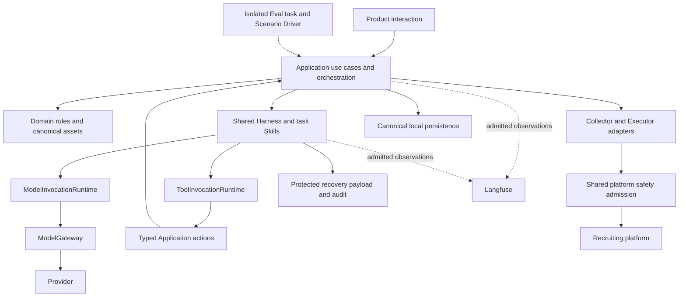

# JobHunter Architecture

> **2026-09-24 supplemental baseline.** [CG03S1](.grill/contract/sl-02-m1-supplement/decisions.md) replaces the candidate source model and downstream allocation. New normative revision is 2026-09-24.S2M1S1-r1; earlier design records remain scoped history, not current authority.

> English is the authoritative documentation language. This W2 draft describes the target architecture, not an existing implementation. See [Progress](progress.md) for current joint-review and user-approval state. Contract architectural boundaries remain here; concrete document organization is in Contract Structure. Reviewed consumed Contracts are reached through Contract Index; future scopes retain their separate Contract Grill.

## 1. Authority, scope, and interpretation

The [Product Specification](spec.md) owns user tasks, entry points, prerequisites, and visible behavior. This document owns the supporting system responsibilities, business authority, dependencies, persistence, concurrency, permissions, recovery, Harness, and Eval boundaries. Repeating a product consequence here explains its mechanism; it does not create a competing definition.

The [English authoring spec](../.scratch/document-authoring-spec.en.md) and [W1 handoff](../.scratch/w1-product-spec-handoff.md) guide document production. The [Decision Register](.grill/grill-me-design-tree.md), six Harness records, and detailed Eval record provide design provenance. Later corrections control the specific clauses they replace, regardless of an earlier record's ACCEPTED label. The [Contract Design Inventory](.grill/contract/contract-design-inventory.md) is a non-normative checklist, not a schema or independent source of new requirements.

The [Acceptance](acceptance.md) draft owns required future proof of behavior, and [Development](development.md) owns delivery discipline. [Progress](progress.md) and its supporting [Traceability Matrix](progress/traceability.md) record actual status and evidence. Detailed `docs/contracts/*` remain planned and will own business/data/interface norms. This document does not supply missing fields, types, enums, state-transition tables, API payloads, database schemas, validation errors, or migrations. Existing conceptual names and bounded invariants do not finalize their representation.

The [user-approved process revision](../.scratch/document-authoring-spec.en.md#f-user-approved-delivery-process-revision) adds independent Implementation Plan as the seventh document category. W6 has authored [Implementation Plan](plans/implementation-plan.md); W7 has jointly reviewed the current documents; [Progress](progress.md) records the remaining user-review boundary. The twelve macro Slices contain independently ready milestones. After W7/user review, each milestone completes its required Contract Grill, normative writeback, interface reconciliation and upstream prerequisites before its own development; other milestones in the same Slice and unrelated Contract scope may remain pending. This later instruction changes the older Q22/S38.1 delivery ordering, not the accepted architecture. W1/W2 are document tasks, not implementation Slices. No old code, database, API, test, or completion claim imposes a compatibility obligation. Historical readers for assets produced by the new system remain required; that is distinct from importing the old system.

**Sources:** Q2–Q5, Q11, Q22, Q26, Q32, S24.2, S25.1, S29.2, S37.1, S38.1. The English-language rule and automatic use of stage handoffs are explicit user authoring instructions.

## 2. System responsibilities and dependency direction

### 2.1 Logical boundaries

SL-01.M1's accepted runtime is a loopback local backend with a browser frontend. Workspace owns first-use semantics and delivered navigation; Storage owns the stable startup-selected data directory, one-backend ownership, recognition, transactions and diagnostics. They are infrastructure boundaries, not multiple Workspace identities. The four [M1 Contracts](contracts/index.md#existing-normative-contracts) define their actual fields and protocols. Browser navigation waits for revision-checked resolution and satisfies final opener/referrer safety properties without becoming an Executor action.

JobHunter is one single-user, local-first workspace. The five navigation entries and two Advisor entry modes are owned by Product section 2; navigation organizes tasks without defining Domain ownership. Company aggregation over formal Jobs is a read view, and no unified Candidate Aggregate or tenant hierarchy is introduced. ManualApplicationEntry is a separate mutable record outside the formal Job family; its browser-opening action is ordinary user navigation, not Collector or Executor activity ([CG01-BC1](.grill/contract/sl-01-m1/decisions.md#cg01-bc1)).

| Responsibility | Owns | Must not own |
| --- | --- | --- |
| Product interaction | Navigation, page-local unsaved editing, explicit selection/confirmation, honest display of outcomes | Fact authority inferred from UI state, model prose, or streamed text |
| Business Domain | Identity, immutable facts/assets, compatibility, grounding, approval and application invariants, versioned business policies | Provider transport, graph checkpoints, telemetry success, or third-party payload shapes |
| Application | Use Cases, dependency preparation, exact input freezing, orchestration, authorized commands, transaction boundaries, validated result persistence | Hidden consent, model-defined authority, or a second copy of Domain rules |
| Skills on the shared Harness | Bounded task semantics and protected instructions, declared inputs/outputs, allowed actions, validation and interaction policy | Independent business stores or unrestricted tool/environment access |
| Harness runtimes | Execution ownership, actual model/Tool calls, Context, budget, cancellation, recovery, and audit | Candidate facts, application progress, or permission to bypass Application commands |
| Repositories and adapters | Canonical persistence and validated source/provider/channel integration behind owned boundaries | Promotion of raw external data or exceptions into Domain authority |
| Eval and observability | Isolated experiments, appropriate checks, admitted observations, and evidence | Runtime authorization, business completion, settlement, recovery, or an alternative test-only Agent |

These are responsibility boundaries, not a prescribed package tree, process topology, or service count. Accepted technology commitments include short local SQLite authority transactions, LangGraph execution under Application/Harness ownership, and self-hosted Langfuse for Eval/observability. They do not settle the complete stack, SDK versions, deployment footprint, or storage placement.

```mermaid
flowchart TD
    UI["Product interaction"] --> APP["Application use cases and orchestration"]
    APP --> DOMAIN["Domain rules and canonical assets"]
    APP --> HARNESS["Shared Harness and task Skills"]
    HARNESS --> MODEL["ModelInvocationRuntime"]
    MODEL --> GATEWAY["ModelGateway"]
    GATEWAY --> PROVIDER["Provider"]
    HARNESS --> TOOL["ToolInvocationRuntime"]
    TOOL --> PORT["Typed Application actions"]
    PORT --> APP
    APP --> ADAPTER["Collector and Executor adapters"]
    ADAPTER --> SAFETY["Shared platform safety admission"]
    SAFETY --> PLATFORM["Recruiting platform"]
    APP --> STORE["Canonical local persistence"]
    HARNESS --> PAYLOAD["Protected recovery payload and audit"]
    EVAL["Isolated Eval task and Scenario Driver"] --> APP
    APP -. "admitted observations" .-> LF["Langfuse"]
    HARNESS -. "admitted observations" .-> LF
```

The Eval arrow means use of the real entry points in an isolated environment, not access to the live Workspace. LangGraph provides workflow mechanics within the shared execution design; the diagram does not make it a wrapper that owns Harness authority. Provider calls still pass through ModelInvocationRuntime, and recruiting-platform access remains an explicitly authorized Application workflow.

**Sources:** Q1, Q3, Q6, Q27, Q53, Q120, Q126, Q135, Q147, Q160, Q173–Q174, S5.1, S7.1, S17.2–S17.4, S22.1, S35.1.

### 2.2 Canonical data and adapter boundaries

Canonical data stays minimal and consumer-driven. Raw source output is runtime-validated into an adapter representation before it can create a JobHunter asset. External field names, temporary credentials, transport objects, and third-party error shapes are not Domain authority. Source data availability does not grant model visibility.

BossHunter, boss-zhipin-scraper, and resume-optimization projects are research inputs. Before related detailed source/channel Contracts, research must pin studied commits, inspect licenses and maintenance, and map source data through the adapter to justified canonical consumers. Quotas, delays, project layouts, and illustrative implementations in source notes are not accepted defaults or verified current upstream guarantees. W2 records the research obligation; it does not claim to have performed that external verification.

**Sources:** Q3, Q27, Q31, Q49, S7.1.

## 3. Authority, identity, and evolution

### 3.1 Asset ownership

| Owner | Authoritative or derived responsibility |
| --- | --- |
| Workspace | One revisioned default_resume_id; no new Candidate aggregate |
| Resume / ResumeVersion | Independent document root and immutable complete contacts/structured entries/canonical rich AST/presentation |
| CandidateEvidenceProjection | Deterministic exact-source entry/block units; read-only, not independent facts |
| CandidateProfileProjection | Schema-v1 semantic capability index (name, description, evidence_refs); read-only and Evidence-supported |
| PreferenceSetVersion | Independently user-authored versioned job intent; not part of Profile |
| JobVersion / RequirementSet | Exact job facts / derived structured requirements |
| CandidateJobFitAnalysis | Single grounded DeepFit result over frozen job, optional intent and portrait |
| ResumeOptimizationAnalysis | Suggestions for selected exact Resume, optional Job/Requirements; no current write application |
| Materials / Preparation / Execution | Exact generated bytes, viewed material and separately approved external effects |

ManualApplicationEntry, ApplicationEvent, Sessions and collaboration Memory retain their separate owners; none become a candidate career-fact source. Model output is not an authority for facts merely because it resolves a citation.

### 3.2 Minimal evolution mechanisms

Resume roots retain independent immutable chains. Workspace selection revision detects default ABA; Resume revision detects content/name/lifecycle races. Stable logical entry_id/block_id survive supported editing, but Evidence identity is exact ResumeVersion + extraction key + unit ID. Source locations resolve canonical structure, never rely on drifting character positions. Root/version identities, logical editor IDs, portrait build fences and invocation IDs have distinct purposes.

No automatic bidirectional synchronization exists: Resume → deterministic Evidence → supported Profile → analysis. A switch selects B.current_version, never unions A/B. Exact historical analyses/materials keep original lineage; currentness requires explicit source/build compatibility. Detailed shapes and editing rules are [RES-017–024](contracts/candidate/resumes-grounding.md#res-017), [EVD-016–023](contracts/candidate/evidence.md#evd-016) and [PRO-010–016](contracts/candidate/profile.md#pro-010).

## 4. Jobs, acquisition, collection, and platform access

### 4.1 Identity and admission

One reliable platform source identity maps to one Job. Semantically changed canonical content produces a new immutable JobVersion; unchanged content updates observation metadata without manufacturing a version. Cross-platform merging and historical physical/logical merge operations are excluded.

BOSS admission atomically persists the formal Job root and first complete JobVersion after validated full detail/JD acquisition. Formal JobVersion retains complete exact canonical JD and immutable content snapshot semantics. No manual root-only admission exception remains.

ManualApplicationEntry has separate identity and mutable company/role/application-URL content, with no JobVersion, source-platform Job identity or downstream Job eligibility. Repeated edits do not create immutable business versions. Its separate view and browser navigation cannot produce Requirements, Fits, Preparation, ExecutionAttempt or ApplicationEvents. The removal request concerns current entry use; detailed retention is not inferred from formal Job history.

The normative definition owner of formal Job identity, content, completeness, versions, lineage and read semantics remains `jobs/jobs-screening.md`. `jobs/collection.md` owns acquisition and adapter workflow under that Contract; SL-08.M2 is the first planned producer and integration milestone, not a semantic owner. `jobs/manual-application-entries.md` is the separate planned entry Contract owner.

**Sources:** Q12–Q13, Q17, Q44, Q48–Q50, S9.1; later [CG01-BC1](.grill/contract/sl-01-m1/decisions.md#cg01-bc1) supersedes the Manual Job branch only and preserves formal canonical Job completeness and immutable history.

### 4.2 Acquisition intent, collection admission and local queries

[CG02-BC1](.grill/contract/sl-01-m2/decisions.md#cg02-bc1) separates three owners: Preferences expresses future acquisition intent; Collection consumes exact immutable PreferenceSetVersion through source planning/admission; Job Pool independently queries already-saved formal Jobs. The six dimensions and explicit-choice gate are defined in Product 4.2. Preferences does not own a source query plan, per-candidate predicate or continuing Job eligibility invariant.

SL-01.M2 supplies complete configuration, immutable versions, read/Save/concurrency and persistence. Under [CG02-S1](.grill/contract/sl-01-m2/decisions.md#cg02-s1), all six dimensions require explicit legal choices before successful Save establishes configured state; no implicit all-empty unrestricted version. Revision admission precedes canonical no-op comparison; real changes create immutable versions. [CG02-Q11–Q15](.grill/contract/sl-01-m2/decisions.md#cg02-q15) adds lazy atomic creation: Workspace bootstrap creates no Preference root; first valid Save creates root, first immutable version and current pointer together, with no residue after failure. Root carries the stable identity/current pointer/revision; versions carry immutable identity and owning-root reference, without is_current. [CG02-Q21–Q25](.grill/contract/sl-01-m2/decisions.md#cg02-q21) defines complete root/version objects, revision-1 first publication, monotonic revision for real changes, successful request receipts and Workspace-lifetime immutable content retention. A replay identifies the original successful result without resetting current authority. Unconfigured reads succeed without creating state. [CG02-Q26–Q30](.grill/contract/sl-01-m2/decisions.md#cg02-q26) fixes versioned Save/current/exact-version HTTP operations, replay-stable success outcomes and lifetime success receipts, including no-ops. Publications share one timestamp, clamped to the previous root.updated_at on clock rollback; no-op/replay refresh nothing. UUIDv4 and created_at provide no strict historical total order; current pointer identifies current, while revision orders root modifications. M2 adds no sequence field. [CG02-Q31–Q35](.grill/contract/sl-01-m2/decisions.md#cg02-q31) fixes strict M2 input admission, bounded raw requests, nested field-error locations and explicit uncertain-Save retry. Common owns shared error representation/vocabulary and the scoped path grammar; Preferences owns triggers and operation mappings. Validated receipt replay precedes ordinary revision admission; errors do not permit hidden command reexecution. The consumed detail now has one normative owner in [Preferences PRF-001–023](contracts/candidate/preferences.md), with shared COM-033–037/WSP-007/STO-014–020 additions. Q38 keeps canonical business equality independent of JSON serialization; Q40 uses INVALID_FORMAT for known mode-incompatible value. [M2 scope review](progress/traceability.md#62-sl-01m2-reviewed-scope-and-interface-evidence) records readiness; implementation remains separate.

SL-08.M2 owns the actual source consumer. `jobs/collection.md` defines exact-version query/admission mapping and source adapter workflow; `jobs/jobs-screening.md` remains the sole definition owner of formal Job admission/content/history and local query semantics. It retains its catalog filename but supplies no M2 QuickScreen component. Search keywords need not appear literally in returned titles. No implicit synonym or model query expansion is introduced in the first release.

Source-expressible constraints may be pushed down; remaining constraints require the defined deterministic admission where metadata supports it. Confirmed list-stage rejection stops detail fetching, and rejected source content is not a durable Job or recoverable audit substitute. Missing/incomparable metadata does not establish conflict or satisfaction. Complete Job/JobVersion admission remains atomic. Collection audit retains usage, aggregate reasons, failures, risk and stop information, not rejected title/company/URL/JD bodies. Acquisition admission does not evaluate CandidateProfile, Evidence, Resume or RequirementSet, and does not parse Requirements.

Each CollectionRun fixes one complete exact PreferenceSetVersion. Later Save affects future Runs only, without changing the running input, initiating collection or automatically restarting it. Explicit stop prevents subsequent access and preserves committed Jobs. Saved Jobs are not re-screened, hidden, marked preference-conflicting, deleted or made ineligible for downstream work merely because current Preferences changed.

JobPoolViewFilter queries existing Jobs independently of acquisition intent. Frontend state and/or backend query parameters may implement it; concrete query/persistence representation remains later Contract work. It does not Save Preferences, create versions, affect future collection, mutate Job authority or produce QuickScreenResult. Genuine Job availability, exact content, material eligibility, runtime admission, safety and consent remain in their existing owners.

**Sources:** Q45/Q49/Q55/Q56/Q110/Q161, S9.1/S17.1, with explicit partial supersession under CG02-BC1/Q6–Q10/S1. The earlier current-Preferences filtering and dispatch QuickScreen gate do not survive; formal Job versioning, fixed collection provenance and exclusion of duplicate screening authority do.

### 4.3 Observation and safety boundaries

Content capture, reliable source observation, and direct availability verification answer different questions. Freshness and availability policies derive views: age can imply staleness, not closure; absence from one search cannot prove closure. Verified closure blocks new automatic application without deleting historical content or applications. Human reporting remains distinguishable from verified source observation. These are formal Job concerns; ManualApplicationEntry has no source observation or availability model. Its explicit browser opening performs no application-controlled extraction, verification or sending.

PlatformAccessSafety is shared persistent admission for platform/account capacity, risk, and action permission. Collector, Browser Executor, and any future implemented Monitor check it before every actual access. Workflow Run/Attempt ownership, budget, recovery, and execution authorization remain independent.

Ordinary page/selector/browser failure may stop its workflow without becoming account risk. Predictable capacity may recover by policy. Strong classified risks require user handling and explicit restoration; no restart, cooldown-only recovery, account/tab switching, or concurrency increase may bypass them. Shared safety admission is never ExecutionApproval. No numeric platform quotas or mandatory Monitor are introduced.

**Sources:** Q36, Q49–Q50, Q160–Q161, Q164.

## 5. Independent Resumes, projections, and derived work

### 5.1 Preparation before authority

Manual editing and reviewed import prepare a complete temporary Resume draft. TipTap maps to/from the canonical application AST with stable entry/block IDs; vendor JSON is not storage authority. Import reveals gaps and performs one confirmed document Save. No independently saved Knowledge stage or shared contact adoption remains.

### 5.2 One atomic source change

Save admission validates full owned content, logical IDs, canonical equality, request receipt and root revision under the owned protocol. Commit root/new Version, any default selection change, current portrait invalidation/new source, durable rebuild obligation and success receipt atomically. No model/network/render inside the transaction. First creation selects default if none exists; ordinary no-op/non-default Save/rename does not dispatch extraction.

After commit deterministic Evidence is constructed and the protected model generates Profile. Publish a coherent pair only if the exact source and current build fence still match. A→B→A, new Save, refresh or removal makes earlier completion obsolete. Durable obligation discovery must recover without losing a source update or dispatching a second call. A complete durable model response may resume local validation/publication; uncertain calls cannot replay automatically. The current consumer version permits at most one request per attempt; deterministic Entry reuse/deletion assembly uses zero and remaps refs to the target exact version.

Under [Q42–Q46](.grill/contract/sl-02-m1-supplement/decisions.md#cg03s1-q42), ProfileIndexEntry is scoped to one source_entry_id; every ref belongs to that Entry. A changed Block or admitted background field dirties the whole Entry, whose complete current admitted fields/Evidence enter generation. Reuse unchanged groups, remove deleted groups and assemble in target Entry order; no persisted cross-Entry skill merge or dependency closure exists. DeepFit may aggregate at execution time. The current source schema has no separate global career-fact field.

Automatic work chooses a successful compatible same-Resume baseline, including across failed versions; an exact compatible historical pair may reattach under fresh current qualification. New source versions require new Evidence/ref bindings and a new pair, even for zero-model reuse. Freeze the target, baseline, semantic configuration, Entry diff and merge/provenance plan before dispatch. Recover only that frozen merge from a lawful durable response. MODEL/INCREMENTAL/REUSE distinguish newly generated, mixed and zero-call assembled pairs; exact reattachment preserves its old immutable generation metadata. Explicit refresh records FULL intent, bypasses reuse and only deduplicates active FULL work; it supersedes AUTOMATIC work with a new fence without pretending its remote effects were cancelled. The current consumer batches all required Entries into at most one request and fails closed on capacity. Future controlled multi-request implementations need their own reviewed execution policy; Entry scope is the enduring semantic rule.

### 5.3 Defaults, removal, and availability

Default switches immediately; portrait can be NO_SOURCE, EMPTY_SOURCE, QUEUED, RUNNING, READY or FAILED. Source validity/Save success does not depend on extraction. Only READY exposes a current pair; old/partial projections cannot masquerade as current. Explicit refresh deduplicates matching current active FULL work and makes a ready source unavailable while rebuilding; GET cannot dispatch. Failed Profile leaves saved source intact and requires explicit retry.

Default removal requires the user-visible replaceable preselection (next otherwise previous) and exact atomic selection/target checks. Final removal clears default/portrait; ordinary removal retains history. Empty/contact/Header-only content is valid but not usable semantic input. See [WSP-013–015](contracts/foundation/workspace.md#wsp-013) and [SAV-018–025](contracts/candidate/candidate-save.md#sav-018).

### 5.4 Exact materials independent of portrait

Materials reads the selected complete ResumeVersion directly. Its schema-2 manifest records exact Resume/configuration/artifact lineage, with no Profile/Evidence joins. Existing explicit demand, shared deterministic work, immutable configurations, verified bytes, fencing and safe local replay remain owned by Materials/Derived Work. A Save does not request rendering. Default/portrait changes do not alter accepted demand or viewed/approved material. Projection model recovery cannot borrow deterministic render replay semantics.

## 6. Requirements, DeepFit, and optimization

### 6.1 Independent dependency preparation

Application owns EnsureRequirementSet. For an exact JobVersion and compatible parser/prompt/schema/validation configuration, reuse a usable immutable Set or create one independent RequirementParse Run. Creation and default activation are separate; a validated Set may activate automatically, while historical consumers retain exact identities. Downstream failure does not delete the successful dependency.

RequirementParse receives complete exact JD for one semantic extraction and at most one deterministic-validation-guided repair. The model interprets meaning; deterministic code checks structure, source support locations, duplicates, emptiness, and verifiable invariants. Structural validation does not prove zero semantic omission. Uncertain necessity/logic is retained, not guessed. A second invalid output fails closed; no usable assessment units means a pre-analysis dependency failure, not a perfect empty-set result or another retry allowance.

DeepFit, Job-targeted optimization and Job-targeted Advisor use the exact RequirementSet as their sole Job-requirements input. They cannot independently reinterpret full JD. Generic optimization and ordinary Advisor requires no specific Job/Set, and neither optimization nor Advisor requires a prior Fit.

Shared parse production uses a database-backed atomic claim/unique target/CAS correctness boundary across processes. A process-local mutex is only an optimization. One owner pays actual parse/repair; waiters reuse without duplicate charges. Waiter cancellation affects only waiting. Owner cancellation/failure/unknown outcome yields dependency-unavailable without automatic takeover, transferred budget, or reparse. Explicit Retry first checks for a compatible durable result.

**Sources:** Q10, Q14, Q24, Q58–Q59, Q110–Q111, Q117, Q121, Q142, Q144, Q171.

Profile derivation is a separate SL-03.M2 consumer; it cannot borrow the parser’s repair allowance or Job-only Frame. ManualApplicationEntry remains outside formal Job admission.

### 6.2 One DeepFit scope

Freeze ready default-derived Profile/Evidence, exact JobVersion/RequirementSet and optional exact Preferences. Build initial Context from the small capability index and job/intent inputs. Controlled Evidence acquisition maps requirements to exact blocks, expands to entries and broader admitted coverage when needed. Privacy applies on every acquisition. A miss/omission is not absence; incomplete coverage means UNKNOWN; an adequately inspected negative is source-bounded. CandidateJobFitAnalysis alone carries preference/capability findings and citations. There is no parallel ResumeFit or joint score invented here; detailed scoring/coverage/result contracts remain future SL-05 work.

### 6.3 Selection, concurrency, and publication

The source is frozen at accepted analysis start. Already-started work continues historically through source/default changes, never latest-substitutes or restarts implicitly. New work needs current READY state. Permission revocation/unavailable required source is independent of ordinary currentness. Multi-Job runs retain independent target outcomes, bounded costs and exact lineage.

Resume optimization is separate: generic selected Resume content or Job-targeted selected content plus Job/Requirements. Candidate inputs exclude default Profile, other Resumes, Memory and chat assertions. Empty selected content prevents dispatch; global portrait unavailability does not block populated selected content. Suggestions create no formal Version; future application must remain same-Resume. SL-05 owns DeepFit, SL-06 owns optimization, SL-07 conversations reuse SL-06.

## 7. Session and suggestion-only Advisor

### 7.1 Durable interaction and actual input provenance

Sessions preserve user interaction, exact task-selected document, dependency waits and completed durable suggestions. Conversation history is not candidate fact authority. For selected-Resume optimization, enforce source isolation at actual Frame construction, including history, summaries, Tool results and Memory; do not admit supplemental career assertions through another channel. Registered Skill/Tool availability never grants permission.

At most one foreground Turn is active per Session. New input waits or follows explicit stop; distinct Sessions and legitimate dependency/auxiliary/background work remain independently admissible. A later request reconstructs admitted context rather than reviving an old Agent. Once a selected Resume is resolved for a task, pin its exact version; default changes and concurrent edits cannot silently replace it.

### 7.2 Deferred application

Current Advisor invokes independent generic/targeted optimization and presents suggestions only. SL-07.M3 assistant application and SL-10.M2 Preparation adopt-back are explicitly deferred. Historical Proposal/confirmation design is future input; its exact application protocol requires its own normative review. No suggestion pipeline silently invokes Save, creates a Version or changes default/material state.

### 7.3 Waiting and deletion

Waiting for independent RequirementParse retains the same foreground Turn while releasing Provider invocation capacity. Application supplies completion; no model polling, deadline extension, inline JD reinterpretation or silent producer takeover is allowed. Waiter cancellation affects waiting only. Session deletion cancels active foreground work and prevents subsequent admission/publication without erasing committed history. Any future deferred confirmation/delete arbitration requires its owned exact agreement.

Dependency waits, remote execution and durable completion are distinct outcomes. Session deletion blocks subsequent interaction/admission and stale publication as owned by the future Session contract; it does not erase independent business history or prove a remote request never ran. Bounded no-replay and honest cost/outcome rules survive. Confirmed formal changes are not a current conversation completion gate.

## 8. Preparation, execution, and application events

ApplicationPreparation is mutable, formal Job/channel-specific, and revision-protected, not immutable history for every edit. Reentry resumes unfinished work without silently replacing exact selections/Greeting. Creation is idempotent against repeated requests; multiple resumable candidates require user choice. Explicit new preparation and reapplication start separate chains.

Preparation displays/selects formally rendered Resumes and cannot edit body text. Greeting is one Preparation-owned editable value with a fixed generic default, no personalization/model call/template library/independent version history. Readiness is a channel-policy projection over eligible saved inputs, validation, rendering, and compatible material confirmation.

MaterialApproval binds actually viewed frozen artifacts, exact sources, and actual Greeting. Required renders precede confirmation. Changed Greeting reconfirms; changed material validates compatibility; equal hashes cannot bypass current eligibility. Rerendering does not replace approved artifacts. A revision/reference/approval/hash check precedes atomic snapshot freeze.

ApplicationExecutionSnapshot is immutable intended input, not execution permission. Separate scope-bound, expiring, single-use ExecutionApproval is consumed by at most one ExecutionAttempt. Partial continuation requires new narrower authorization. Unknown external outcome requires verification, produces no success event, and cannot retry automatically.

Executor's necessary authorized live identity/availability checks do not refresh JobVersion, parse Requirements, replace frozen inputs, or add model Job analysis. Mismatch/closure stops subsequent actions for explicit refresh/repreparation. All access also passes shared PlatformAccessSafety.

ExecutionEvents describe technical actions/observations. Only reliable channel read-back or explicit human report establishes ApplicationEvents. Human reports about formal Jobs do not require automated execution and do not fabricate Snapshot/Approval/Executor history. ManualApplicationEntry is not an ApplicationRecord target; opening its URL creates no Attempt or application fact ([CG01-BC1](.grill/contract/sl-01-m1/decisions.md#cg01-bc1)). ApplicationRecord identifies one real Job/channel/account attempt; reapplication creates another. Events are deduplicated and append-only, retain occurrence/observation distinctions, and use appended corrections/retractions. Versioned ApplicationProgressPolicy derives the read view; it is not independently writable status. Interviews remain ApplicationEvents without a new Aggregate.

Batch application groups membership, scheduling, and progress, while each Job has its own Preparation, Snapshot, Approval, Attempt, and optional real application record. Bulk confirmation does not merge approval scopes or create an atomic business batch. Undispatched members are not failed/applied. Shared risk may stop later dispatch without rewriting completed outcomes.

**Sources:** Q7, Q16–Q17, Q21, Q25, Q30–Q31, Q36–Q37, Q42, Q77, Q91, Q108, Q146, Q150, Q157, Q160, Q162, Q164; Product sections 7–8.

## 9. Shared Harness, Skills, and controlled actions

### 9.1 Task contracts and runtime ownership

Use static code registration for RequirementParse, Profile derivation, single DeepFit, independent Resume optimization, Advisor interaction and MemoryExtraction on one shared Harness; concrete keys belong to each consumed Contract. Core Skill semantics/instructions, input requirements, output/validation rules, action/Memory policy, interaction, and execution bounds are protected control. Detailed guidance can be progressively disclosed without becoming a new semantic Tool or Memory authority. No plugin marketplace, workflow editor, or universal career Agent is implied.

One AgentRun serves one bounded semantic task; a Job-specific Run binds one exact Job. Multiple invocations may implement a bounded loop/repair or permitted maintenance for that task, not multiple independent Jobs or unrelated tasks. Single-target DeepFit is one bounded analysis task. MemoryExtraction is independent background work; current-Run semantic compaction is auxiliary work in that Run.

| Runtime responsibility | Governing boundary |
| --- | --- |
| AgentRunRuntime | Lifecycle, ownership/generation, foreground/target admission, cancellation, timeout, and startup reconciliation |
| ModelInvocationRuntime | Unique business Provider-call boundary: admission, count/reservation, durable dispatch, complete durable response, settlement, fencing, cancellation/recovery, audit |
| ModelGateway | Provider/model transport adaptation only; no transparent retry, fallback, or separate helper-call authority |
| ToolInvocationRuntime | Per-action argument/object/scope/permission/source validation, invocation/replay and side-effect boundaries, returned-content admission |
| LangGraph workflow integration | Recoverable workflow mechanics, never remote receipts or permission to replay uncheckpointed calls |

Primary, parse, Fit, Advisor, validation repair, semantic compaction, size rescue, and MemoryExtraction Provider requests all use ModelInvocationRuntime. An SDK cannot turn one admitted invocation into hidden additional requests. Independent Eval judges are governed by section 15, not an exception for uncounted business calls.

**Sources:** Q47, Q120–Q122, Q126–Q127, Q132, Q135, Q138–Q140, Q155, Q176, S7.1, S17.4, S22.1.

The scoped [SL-03.M2 Runtime](contracts/agent/execution-runtime.md#exr-035) uses a stable idempotent semantic-start identity and freezes only exact nonsecret execution bindings at Run level. Historical start confirmation precedes fresh admission and returns the original run_id. The first production integration is ModelInvocationRuntime → ModelGateway → DeepSeekAdapter → official DeepSeek Chat Completions; the adapter isolates third-party protocol details without a multi-Provider registry or arbitrary endpoint. Semantic mapping finishes before Frame freeze. The controlled transport cannot hide retry, fallback, route changes or TLS bypass; HTTPX is the first implementation choice, not a permanent architecture constraint.

M2's current semantic consumer admits at most one active MODEL/TOOL Invocation, without imposing a permanent concurrency field on all Runs. Static Skill definitions declare semantic bounds; Budget owns resource accounting. The first proof consumer is an Eval conformance Skill over the real path, not a product capability or alternate Agent. Future business validators/repair and progressively disclosed Skill guidance remain with their actual consumers.

### 9.2 Tool capability is not permission

Effective action access is the intersection of registration, Skill action allowlist, Context/acquisition restrictions, and current runtime permission. Before execution validate arguments, referenced objects, resource scope, Run authority, and any required approval. Readmit returned content for privacy and task scope before a Frame. Stored data, generated paths/IDs, JD/web content, quoted instructions, Tool output, and checkpoints cannot expand permissions.

Expose typed business read/list/search/write operations through Application boundaries, not arbitrary Shell, SQL, file, HTTP, or model-autonomous browser access. Reads cannot conceal model calls, nested semantic Runs, asset creation, or platform fetches. Necessary invocation audit does not violate read purity.

ResumeAdvisor owns interaction and reuses SL-06 generic/Job-targeted optimization suggestions. It does not implement another optimizer or acquire authority to apply changes. Typed Tool admission and concrete task permissions remain required.

**Sources:** Q120–Q122, Q126, Q128, Q138–Q144; [Tool Actions](.grill/harness/tool.md), sections 1–7 and 9–10.

The [M2 Tool scope](contracts/agent/tools.md) uses a finite static registry of typed owned actions. Provider schema is a controlled projection; Runtime admission enforces the full action protocol. One selected model request maps to one independently admitted TOOL Invocation; Skill owns list scheduling. Action completion survives later result-representation/admission failure. Reexecution defaults to forbidden unless an explicit action agreement permits it.

## 10. Context Engineering

### 10.1 Allowed sources versus actual model visibility

Context Engineering owns strategy, admission, assembly, compaction, and actual-input records. Its sources are protected control, Session continuity, dynamically admitted collaboration Memory, available typed capabilities, business inputs, and runtime/Tool results. Available source does not mean default prompt payload.

RequirementParse protects exact Job input. Profile derivation protects complete admitted deterministic Evidence/background for every Entry selected by the frozen plan: dirty Entries for automatic incremental work, all Entries for first generation or explicit full refresh. DeepFit starts with a frozen Profile index and uses controlled exact block/entry retrieval (CTX-016/TOL-015); this accepted progressive acquisition replaces the older all-Evidence eager-input requirement and progressive-retrieval prohibition. Optimization protects the selected Resume’s admitted content only. Capacity failures never silently replace protected input with summaries or other sources.

ContextPackage is the immutable initial scope/policy/input/capability manifest. Append actual admitted read/write references as runtime inputs; never rewrite that manifest or earlier outputs. Each ModelInvocation binds an immutable ContextFrame recording what was actually sent, including redaction, selected messages, Tool data, and compaction. Assessment completeness is tested against its producing Frame, not the package's possible scope.

First lazy resolution pins exact versions. A same-task authorized write may add actual committed versions after admission, without guessing IDs, changing independent frozen tasks, or adopting unrelated edits. In the Proposal flow the generating Run has already ended; follow-up narration uses new execution.

**Sources:** Q19, Q72, Q80, Q83, Q94, Q134, Q138–Q139, Q143, Q146, Q158; [Context](.grill/harness/context.md), sections 1–3.

The [M2 headless Context scope](contracts/agent/context.md) freezes Provider-effective semantic content, not SDK objects or network request bytes. Provenance is immutable and attached to that Frame; it cannot replace actual content or become another independently current manifest. Deterministic local candidate preparation is discardable until the owned publication boundary. One estimator evaluation supplies Context capacity and Budget reservation inputs, while their policies remain separate. Historical Frame/Package audit/recovery reading remains lawful under its own access rules; permission to reuse content in a new model input is checked independently. M2 supplies no interactive compaction or Memory implementation.

### 10.2 Protected inputs and ordered reduction

RequirementParse protects exact Job input. Profile derivation protects complete admitted deterministic Evidence/background for every Entry selected by the frozen plan: dirty Entries for automatic incremental work, all Entries for first generation or explicit full refresh. DeepFit starts with a frozen Profile index and uses controlled exact block/entry retrieval (CTX-016/TOL-015); this accepted progressive acquisition replaces the older all-Evidence eager-input requirement and progressive-retrieval prohibition. Optimization protects the selected Resume’s admitted content only. Capacity failures never silently replace protected input with summaries or other sources.

Apply the accepted order: classify protected/compactable content; externalize large Tool results while retaining their appropriate exact durable source; select a bounded history window; produce deterministic structured/micro projections; only if still insufficient create a bounded semantic ContextCheckpointSummary. Preserve valid Tool-call/result relationships and distinctions between requested/completed, suggested/adopted, observed/authorized. None of the deterministic stages creates career facts or a model call.

Trigger threshold and target watermark are separate to avoid repeated near-limit compaction. Values remain unfrozen. Capacity uses actual serialized input, control/Tool overhead, output reserve, and margin, not remaining money alone. If protected full inputs cannot fit, fail before invocation; do not trim, summarize them, change models automatically, or enable deferred RAG.

**Sources:** Q80, Q121, Q123, Q132, Q139; [Context](.grill/harness/context.md), sections 4–10 and 16–17.

### 10.3 Checkpoint publication and bounded rescue

Semantic compaction is a same-Run auxiliary invocation sharing ownership, budget, deadline, recovery, and audit. At most one semantic compaction and at most one reactive size-rescue retry are allowed per entire Run; loop progress does not replenish allowances. Both remain subject to total limits. Reactive rescue requires an explicit Provider size rejection, never a guessed explanation for timeout/disconnection/unknown outcome. It cannot grant another semantic checkpoint after that allowance is exhausted.

Retain former recoverable sources while generating and validating a candidate checkpoint. Only valid, durably published, properly fenced checkpoints may enter a later Frame. Failed generation/validation does not publish an untrusted summary or delete Session history. The checkpoint is execution continuity, not fact, approval, or commit evidence. Direct Long-term Memory blocks are excluded; Recall is readmitted per Frame. Indirect influence in actual assistant history is not removed in v1.

Retain exact payload while it is an active recovery dependency; terminal historical references need not pin every source forever. Later permitted exact-source reads are new ToolInvocations, not fabricated old responses. Necessary unavailable sources stop reliable continuation or require user input; no guessed source content, automatic platform revisit, or external replay is allowed.

Mid-run revocation of protected EAGER_EXACT input ends that frozen task and prevents later Frames/repair/Tools from using it or publishing a valid current analysis. A new admitted scope requires a new task; historical frames and truthful prior usage remain. Initial exclusions retain UNKNOWN semantics, and transmitted content cannot be retracted.

**Sources:** Q83, Q122–Q125, Q132, Q135–Q136, Q139–Q140, Q172; [Context](.grill/harness/context.md), sections 10–18.

## 11. Budgets and resource admission

One shared Budget Runtime serves distinct owners. Application foreground operations own their ExecutionBudget; Runs also have local call/token/step/deadline limits. A DeepFit operation pays its actual parse/Fit/repair work without merging task results. A parse producer's owner pays; reuse does not duplicate cost. Independent background MemoryExtraction uses BackgroundMemoryBudget rather than the last foreground Turn. Current-Run compaction charges that Run.

Before each charged or limited invocation, require valid execution scope and Provider/runtime capacity, then atomically check the owner's remaining envelope, Run totals, and applicable local allowance and reserve before durable dispatch. Conceptually, available budget excludes both settled usage and outstanding reservations. Concurrent calls cannot spend the same balance or allowance. Do not hold a transaction while waiting for a network response.

Actual usage settles the invocation idempotently and releases excess reservation. Record overruns honestly; preserve exact admitted usage and prevent subsequent overspending without clipping usage or silently increasing allocation. Other owners retain their own future policies. Dispatched unknown outcomes retain conservative exposure and are not zero cost. Restart and explicit Retry do not create an unused budget or erase old reservations. Safe local reconciliation must not reserve or settle twice. Releasing a concurrency slot does not release uncertain spend.

RequirementParse retains one primary invocation and at most one deterministic-validation-guided repair. The current Profile consumer version permits at most one request and no repair (PRO-014); this is not a permanent Domain batching constraint. DeepFit progressive acquisition and independent optimization retain finite consumer-owned limits; their detailed policies require their own reviewed Contracts. No hidden helper/provider calls bypass accounting.

Money/token budget, actual Context capacity, Provider headroom, runtime concurrency, and recruiting-platform safety are distinct resources. Background work yields to foreground headroom even if its monetary budget is sufficient. Insufficient budget prevents new dispatch, preserves independently completed results, and produces no Fit negative. The concrete Budget Contract is pending redesign. Other owner envelopes, billing collection and scheduler thresholds remain future work.

**Sources:** Q35, Q110–Q112, Q121–Q124, Q130, Q132, Q135, Q140, Q142, Q144, Q155, Q158–Q160, Q169–Q172, Q176; [Budget](.grill/harness/budget.md), sections 1–12.

The former SL-03.M2 detailed Budget decisions have been withdrawn for redesign. Replacement Contract review must resolve concrete owner identities, dimensions, representations and admission interfaces.

## 12. Durable execution and recovery

### 12.1 Dispatch, response, and canonical publication

Application freezes valid inputs; Runtime admits and reserves; dispatch intent becomes durable before the remote request; complete business response becomes durable before local parsing/validation; current-input, permission, and fencing checks precede canonical Application commit. An in-memory response or partial stream is not durable recovery evidence. A durable malformed response is recoverable input for validation, not accepted business authority.

The following are recovery permissions. The bounded M1 representations and atomic predicates are now defined in [Execution Runtime](contracts/agent/execution-runtime.md); they are not a universal consumer business lifecycle:

| Known durable boundary | Permitted interpretation |
| --- | --- |
| Proven undispatched local work | Continue only after current input/permission/budget validation |
| Dispatch intent without complete durable response | Remote work may have happened, including a crash before actual send; end ambiguous execution without silent replay |
| Complete durable response | Resume local parse/validation/publication without another model request |
| Canonical result committed | Reconcile existing identity/result idempotently; no duplicate business asset |
| Former execution authority revoked | Reject its late canonical writes regardless of eventual remote response |

Unknown remote calls require explicit Run-level Retry into a new Run with fresh admission and preserved lineage/exposure. M1 does not deliver that Retry command or its lineage fields; Invocation-level repair remains separately consumer-defined. Bounded validation repair and explicit size rescue are distinct admitted invocations, not hidden transport retries. LangGraph checkpoint state alone cannot authorize resending a model request or browser effect.

An original live dispatch winner may continue after an uncertain intent acknowledgement only after confirming its own committed intent, proving adapter entry has not begun and retaining valid qualification/admission. A restarted or replacement path cannot reuse that intent as sending authorization. Existing immutable response confirmation is read-only and remains available after ending, revocation or expiry; this never grants first-publication authority. First publication must still match the original dispatch generation and current valid owner.

Consumer-established deadlines do not universally start at Run creation. Expiry prohibits new remote effects and late first response publication. A response legitimately durable before expiry can support explicitly admitted, finitely bounded local recovery under fresh authority without extending the deadline or reopening an ended Run. Canonical business writes retain their own current eligibility checks. Consumer whole-Run completion may be reconciled without unneeded raw-response access, but ending still requires lawful recovery qualification or atomic ownerless coordination. A single committed result is not automatically proof that the whole Run completed.

Scoped source: [CG05 closure](archived/sl-03-m1-grill.md#cg05-pub), especially Q28/Q58/Q71/Q83/Q89/Q126/Q127.

**Sources:** Q40, Q116, Q122, Q124–Q125, Q135, Q140–Q142; [Recovery](.grill/harness/recovery.md), sections 1–4 and 9.

M2 adds atomic semantic Frame/reservation/descriptor/intent publication and confirmation of the entire committed association. Confirmation issues no transferable dispatch right. Provider protocol completion is independent of useful semantic output; the current DeepSeek streaming terminal format is adapter-specific. Usage and optional Provider observations remain outside immutable response equality and may reconcile independently after execution. Model identifiers/system_fingerprint do not prove immutable weights. Initial semantic-start rejection creates no durable rejected-task lifecycle. The conformance-only agreement in EVO-022–026/EXR-057 keeps consumer validation distinct from Runtime faults while coordinating terminal failure under existing CAS. Its frozen local-recovery grace belongs to the consumer binding; expiry prevents new recovery grants without deleting evidence or rewriting completed facts. A model behavioral failure in this exercise is not by itself an infrastructure Contract violation.

### 12.2 Ownership, cancellation, and reconciliation

One current execution owner controls a Run. Canonical writes validate current eligibility and execution generation at their write boundary. Cancellation, timeout, revoked ownership, or safe recovery takeover invalidates old writers. A late coroutine cannot publish analysis or checkpoint merely because it received a response. The [M1 Runtime scope](contracts/agent/execution-runtime.md#exr-005) uses the physical Workspace owner, a fresh runtime instance and generations advanced only when execution is granted/regranted. Revocation clears qualification without incrementing generation; no distributed lease is introduced. Broader consumer interfaces remain separate Contract work.

Startup reconciliation inspects unfinished work and durable boundaries, fences former owners, validates frozen inputs/permissions/deadlines/budgets, continues only safe local or undispatched work, ends ambiguous remote work, and releases ended slots. It never silently updates frozen references. Safe continuation cannot cure stale business inputs.

Tool replay is action-specific: eligible local reads may repeat after validation; remote idempotency requires a proven concrete contract; outcome-sensitive calls cannot silently repeat when unknown. No generic idempotency claim reconsumes single-use execution authorization or grants model-controlled browser retry. Recovery promises explicit uncertainty and safe boundaries, not exactly-once remote execution or resumption from every code line.

M1's controlled exact-version pure local-read proof may recover the original unfinished ToolInvocation with unchanged exact inputs and fresh qualification under its explicit action agreement. This is distinct from a new Context acquisition. It performs no hidden Ensure, remote parsing or business write. A Run ending fences all sibling Invocations without inventing remote completion or discarding independent committed facts. Missing historical consumer/read-format capabilities isolate and lawfully converge affected OPEN Runs; they do not require unrelated application startup failure.

**Sources:** Q30–Q31, Q40, Q116, Q122, Q124, Q126, Q136, Q142, Q155, Q172; [Recovery](.grill/harness/recovery.md), sections 5–8 and 13.

### 12.3 Independent committed and presented outcomes

Persisted mutation success survives later narration failure. The same confirmed Proposal resolves to its already committed result without duplicate facts. Stream deltas are disposable presentation, not completed Turns, adoptable Suggestions, extraction sources, or save receipts. Never join fragments from an interrupted attempt to Retry output. Frontend loss does not itself cancel a healthy backend; reconnect may read its complete final result.

For Proposal-specific examples in this paragraph, apply them only to the separately reviewed deferred SL-07.M3/SL-10.M2 consumer; generic runtime/Context/evaluation rules remain current. Pending Proposals outlive the generating Run but not their current Session eligibility. Unsaved page Drafts have no recovery guarantee. Safe derived-work recovery finds durable intent and respects current demand/reference checks; it does not replay model or recruiting-platform work. These are separate recovery subjects with separate owners.

**Sources:** Q141, Q146–Q149, Q152, Q156, Q158, Q165–Q167; [Recovery](.grill/harness/recovery.md), sections 9–12.

## 13. Storage, retention, and audit

Storage retains configured local placement, exclusive ownership, short atomic transactions, schema recognition, integrity failures and explicit versioned initialization. Current implementation at HEAD 66e2bb8 remains schema 5 with old candidate authority. It does not yet implement the revised model.

For this local development transition, the user authorizes explicit offline reset of the full development database and generated materials, including Preferences, Manual Entries and invocation test records. Preserve source, Git and configuration. No old-model conversion, compatibility requests/readers or archive UI is required. Startup and ordinary operations never reset silently; this documentation session executes no reset. Historical migration sources and prior test evidence remain historical records.

The new store persists complete independent Resume versions, stable logical-ID ownership, exact immutable Evidence/Profile pairs and generation/reuse provenance. Source/default changes commit with current-state invalidation, durable fenced build and receipt. Invocation owns dispatch and protected response durability; projection persistence cannot create a competing replay authority. Materials reads exact Resume source directly and retains its own byte/work/receipt invariants.

After transition, ordinary Save/removal/default changes preserve exact histories. Business history, Session content, collaboration Memory, protected recovery payload and sanitized telemetry have different purposes; minimal logs must not contain raw sensitive source or provider payload. The reset exception is not a broad personal-data erasure feature. [STO-054–058](contracts/foundation/storage.md#sto-054) owns concrete transition/persistence obligations.

## 14. Collaboration Memory

### 14.1 Ownership, admission, and controls

Separate Business Authority, durable Session, admitted Long-term Memory, and derived Memory retrieval. Context Engineering is not a Memory layer. Career facts, identity/contact, search Preferences, Resume selection, and application history keep their business owners. Memory admits collaboration preferences, feedback, working style, and reusable collaboration learning only; no USER_FACT authority is added.

Keep three conflict rules: saved business authority governs facts; Skill/runtime/approval governs permission; current explicit instruction outranks admitted Memory and derived summaries for interaction style. A temporary style override is not a durable preference or approval bypass.

Auto Learning controls automatic pending work/extraction/publication. Recall independently controls entry/summary lookup and every new Frame's Memory injection. Explicit View/Add/Edit/Delete/Clear All uses deterministic validation without extraction and requires neither switch. Recheck learning at dispatch/publication and Recall at each use. Disabling one does not imply the other, delete entries, erase Session history, or retract earlier transmission. Reenablement does not default to historical/disabled-period backfill.

RequirementParse, Profile derivation and DeepFit admit no Long-term Memory. Advisor admits collaboration preferences, feedback, and working style; reusable-learning storage is not an automatic Advisor grant. A small derived summary and scoped on-demand lookup suffice; no all-chat scan, embedding graph, or complex consolidation is required. New chats do not inherit prior temporary Resume/Job scope.

**Sources:** Q127–Q129, Q131–Q133, Q137, Q139; [Memory](.grill/harness/memory.md), sections 1–5 and 8–11.

### 14.2 Independent background learning and non-resurrection

Eligible completed durable user-facing Turns create durable pending source work. Coalescing/delay/idle policies schedule independent headless MemoryExtraction; timers are not pending-work authority, a reliable Session-ended event is not required, and every Turn does not automatically invoke a model. Extraction output cannot recursively trigger itself. Sources are minimized to relevant user expression, necessary assistant context, and explicit correction/confirmation evidence.

Extractor proposes; MemoryWriteAdmissionPolicy evaluates collaboration category, scope, durability, existing business owner, supported source, conflict, and sensitivity. Explicit traceable durable user expression/correction may be automatically admitted without a popup for every entry. Repeated behavior, assistant inference, generated summaries, or self-declared candidate type alone are insufficient. Ambiguous candidates remain Session-only or rejected; business routing is not write authorization.

Extraction has independent Run, recovery, and BackgroundMemoryBudget ownership and yields foreground capacity. Failure or shortage cannot roll back a completed Turn or spend its budget retroactively. Failed/unknown ranges remain distinct, do not block new eligible ranges, and do not silently rejoin later automatic batches. Only explicit Retry revisits old failed work; undispatched capacity waiting is still pending.

Forgetting removes future Context eligibility, invalidates derived summaries/indexes, and prevents old sources or late candidates from recreating the entry. Newer corresponding manual management wins over older-source extraction; uncertain recurrence is rejected conservatively. Later genuinely durable user instruction may establish new Memory. Minimal anti-recreation information need not retain deleted content forever; exact markers are deferred.

Deleted source Sessions cannot dispatch new automatic extraction or publish late candidates from pending/in-flight ranges. Recheck sources before dispatch and publication; cancel where possible. Existing accepted Memory retains its own lifecycle. Source deletion/Recall disablement does not prove remote work ceased or cost zero. Direct Memory is excluded from checkpoints; indirect influence already in real dialogue is not removed in v1.

**Sources:** Q127–Q132, Q139, Q141, Q145, Q155–Q156, Q169–Q170; [Memory](.grill/harness/memory.md), sections 6–7 and 12–17.

## 15. Eval and observability

### 15.1 Platform and authority

Use LangGraph execution with self-hosted Langfuse for generic datasets/versioning, experiments, evaluators, scores/comparison, and dashboards. JobHunter supplies thin real Application/Harness task adapters, domain-aware checks, fixture hydration, and deterministic Scenario driving. Production invariant enforcement stays in Domain/Application/Harness; no second general Eval platform, test-only Agent, generic custom Telemetry Port, or new Domain Eval Aggregate is introduced.

Evaluate outcome, trajectory, Tool behavior, Context, grounding, authorization/safety, reliability, and efficiency separately. Deterministic tests and controlled fault injection primarily prove transactions, permissions, CAS, budget, fencing, and recovery. Model experiments measure semantic/behavioral quality; a judge or fluent final answer cannot prove authorization or actual commit. A model's forbidden request correctly rejected by Runtime differs from actual forbidden execution/exposure.

Independent LLM judges assess existing outputs under separate Eval invocation, budget/cost, model, prompt/rubric, and observability configuration. Their results do not mutate Domain, direct the business decision, or change the original Run outcome. Judge failure/cost remains separate from task failure/cost. Langfuse-managed judges are not assumed to inherit business Runtime atomic reservation, fencing, or recovery guarantees. Semantic support needs appropriate human calibration; resolvable references alone do not prove entailment.

**Sources:** Q117, Q173–Q176, S35.1; [Agent Evaluation](.grill/eval/agent-evaluation.md), sections 1–7, 16–17, and 26–28.

The former M2-specific Eval agreement is withdrawn. Replacement infrastructure and consumer interfaces require fresh Contract review.

### 15.2 Isolated exact trials and input separation

Every Trial reconstructs an isolated environment from immutable fixtures and executes the real Application/Domain/Repository/Harness path. Real commits affect a test database, never the live Workspace. Controlled external adapters prevent real recruiting-account access and side effects without bypassing admission. Trials cannot inherit each other's mutations, approvals, or Memory; intended multi-step state remains inside one Scenario.

Freeze Dataset version, reconstructible business fixture, Scenario events/expectations, and exact Skill/Prompt/Context/Model/Evaluator/Rubric/Runner configuration. Stable references and hashes must resolve; missing, mismatched, or unavailable required state is explicitly non-reproducible with no fallback to latest. Fixture storage form is deferred. Exact input/configuration reproducibility does not promise identical remote model output.

Partition task input, evaluation reference, and Scenario control. Agent-under-test receives only reached current/past user inputs and admitted business data; expected answers, future Turns, confirmation scripts, rubrics, and earlier Trial scores cannot reach its Context/Tools. Evaluators receive their own admitted evidence. Trusted judge rubric remains control; task output, Tool text, and embedded instructions remain untrusted evidence.

Semantic judges receive only the exact admitted evidence for Profile support, DeepFit’s actual acquired coverage, or selected-Resume optimization; broader audit access cannot leak extra candidate facts. A citation-valid claim still needs semantic support evidence. Evaluators never own commit, permissions or runtime endings (EVO-027).

**Sources:** Q173, Q177, Q184–Q185; [Agent Evaluation](.grill/eval/agent-evaluation.md), sections 4–5 and 30.

### 15.3 N+1, full Scenarios, and experiment claims

For Proposal-specific examples in this paragraph, apply them only to the separately reviewed deferred SL-07.M3/SL-10.M2 consumer; generic runtime/Context/evaluation rules remain current. Comparable multi-turn regression uses fixed authored inputs and a thin deterministic Scenario Driver, not a generative User Simulator. For a localized next-turn failure, restore the preceding conversation and necessary exact business/session/runtime/Proposal/source boundary coherently, then execute only N+1. Do not replay historical calls/Tools/mutations to rebuild it, or claim this proves the prior N Turns.

For Proposal-specific examples in this paragraph, apply them only to the separately reviewed deferred SL-07.M3/SL-10.M2 consumer; generic runtime/Context/evaluation rules remain current. Full Scenarios exercise state creation/progression, Proposal generation, confirmation/refusal, revocation, concurrency, and final persisted effects. At logical checkpoints, the Driver applies authored events through formal Application interfaces rather than wall-clock sleeps. Confirmation requires an actual uniquely matching produced Proposal. Zero/multiple matches or missing preconditions cannot be fixed by arbitrary selection, DB success injection, invented consent, or helping the Agent. The generating Turn has ended under Q158. Assertions use actual structured events, canonical task results, and persisted state rather than trace arrival. NiceEval is inspiration, not a required dependency.

Skill-focused and composed-workflow experiments make different claims. A Fit benchmark with a compatible Set still uses real Ensure reuse but does not measure parsing. Workflow cases include declared dependency preparation and actual executed stages. Attribute failures and cost to those stages; an unexecuted Fit has no measured semantic result, and partial-path cost is not end-to-end cost.

Ordinary comparable Advisor Trials freeze isolated initial Memory, Recall, and permissions and use supported controls to prevent unscripted learning. Memory-specific Scenarios explicitly drive real learning and track separate background evidence/cost. Disabled learning cannot claim Extraction coverage. Neither mode changes production defaults or relaxes guards.

**Sources:** Q158, Q173, Q177–Q178, Q180, Q183, Q186–Q187; [Agent Evaluation](.grill/eval/agent-evaluation.md), sections 4, 14, 27, and 30.

### 15.4 Judgments, regression retention, and re-evaluation

Keep task outcome separate from every check's conclusion. Correct rejection can satisfy a case. Proven violations, incomplete evidence, evaluator errors, and unassessable samples remain visible; a failed judge does not erase valid deterministic findings. Do not drop inconvenient cases, count missing evidence as pass, or turn Q168's unavailable score into zero.

Expected results constrain required meaning, support, exact identity, and permitted behavior rather than unique wording or Tool order. Multiple semantically valid outcomes can pass, while exact references/authorization remain strict. Required input already supplied through an admitted pinned source does not mandate a redundant read purely to satisfy a metric. Ambiguous expectations require review or an explicit unassessable disposition.

Keep development and holdout datasets separate by Skill, using positive/negative/boundary/regression intent without freezing example names/counts. Disclose holdout contamination if used for tuning. Report deterministic recorded replay separately from live-model behavior. Pass@1 represents the single-attempt experience; repeated Trials measure variability, not best-of-N selection. Trials, in-Run repair, and user Retry are different operations.

Reviewed minimal sanitized/synthetic regression fixtures can outlive original sensitive payload when the failure mechanism and coherent references remain verified. Raw trace promotion is not automatic truth or permission to copy the Workspace. If admissible executable evidence cannot be retained, disclose missing coverage. Retire a regression requirement only when its governing behavior is superseded.

New evaluators may reassess the same retained actual Trial outputs/trajectory/post-state without rerunning Agent, Tools, or mutations. Preserve prior evaluation history and record new evaluator versions; missing evidence yields incomplete/unavailable evaluation, never a silent new run. Rebuilt initial fixtures cannot stand in for actual original post-state. Intentional re-execution is a new Trial with its own inputs and costs.

Hard authority/permission/replay violations cannot be offset by aggregate quality. Report quality, stability, cost, and latency separately, and distinguish absolute target attainment from relative regression. Q175 leaves thresholds, Trial counts, default enablement, release ladders, and repository/CI rollout policy undecided. Q117's formal annotated ParserVersion certification remains deferred, while real-JD tests, manual checks, and traceable quality work remain required.

**Sources:** Q117, Q168, Q173, Q175, Q177–Q182, Q186; [Agent Evaluation](.grill/eval/agent-evaluation.md), sections 8–21 and 31.

### 15.5 Derived telemetry and platform verification

LangGraph callbacks and explicit Langfuse SDK observations share pre-export masking and canonical Run/Model/Tool correlation. Auxiliary calls and work outside callback-producing graph nodes remain observable without duplicate invocation/cost counts. The integration is infrastructure, not a Domain dependency or a generic telemetry abstraction project.

Local canonical state determines business commit, invocation completion, settlement, and recovery. Failed upload or missing spans cannot roll back success or authorize replay. A missing span alone does not invalidate a check with sufficient local evidence; absence of required evidence does make that check incomplete. Production outcome and evidence availability remain distinct.

Default exports favor admitted minimal references, hashes, versions, usage, source categories, and outcomes. Self-hosting does not authorize full sensitive payload copies, secrets, or a second Knowledge database. Evaluator raw-evidence access is separately admitted. Verify actual selected platform/SDK versions, workers, callback behavior, masking, judge connections, and deployment later; research appendix statements are not claims of deployed capability.

**Sources:** Q125, Q174, Q176, Q178, Q184, S35.1; [Agent Evaluation](.grill/eval/agent-evaluation.md), sections 22–28 and Appendix A.

M2 export is optional bounded best-effort, not a durable outbox or exactly-once system. An allowlist applies before SDK callbacks/media/logging can process raw payloads. Explicit Harness observations own countable Invocation and usage/cost facts; LangGraph callbacks describe correlated workflow mechanics without a second generation or debit. Exact CNY values cannot be sent as Langfuse native USD/float cost. Late accounting may use a correlated non-generation event after execution ends, preserving prior Trial and timing facts. Selected SDK versions, export samples and bounded failure/shutdown behavior require implementation proof; source inspection alone is insufficient.

## 16. Contract document structure and responsibility plan

### 16.1 Architectural role and authority

Actual normative bodies own detailed requirements; [Contract Structure](contracts/structure.md) owns navigation/planned responsibilities. Neither a planned path nor an example establishes readiness.

### 16.2 Families and cross-family references

Common owns shared values and identity exceptions. Workspace owns default selection. Resume owns complete source and canonical editor IDs. Evidence/Profile own read-only projections and semantic support. Save/Storage own atomic source mutation, receipts and durable build fencing. Preferences and Jobs own intent and job facts. Materials/Derived Work own exact demand and bytes. Runtime/Context/Tools/Budget own protected bounded invocation, never business source authority.

### 16.3 Required boundary reconciliations

| Interface | Agreement |
| --- | --- |
| Resume → Evidence → Profile | Exact canonical source, deterministic Entry/Block units, admitted fields only, supported schema-v1 capability refs |
| Save/default → portrait | Atomic source/selection + durable mode/obligation + receipt; Entry-scoped plan, current-version single-request attempt or exact reuse; complete paired publication under fence |
| Import → Save | Reviewed temporary complete document, one Save; no independent fact stage |
| Profile/Evidence + Job/Requirements + optional Preferences → DeepFit | Frozen independent inputs, progressive exact acquisition, one analysis, honest source-bounded negatives |
| Selected Resume (+ Job/Requirements) → optimization | Selected-source-only suggestions, no current apply |
| Conversations → optimization | Reuse the capability; Session/Memory cannot supplement career facts |
| Resume → Materials → Preparation/Execution | Direct exact source, verified bytes, viewed-material binding and separate external authorization; default changes do not retarget |
| Development reset → new schema | Explicit offline deletion within configured data, no legacy adapters; preserve source/Git/configuration |

### 16.4 Scope-level development principle

2026-09-24.S2M1S1-r1 reviews the replacement source/projection and actual shared interfaces; r2 adds Entry-scoped incremental generation, same-Resume baseline and full-refresh consumer agreement. Future Import/Fit/Advisor/Session/Preparation/Execution/Memory detailed Contracts remain pending where not authored. Real SL-03.M2 protected invocation is required before model-derived portrait completion; it does not block independent deterministic source Save implementation. Documentary Ready does not claim code, provider adoption, rendering or browser acceptance.

## 17. Deferred detail, exclusions, and handoff boundaries

The [Product Specification](spec.md#12-non-goals-and-pending-detail) defines product exclusions. Architecture additionally excludes a universal lifecycle framework, dynamic Skill/plugin marketplace, arbitrary model execution tools, exactly-once remote guarantees, a generic telemetry abstraction, a second Eval platform/test Agent, and a required distributed queue. Illustration alone does not select code layout, service count, stack version, budget constant, model, or deployment topology.

Unapproved vector/RAG infrastructure and silent overflow fallback remain deferred. DeepFit’s exact frozen Entry/Block Evidence Tool is current accepted scope under TOL-015, with source support, privacy and honest coverage. Retrieved units cannot augment selected-Resume optimization. Rejected Overlay and superseded parallel-Fit mechanisms remain historical only.

| Pending work | Accepted constraint and next owner |
| --- | --- |
| Business fields and per-function prerequisites | Contract Grill derives exact inputs from real consumers; preserve complete JobVersion, empty saved state, saved authority, and no universal completeness Gate: Q3, Q15, Q44, Q48, Q54, Q154 |
| Reference/type/error/API/schema/evolution details | Contract Grill defines concrete expressions while preserving exact history, original readers, authority, and admission; no old-system migration obligation: Q2–Q5, Q26, Q79, Q86, S24.2, S37.1 |
| Transaction, command/idempotency, target-key, approval and Run protocols | Later Contracts specify representation/concurrency without weakening separate per-command Save under BC3, exact confirmation, single-use execution, fencing, or Session deletion arbitration: Q30, Q42, Q73, Q91, Q116, Q118–Q119, Q122, Q147–Q149, Q158, Q167 |
| Score and parser validation detail | Preserve valid unscored results, bounded MISSING/UNKNOWN, usable requirements, and bounded repair; weights/thresholds/formulae remain pending: Q46, Q51, Q82, Q111, Q115, Q117, Q168, Q171 |
| Tool catalog, privacy, Context, Memory, budget, retention and rendering policy detail | Later Contracts/policies define interfaces, triggers/values, units/overrun/unknown reconciliation, source ranges, forgetting markers, cleanup, and formats; examples do not freeze defaults: Q19, Q123–Q145, Q150–Q152, Q169–Q172 |
| Upstream/channel/platform feasibility | Research pins source commits/licenses/mappings and actual Langfuse/SDK deployment capabilities before detailed integration claims: Q27, Q31, Q49, S7.1, S35.1 |
| Fixture/evaluator/Scenario interfaces and metric definitions | Eval Contracts and W3 evidence design preserve actual state, data/control separation, multiple valid outcomes, isolation, and explicit incomplete checks: Q173–Q187 |
| Rollout and release | Thresholds, Trial counts, default enablement, release rules, and CI policy remain later rollout work; parser certification remains deferred: Q117, Q175 |

Q18's mechanism review and S7.1's shared Harness boundary, explicitly handed over by W1, are addressed in sections 3.2 and 9. The [Acceptance](acceptance.md) draft maps Product and Architecture behavior to required future scenarios and evidence, distinguishing deterministic invariant proof from semantic Eval. [Development](development.md) defines delivery discipline; [Progress](progress.md) records real state and mappings; W6 has authored the independent [Implementation Plan](plans/implementation-plan.md); the [W7 handoff](../.scratch/w7-joint-review-handoff.md) records joint review, with user baseline approval still required before milestone-scoped Contract cycles within the twelve macro Slices.

The nine design records remain provenance. S25.1/S26.1 describe their module organization; S27.1/S28.1/S29.1/S29.2/S30.1 describe source maintenance history, not new product features or permission to edit the originals during authoring. Stable Q/S identifiers are retained. The [Progress matrix](progress/traceability.md) owns status, and file existence cannot establish implementation or passed acceptance.

**Sources:** Q7, Q18, Q22, Q26–Q27, Q32, Q81, Q109, Q120–Q127, Q175, S7.1, S24.1–S24.2, S25.1, S26.1, S27.1, S28.1, S29.1–S29.2, S30.1, S35.1, S37.1, S38.1.
